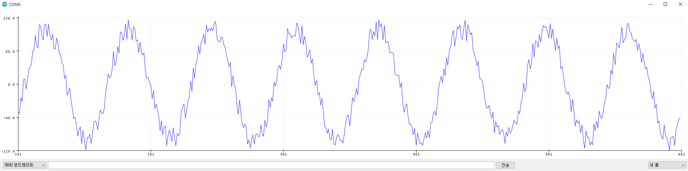
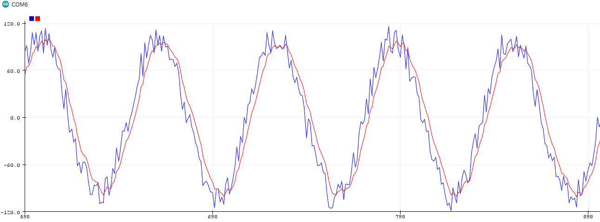

# 기본적인 노이즈 환경 (가상 시뮬)
```c++
void setup() {
  Serial.begin(9600);
}

float value = 0;
float radian = 0;
// the loop function runs over and over again forever
void loop() {
  radian += 0.1;
  value = sin(radian)* 100 + random(-100, 100)/5;
  Serial.println(value);
  delay(10);
}
```

---



---

# SimpleFOC
- 출처 : https://docs.simplefoc.com/library_download
- ```Tools > Manage Libraries....```
- Search for “Simple FOC” library and install the latest version .

---

```C++
#include <SimpleFOC.h>
void setup() {
  Serial.begin(9600);
}

LowPassFilter filter = LowPassFilter(0.001); // Tf = 1ms 로우패스필터 생성
float value = 0;
float radian = 0;

// the loop function runs over and over again forever
void loop() {
  radian += 0.1;
  value = sin(radian)* 100 + random(-100, 100)/5;
  Serial.print(value);
  Serial.print(",");
  
  filter.Tf = 0.01; // changed to 10ms 필터링 정도 변경
  float signal_filtered = filter(value); // 원본 데이터 입력후 필터링된 값 리턴
  Serial.println(signal_filtered);
  
  delay(10);
}
```

---


- Tf = 0.01;


- Tf = 0.03;

---

# Kalman Filter Library

- https://github.com/TKJElectronics/KalmanFilter
- ```Tools > Manage Libraries....``` ```툴 > 라이브러리 관리```
- Search for “Kalman Filter Library” library and install the [latest version .]
- "SimpleKalmanFilter" : https://github.com/denyssene/SimpleKalmanFilter
``` c++
double dt = (double)(micros() - timer) / 1000000; // Calculate delta time
timer = micros(); 
```

---

```C++
#include <SimpleKalmanFilter.h>
void setup() {
  Serial.begin(9600);
}

float value = 0;
float radian = 0;

float e_mea = 1; //측정값 달라지는 양
float e_est = 1; //kalman필터가 값을 조정함으로 e_mea와 동일값 입력
float q = 0.01; // 0.001 ~ 1 : 측정이 얼마나 빨리 움직이는지 (권장: 0.01) 필요에 따라 조정
SimpleKalmanFilter kf = SimpleKalmanFilter(e_mea, e_est, q);

// the loop function runs over and over again forever
void loop() {
  radian += 0.1;
  value = sin(radian)* 100 + random(-100, 100)/5;
  Serial.print(value);
  Serial.print(",");
  
  float estimated_x = kf.updateEstimate(value);
  Serial.print(estimated_x);
  Serial.print(",");
  
  Serial.println("");
  
  delay(10);
}
```

---


- q = 0.01;


- q = 0.03;

---

# 실적용 예시
- 파랑 : 로우데이터, 빨강 : 로우패스필터, 녹색 : 칼만필터


---


- filter.Tf = 0.1;
- float q = 0.01;
- 확실히 칼만필터쪽이 반응이 빠르고 노이즈 제거 효과가 좋다