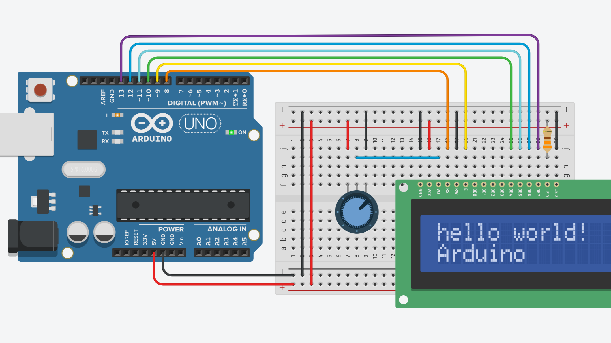

# LCD

---

```C++
#include <LiquidCrystal.h>

LiquidCrystal lcd(8,9,10,11,12,13);
// 8 : RS
// 9 : E
// 10 : d4
// 11 : d5
// 12 : d6
// 13 : d7

void setup()
{
  lcd.begin(16,2); //16열 2줄 LCD 설정
}

void loop()
{
  lcd.setCursor(0,0);
  lcd.print("hello world!");
  lcd.setCursor(0,1);
  lcd.print("Arduino");
  delay(1000);
}
```
- [틴커캐드](https://www.tinkercad.com/things/f4O8uVMejB6-sizzling-lappi-bruticus/editel?sharecode=7DZTenpsplqBXnIcDaH-YQU046deIswaLqSUmiffECY)


---

```C++
#include <Adafruit_LiquidCrystal.h>

int seconds = 0;

Adafruit_LiquidCrystal lcd_1(0);
//SCL : SCL
//SDA : SDA

void setup()
{
  lcd_1.begin(16, 2); //16글자, 2줄 LCD 시작
  lcd_1.print("hello world");
}

void loop()
{
  lcd_1.setCursor(0, 1); //커서 옮기기 (칸,줄)
  lcd_1.print(seconds);
  lcd_1.setBacklight(1);
  
  delay(500); // Wait for 500 millisecond(s)
  lcd_1.setBacklight(0);
  delay(500); // Wait for 500 millisecond(s)
  seconds += 1;
}
```
- [틴커캐드](https://www.tinkercad.com/things/1fwZiHgiR6y-grand-wluff/editel?sharecode=95N3YSeWZyDkhhf4wncuZm5sANhe87hdLzi_wWca8o8)


---


``` C++
#include <Wire.h> 
#include <LiquidCrystal_I2C.h>

LiquidCrystal_I2C lcd(0x27,16,2);  
// set the LCD address to 0x27 for a 16 chars and 2 line display

void setup()
{
  lcd.init();                      // initialize the lcd 
  lcd.init();
  // Print a message to the LCD.
  lcd.setCursor(3,0);
  lcd.print("Hello, world!");
  lcd.setCursor(2,1);
  lcd.print("Arduino!");
}


void loop()
{
  lcd.backlight();
  delay(1000);
  lcd.noBacklight();
  delay(1000);
}
```


---

- Liquidcrystal 정보출처 : https://webnautes.tistory.com/978
- Liquidcrystal_i2c 정보 출처: https://juahnpop.tistory.com/97