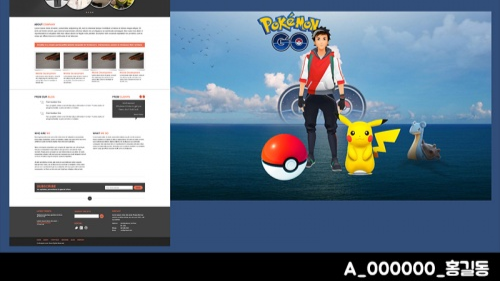
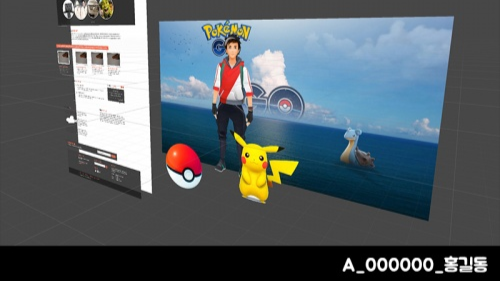

# 2주차 과제
- 이미지중에는 배경1장, 상단에 곂쳐지는 이미지 10장 필수 (총 11장)
- 이미지를 마구잡이로 붙여넣지 말고 장면을 생각하여 구성하듯이 나열할 것
- 주의 : 오늘한 과제는 그대로 다음 수업때 사용됩니다. 파일을 삭제하지 말고 USB에 담아두거나 노트북에 잘 저장하여 다음시간에 가지고 오세요.

---

# 제출 이미지 1 
- 2D 모드에서의 Scene 화면
- 이미지 크기는 1920 - 1080
- 하단에 ```반_학번_이름``` 표기


---

# 제출 이미지 2
- 3D 모드에서의 Scene 화면
- 입체감이 확인 될 수 있도록
- 이미지 크기는 1920 - 1080
- 하단에 ```반_학번_이름``` 표기


---

# 주의사항
- 카페에 댓글이 아닌 답글로 작성
- 답글의 제목은 "[1A. 과제2]"등 과제번호의 앞부분을 그대로 제목에 사용
- 과제 제목을 ```반_학번_이름``` 으로 변경
```
[1A. 과제2] A_000000_홍길동
```

---

# 스크린샷 하는 방법
- 윈도우는 Window+Shift+S
- 맥은 Commend+Shift+4

---

# 포토샵 사용시 유의사항
- jpg확장자가 없을때 : 편집>환경설정>파일처리>원래폴더에 다른이름으로 저장
- jpg확장자가 없을때 : edit>Preferences>File Handling> Enable legacy "Save As"
- 맥에서 이미지 파일을 다른 확장자로 저장하기 위해서는 export as로 