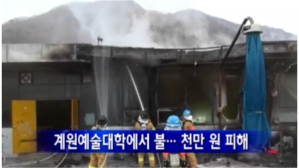

# 학과수칙 및 교과운영 계획

---
 
# 생활(교수/학생 공통)

---

## 흡연
- 실내흡연 금지(화장실, 휴게실 포함)
- 흡연발견 시 학생의 전임 교수 수업의 학점을 F처리
- 예전 화장실 흡연 발생 이후, 화장실에 연기 경보기 설치

---

## 화재주의
- 실외(테라스) 흡연시 불씨에 의한 화재 주의

 
---

## 음식물
- 컴퓨터 강의실내 음료/음식 반입을 불허(물 포함)
- 발견 시 해당 학생을 게시판에 게시
- 해당 컴퓨터실은 일정기간 동안 야간작업을 금지

---

# 지각 결석 처리 규칙

---

## 4회이상 결석은 F
- 3번 지각 = 1회 결석
- 한 학기(15회) 수업 중 4회 이상 결석은 F처리
- 단, 4회 미만 결석했다고 해서 반드시 F를 면하는 것은 아님
- 결석을 휴식권처럼 사용하지 말 것(마지막에 숫자를 넘겨서 F가 되면 선처가 불가)

---

## 지각처리
- 지각/결석 처리 시간 기준: 교수가 기준을 정함
- 출석은 수업시간 정시 (00:00)체크
출석을 부르는 도중 도착한 학생까지 출석으로 인정
출석부른 이후 도착한 학생은 지각
수업에 왔어도 전체시간의 과반 이후 출석한 학생은 결석

---

## 출결 표기 사항
- 출석 체크 방법: 스크린에 웹출결시스템을 띄워놓고 호명
- 지각 표시 방법: 출결시스템상 1교시만 지각으로 표시하지 않고 4교시 모두를 지각으로 표시하기로 함
- 지각생은 반드시 직접 모바일 출석부를 확인
- 해당 수업 이후에 출석여부 확인/수정 불가
---

## 수강신청 변경 및 공결
- 수강신청 변경 학생에 한해서 변경 기간(1주만 해당)의 결석은 출석으로 인정
- 출석인정허가서를 제출한 경우 학과규정에 따라 출석이 인정될 수도 있다(디지털미디어 디자인과 카페 참고)

---

# 성적 처리 방법

---

## 성적 처리
- 진단평가 결과는 성적에 반영되지 않는다
- 매 주간 과제 제출 시간은 다음 수업 하루 전 0시까지
- 각 과제 및 중간 기말과제를 통한 평점을 기록하고 평점 순으로 등급별 상대평가 한다.
- 상대평가용 평점은 학점과 별개이다, 평점이 높아도 학점이 낮을 수 있음

---

## 성적 유의 사항 (가장 잘 발생하는 케이스)
### 결석 지각 없고 '과제, 중간평가, 기말평가' 모두 제출하였는데 성적이 C+
- 상대평가로 진행되기 때문에 80%이상의 학생이 결석, 지각 없고 모든 과제 제출 시 중간 기말 기준 좋은 결과물을 제출한 학생을 선두으로 하여 순번이 밀릴 수 있음
반대로 결석 지각 있고, 주차 별 과제를 몇 개 안내었어도 전체 반 학생들이 대부분 그렇다면 그중에 잘한 학생을 선두로 하여 순번이 결정됨
### 결석 지각 없고 과제를 모두 제출하였는데 지각있고 주차별과제를 몇개 빼먹은 학생보다 학점이 낮다
- 출석 30%, 주차별과제 20%, 중간평가 25%, 기말평가 25% 비율
'지각 1회','주치별 과제 1회 미제출','중간평가 미흡1' 등이 비슷한 평가를 받기 때문