 TTS 
 타임케스트: 장점: 여러가지 성우,캐릭터,가상AI아나운서를 만들어 쉽게 간단하게 웹에서 가능하다 또한 음향이랑 설정도 웹에서 가능하고 쉽게 간단하게 만들 수 있으며 MP3다운로드도 되어 편집과 프로그램을 만들기 편할 것이다.

 단점: 무료 플랜인 만큼 저작권에 매우 민간하며 최대로 다운로드가 가능한 시간이 고작 3분밖에 되지않아 유료 플랜을 사용하지않은 이상 3분 컷으로 모든 작업을 삽입해야한다
 

---
 프로소디
 장점: 1500자 라는 꽤 괜찮은 TTS문장 내용을 넣을 수 있고 여러가지 감정표현을 추가할 수 있으며 음성 조절까지 가능하다 

 단점: 인공지능이 문장을 인지하는데 시간이 꽤 걸린리며 성우도 다른 웹보다 부족하다 추가로 자신이 원하는 설정이 먹히지가 않을 때도 있다.

---

클로바 더빙: 타임스케어 못지 않게 여러가지 성우들과 추가효과음들도 있음(개,고양이,박수 관객환호등등) 영상들도 웹안에서 불러들어 편집도 가능하며 영상편집도 어도비 프리미엄이랑 비슷하게 프레임씩으로 구성되어있으며 편집을 더욱쉽게 가능하다. 다운로드가능한 글자수가 15000개이며  다운로드 수도 20개로 구성되어있어 쉽게 편하게 다운로드가 가능하다 

단점: 유료 플랜으로 좀 더 다양하게 즐기기엔 없다

---

온에어 스튜디오 

장점: 성우도 꽤 적당히 있고 월마다 15분을 저장 할 수 있는 권한도 주어진다. 또한 호흡, 음량 속도 조절도 할 수 있으며 잘 모르는 사람들을 위해 사용법도 있음

단점: 더 추가하거나 음성을 더 편집 하고 싶으면 월정액을 사서해야한다는 단점이 있다.

----

<!--_color: orange -->
# TTS프로그램 다운로드 

---

# TTS 사용 프로그램(무료)

타임케스트
프로소디
클로바 더빙

---
## 타입캐스트
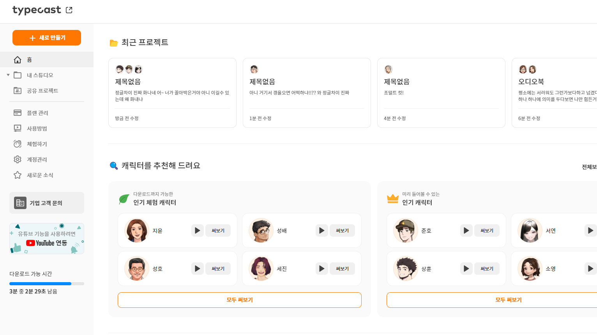

---
 #### 분석
 성우캐릭터 | 다운로드가능횟수(시간) | 음질설정여부 
:-----:|:------:|:----|
360개| 3분 | 불가     

---
 #### 다운로드 방법
 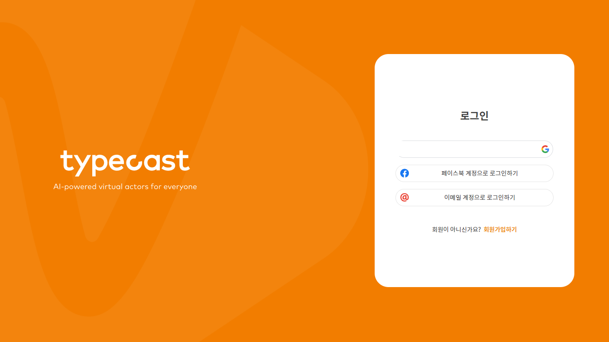
 - 로그인을 한 후 

 ---
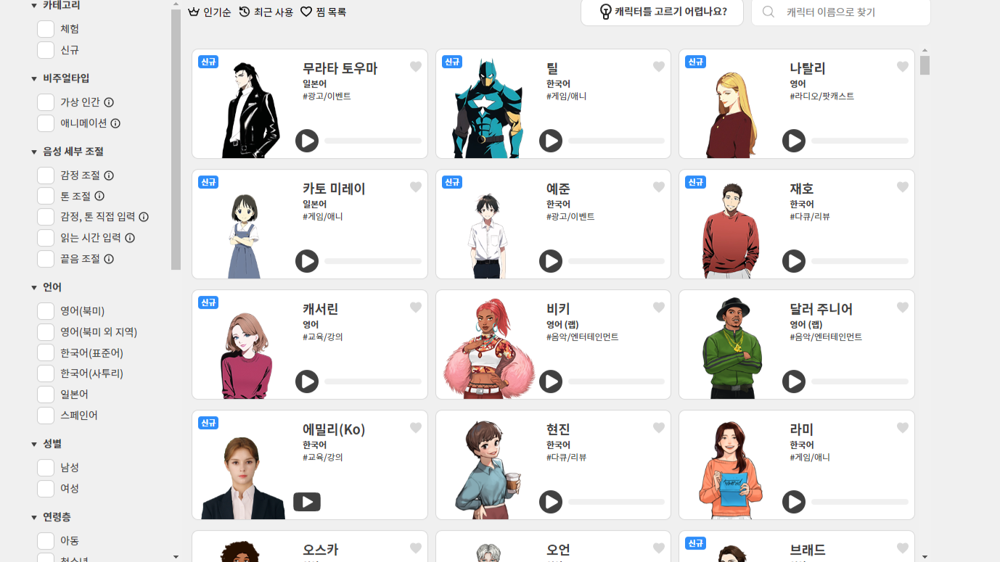
- 자신이 원하는 캐릭터를 선택
(종류는 다양하나 무료플랜에서 사용 할 수있는 
한정적으로 제공된 캐릭터만 다운로드 가능)
---

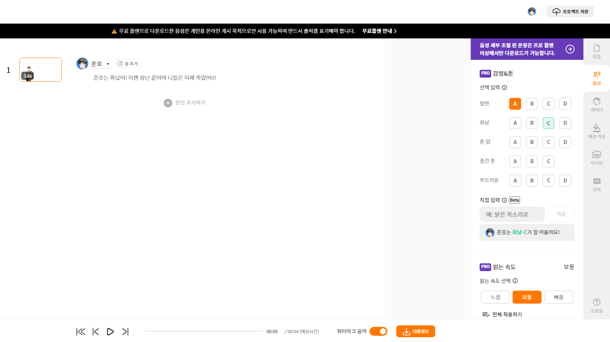
- 대사 입력 후 다운로드 클릭
(효과를 넣을려면 유료플랜을 사용해야함)

---

- 대사 입력 후 다운로드 클릭
(효과를 넣을려면 유료플랜을 사용해야함)

---

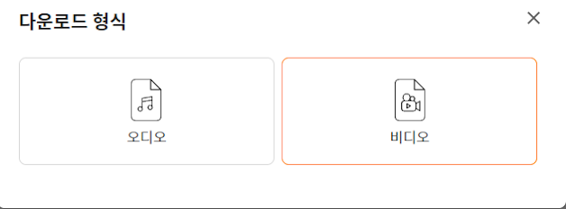
- 원하는 형식으로 다운로드 
(다운형식을 선택하면 음질설정이 나오지만 무료플랜은 선택불가)

---

- 원하는 형식으로 다운로드 
(다운형식을 선택하면 음질설정이 나오지만 무료플랜은 선택불가)

---
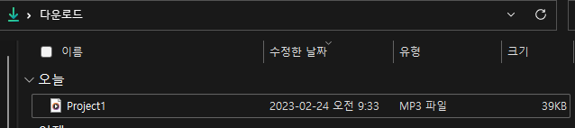
- 이런식으로 파일로 다운로드할 수 있다.
(추가로 다운로드 가능한 시간이 3분이니 참고하고 
영상에 쓰일거면 출처를 남길 것)

---
# 프로소디 

---

 #### 분석
 성우캐릭터 | 다운로드가능횟수(시간) | 음질설정여부 
:-----:|:------:|:----|
13개| 글자수로4000자 | 사용가능 

---

### 다운로드법
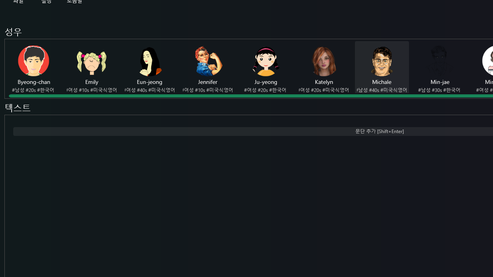
자신이 원하는 캐릭터(성우)를 고른 후 문단 추가 클릭

---

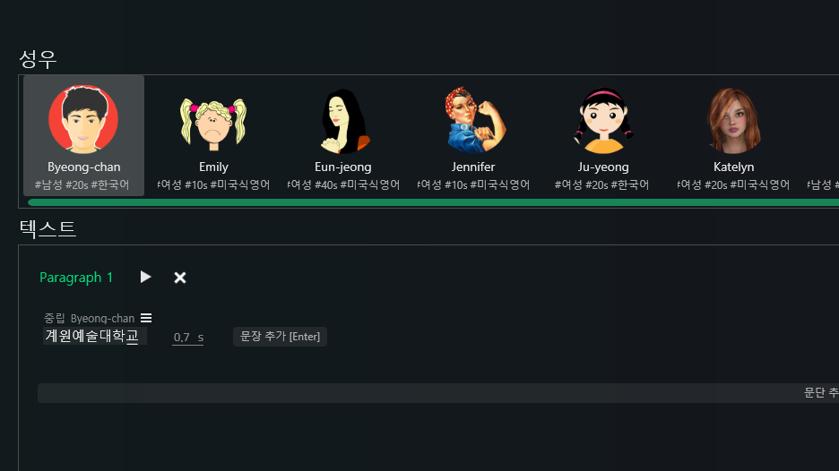
- 본인이 넣고싶은 문장을 삽입 후 

---

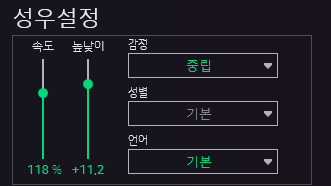
-우측 위에 성우설정에서 속도와높낮이감정옵션
설정이 필요하면 쓸 것 

---
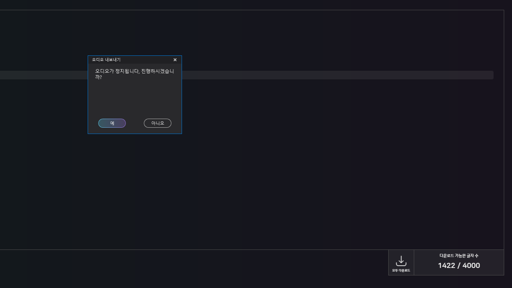
- (모두) 다운로드 클릭 후 

---

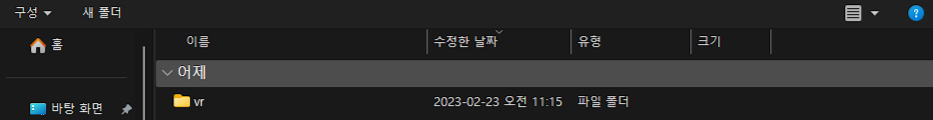
- 원하는 위치에 다운로드 후 확인  

---

# 클로바 더빙
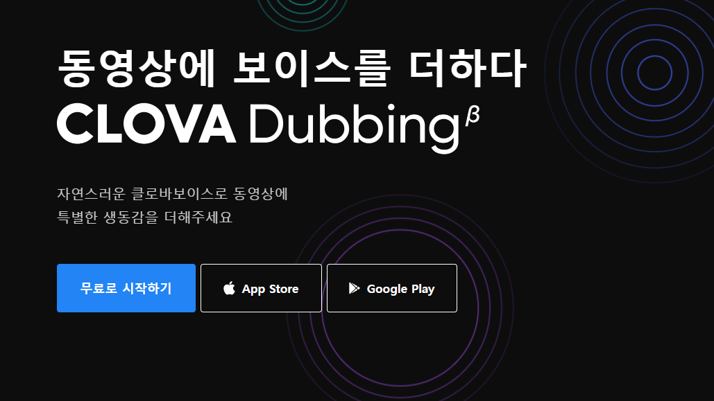

---

#### 분석
 성우캐릭터 | 다운로드가능횟수(시간) | 음질설정 
:-----:|:------:|:----:|
292개| 글자수15000개다운로드20회 | 불가 

----

### 다운로드법
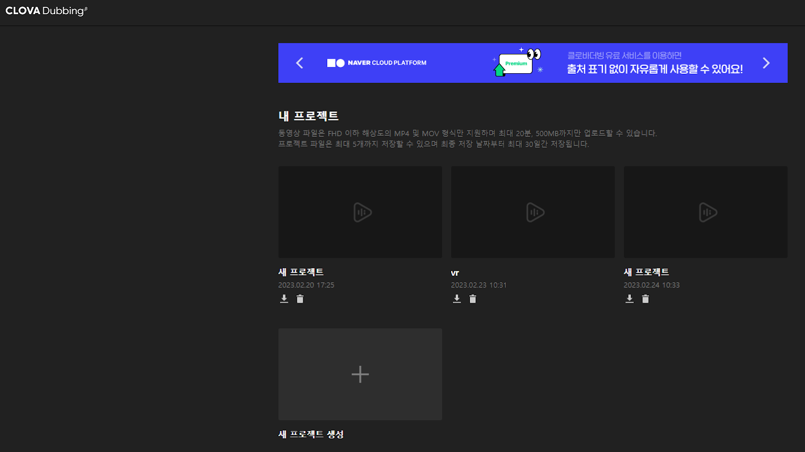
* 클로바 더빙에 들어가 로그인(네이버)후 새프로젝트 생성

---
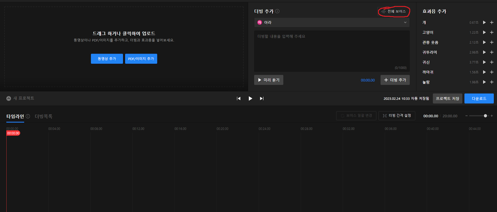
* 생성후 전체 보이스를 눌러 자신이 원하는 보이스캐릭터를 선택

---
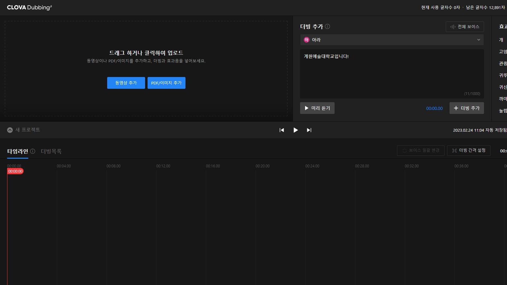
* 캐릭터 생성 후 더빙할 내용 입력
---
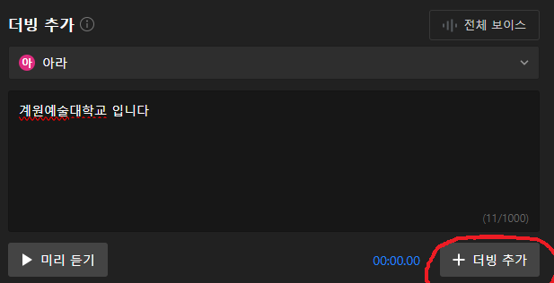
* (클릭전 미리 듣기 테스트) 더빙추가 클릭

---

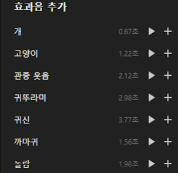
* (추가로 여러가지 효과(강아지,박수등등)를 넣을 수 있으니 참고)

---
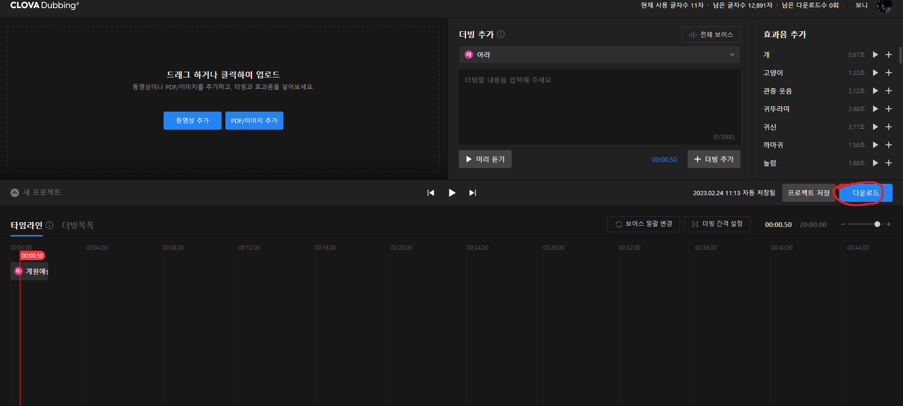
* 더빙추가 후  다운로드

---
* MP3,WMV둘중 하나 선택후 다운로드 