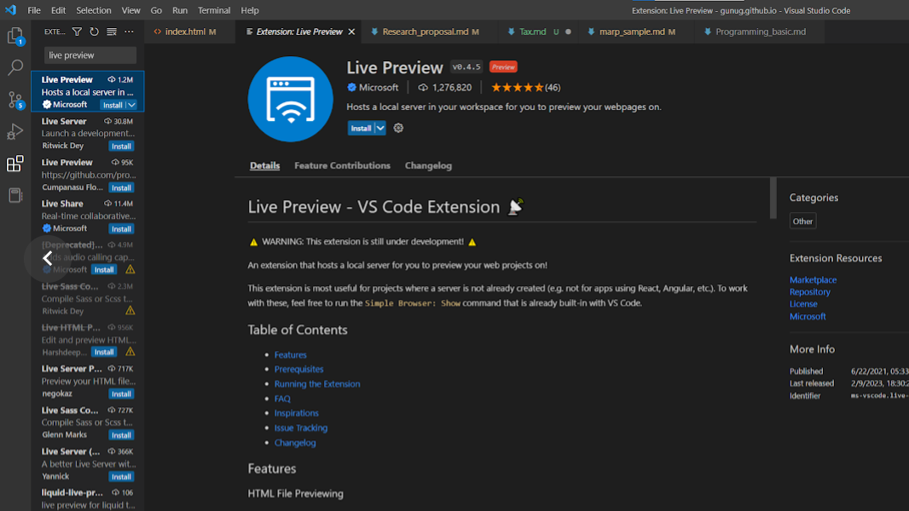

# visual studio code 설치, 연결
- 기본으로 설치된 visual studio가 실행되지 않거나 라이선스 만료일때
- 다운로드 및 설치 : https://code.visualstudio.com/
- 다이렉트로 설정하기 : https://code.visualstudio.com/docs/other/unity
- menu | edit>preference>external tools>external script editor>visual studio community 선택

---

# HTML 뷰어 설치

* html 문서 실시간으로 반영되는 것을 확인하고자 할때 (Chrome 브라우저가 더 나을수도)

---

# 한글에 네모 표시
* Ctrl + , :셋팅창 열기
* 검색창에 Unicode 검색
* Editor › Unicode Highlight: Non Basic ASCII
* Editor › Unicode Highlight: Include String
* 둘다 false로 변경