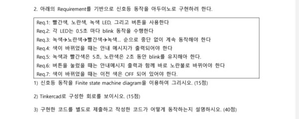
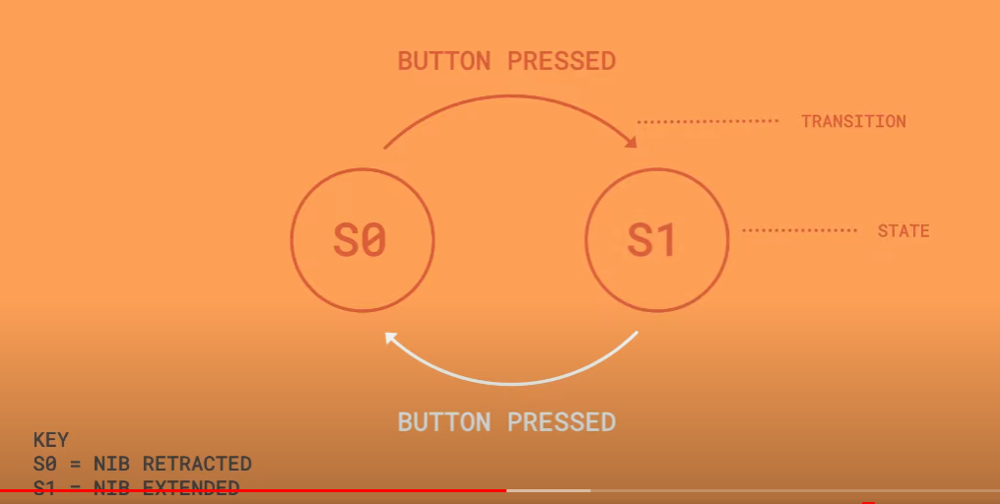
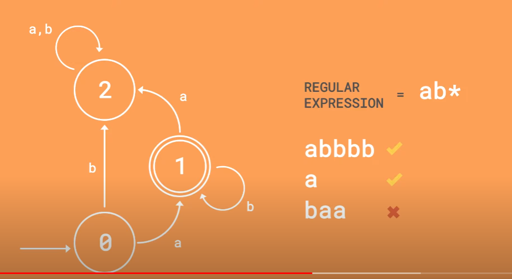
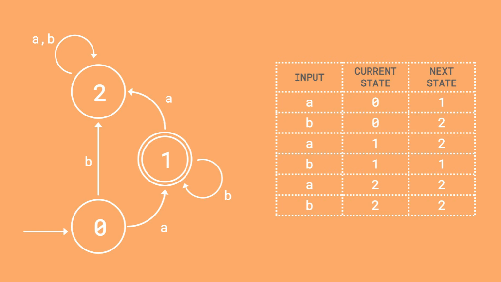

# 2023-05-05 7:30
# 네이버 엑스퍼트 상담

---

안녕하세요. 학교 과제나 학교 시험인 경우에는 전체 과제를 모두 해결하려고 하시는 경우 답변드리기 어렵습니다. 해당 과제를 완수 할 수 있도록 전반적인 부연설명을 해드릴 수 있습니다.

1. 학교 과제나 시험내용중 전체를 해결받고자 하시는 경우(회로연결부터 완성된 소스코드, 정답)는 제공해 드릴 수 없어서 예약 취소하여 주시면 감사하겠습니다.

2. 30분 동안 해당 과제를 수행할 수 있도록 완성된 코드가 아닌 부분부분 조각난 코드, 선을 연결 할 수 있도록 힌트제공, 질문 답변을 통하여 이해할 수 있도록 부연 설명을 원하신다면 이 채팅으로 알려주세요.

확인후 예약 확정 하도록 하겠습니다. 신청 감사드립니다.

---



---

* 빨간색, 노란색, 녹색 LED, 그리고 버튼을 사용한다.
* 각 LED는 0.5초 마다 blick 동작을 수행한다
```C++
    digitalWrite(target, HIGH);
    delay(500);
    digitalWrite(target, LOW);
    delay(500);
```

---

* 녹색->노란색->빨간색->녹색 순으로 중단 없이 계속 동작해야 한다
```C++
    int light = 0; //0:녹색, 1:노란색, 2:빨간색
    light ++;
    if(light > 2) light = 0; //리셋
```
* 색이 바뀌었을 때(?)는 안내 메시지가 출력되어야 한다
```C++
    int past_light = -1;
    if(past_light != light){ //과거의 색깔과, 새로운 색깔이 다르면 = 불 바뀜
        if(light == 0) Serial.print("녹색");
        if(light == 1) Serial.print("노란색");
        if(light == 2) Serial.print("빨간색");
        Serial.println("불바뀜");
        past_light = light; //새 불을 기록
    }
```

---

* 녹색과 빨간색은 5초, 노란색은 2초 동안 blink를 유지해야 한다.
* 버튼을 눌렀을 때는 안내메시지 출력과 함께 바로 노란불로 바뀌어야 한다.
* 색이 바뀌었을 때는 이전색은 OFF 되어 있어야 한다.

---

# FSM (finite state machine diagram)
* 유한 상태 머신
* 참고 : https://www.youtube.com/watch?v=4rNYAvsSkwk
1. Definition
2. Charactoeristics
- next state = current state + input value
3. Representations (x2)
- state transition diagram
- state trasition table

---

Fixed set of possible states
Finite states machine 은 아웃풋이 필요 없다?
new state = current state + input value

---

* KEY
* S0 = 볼펜촉 들어감
* S1 = 볼펜촉 나옴
* 원형으로 Key값이 표시되어 있는것을 State: 상태라고함
* 화살표로 방향이 표시되어있는것은 trasition
* transition에 컨디션이 표시됨
---

* Initial state : 동그라미 하나
* Accepting state (Goal state) : 동그라미 두개

---


* regular expresstion = ab*
* 별표 : 0개 또는 그 이상
---


* Transition table
* 입력값에 따라 현재 상태에서 어떤상태가 되는지를 나타내는 표

---

* 세세하게 말하기
- 빨간불이 깜빡인다.
- 빨간불이 켜졌다, 꺼졌다 한다.
* 직설적으로 말하기
- 빨간불이 깜빡인다.
- 빨간불이 켜지고 0.5초 뒤에 빨간불이 꺼진다 0.5뒤에 켜지는 것을 반복한다.

* 다른말로 해보기
- 색이 바뀌었다
- 색이 바뀌었다 - 새로운 색과 이전의 색이 다르다 - 새로운색 != 이전색
- 녹색 5초
- (0.5초 + 0.5초) * 5번 = 5초

---

```C++
const int redLED = 10;
const int yellowLED = 9;
const int greenLED = 8;
const int button = 7;

enum State {
GREEN,
YELLOW,
RED,
BUTTON
};

State currentState;
unsigned long stateStartTime;

void setState(State state);

void setup() {
pinMode(redLED, OUTPUT);
pinMode(yellowLED, OUTPUT);
pinMode(greenLED, OUTPUT);
pinMode(button, INPUT_PULLUP);

currentState = GREEN;
stateStartTime = millis();
}

void loop() {
unsigned long stateDuration = millis() - stateStartTime;

if (digitalRead(button) == LOW) {
setState(BUTTON);
delay(1000);
}

switch (currentState) {
case GREEN:
if (stateDuration >= 5000) {
setState(YELLOW);
} else {
digitalWrite(greenLED, HIGH);
delay(250);
digitalWrite(greenLED, LOW);
delay(250);
}
break;

case YELLOW:
if (stateDuration >= 2000) {
setState(RED);
} else {
digitalWrite(yellowLED, HIGH);
delay(250);
digitalWrite(yellowLED, LOW);
delay(250);
}
break;

case RED:
if (stateDuration >= 5000) {
setState(GREEN);
} else {
digitalWrite(redLED, HIGH);
delay(250);
digitalWrite(redLED, LOW);
delay(250);
}
break;

case BUTTON:
digitalWrite(greenLED, LOW);
digitalWrite(yellowLED, HIGH);
digitalWrite(redLED, LOW);
delay(2000);
setState(RED);
break;
}
}

void setState(State state) {
switch (currentState) {
case GREEN:
digitalWrite(greenLED, LOW);
break;

case YELLOW:
digitalWrite(yellowLED, LOW);
break;

case RED:
digitalWrite(redLED, LOW);
break;
}

switch (state) {
case GREEN:
digitalWrite(greenLED, HIGH);
break;

case YELLOW:
digitalWrite(yellowLED, HIGH);
break;

case RED:
digitalWrite(redLED, HIGH);
break;

case BUTTON:
```

---

```c++
int past_light = -1;

void loop() {
unsigned long stateDuration = millis() - stateStartTime;

if (digitalRead(button) == LOW) {
setState(BUTTON);
delay(1000);
}

int light = -1;

switch (currentState) {
case GREEN:
if (stateDuration >= 5000) {
setState(YELLOW);
light = 1;
} else {
digitalWrite(greenLED, HIGH);
delay(250);
digitalWrite(greenLED, LOW);
delay(250);
light = 0;
}
break;

case YELLOW:
if (stateDuration >= 2000) {
setState(RED);
light = 2;
} else {
digitalWrite(yellowLED, HIGH);
delay(250);
digitalWrite(yellowLED, LOW);
delay(250);
light = 1;
}
break;

case RED:
if (stateDuration >= 5000) {
setState(GREEN);
light = 0;
} else {
digitalWrite(redLED, HIGH);
delay(250);
digitalWrite(redLED, LOW);
delay(250);
light = 2;
}
break;

case BUTTON:
digitalWrite(greenLED, LOW);
digitalWrite(yellowLED, HIGH);
digitalWrite(redLED, LOW);
delay(2000);
setState(RED);
light = 2;
break;
}

if (past_light != light) {
if (light == 0) Serial.print("녹색");
if (light == 1) Serial.print("노란색");
if (light == 2) Serial.print("빨간색");
Serial.println("불바뀜");
past_light = light;
}
}
```

---

```c++
State currentState; //현재 상태
State pastSate; //과거 상태
if (pastSate != currentState) {
    if (currentState == 0) Serial.print("녹색");
    if (currentState == 1) Serial.print("노란색");
    if (currentState == 2) Serial.print("빨간색");
    Serial.println("불바뀜");
    pastSate = currentState;
}
```