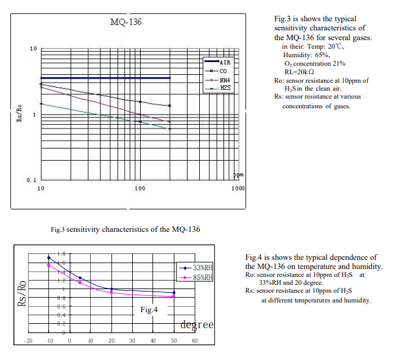
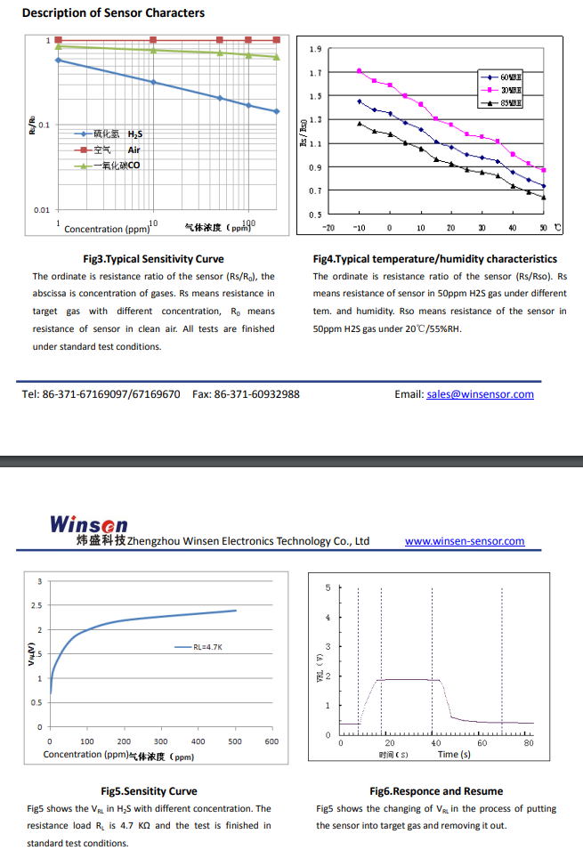

mq136 (H2S 황화수소)
mq137 (NH3 암모니아)
측정값에 오류

PPM 100만 분율
1000 ppm = 0.1%

* 데이터시트 : https://www.mysensors.org/dl/57c3ebeb071cb0e34c90057a/design/MQ-136.pdf
---

```C++
#define MQ136pin A0
#define MQ137pin A1
#include <LiquidCrystal_I2C.h>
LiquidCrystal_I2C lcd(0x27, 16, 2);

float sensorValue1; //센서값 저장용 변수
float sensorValue2;

void setup() {
  // put your setup code here, to run once:
  Serial.begin(9600); // 9600bps의 속도로 시리얼 통신 개

  lcd.init();
  lcd.backlight();
  lcd.setCursor(1, 0);
  lcd.print("H2S : ");
  lcd.setCursor(1, 1);
  lcd.print("NH3 : ");
}

void loop() {
  // put your main code here, to run repeatedly:
  sensorValue1 = analogRead(MQ136pin);
  sensorValue2 = analogRead(MQ137pin);

  float h2s_ro = 9.83; // H2S 센서의 로(데이터시트 참조)
  float nh3_ro = 50.0; // NH3 센서의 로(데이터시트 참조)
  float h2s_ppm = pow(10, ((log10(sensorValue1/h2s_ro)-1.5151)/-2.8222)); // 출력값 ppm으로 변환
  float nh3_ppm = pow(10, ((log10(sensorValue2/nh3_ro)-1.5231)/-2.7699));
 
  lcd.setCursor(7, 0);
  lcd.print(h2s_ppm, 2);
  lcd.setCursor(7, 1);
  lcd.print(nh3_ppm, 2);
 
  Serial.print("H2S: ");
  Serial.print(h2s_ppm, 2);
  Serial.print(" ppm, NH3: ");
  Serial.print(nh3_ppm, 2);
  Serial.println(" ppm");

  delay(1000);
} 
```
---


* PPM에 따른 Rs/Ro 그래프
* 온도에 따른 Ps/Ro 그래프
* 여러 가스용 MQ-136, 온도: 20℃, 습도: 65%,  O2 농도 21%, RL=20kΩ, 
* Ro: 10ppm에서의 센서 저항 H2Sin 깨끗한 공기. 
* Rs: 다양한 센서 저항 가스 농도.
* Ro: H2S 10ppm에서의 센서 저항 33%RH 및 20도.
* Rs: H2S 10ppm에서의 센서 저항 다양한 온도와 습도에서.
---

Ro means resistance of in 100ppm Toluene under different tem. and humidity.
sensor in 100ppm Toluene.
Ro는 다른 온도에서 100ppm의 톨루엔 저항성을 의미합니다. 그리고 습도.
100ppm 톨루엔의 센서.

Rs means resistance of sensor
resistance in different gases
Rs는 다른 가스에서 센서 저항의 저항을 의미합니다.

---

* https://www.devicemart.co.kr/goods/view?no=1271992

---

# 센서 원리
https://www.circuits-diy.com/mq136-hydrogen-sulfide-gas-sensor-module/

---

아두이노 값 매핑
```c++
y = map(x, 1, 50, 50, -100);
```

* MultiMap : https://github.com/RobTillaart/MultiMap


---

```C++
//My calibrated distance sensor - SHARP 2Y0A02 F 9Y
  // out[] holds the values wanted in cm
  int out[] = {150,140,130,120,110,100, 90, 80, 70, 60, 50, 40, 30, 20};

  // in[] holds the measured analogRead() values for defined distances
  // note: the in array should have increasing values
  int in[]  = { 90, 97,105,113,124,134,147,164,185,218,255,317,408,506};
  val = analogRead(A0);
  cm = multiMap(val, in, out, 14); //value, input, output, size
```

---

* 가스센서에 대한 설명
* https://www.codrey.com/electronic-circuits/how-to-use-mq-135-gas-sensor/

---

* 자료 : https://www.youtube.com/watch?v=QYSDSKn2Vf8
* 소스코드 : https://sandboxelectronics.com/?p=165

---

* MQ-2 : http://sandboxelectronics.com/?p=191
* MQ-2 : https://projecthub.arduino.cc/m_karim02/f3ae33f3-cc71-4459-b4d1-1d49d537c1df?ref=platform&ref_id=424_trending__beginner_&offset=294

```c++

#define         MQ_PIN                       (0)     //define which  analog input channel you are going to use
#define         RL_VALUE                     (5)     //define the load resistance on the board, in kilo ohms
#define         RO_CLEAN_AIR_FACTOR          (9.83)  //RO_CLEAR_AIR_FACTOR=(Sensor resistance in clean air)/RO,
                                                     //which is derived from the  chart in datasheet
 
/**********************Software Related Macros***********************************/
#define         CALIBARAION_SAMPLE_TIMES     (50)    //define how many samples you are  going to take in the calibration phase
#define         CALIBRATION_SAMPLE_INTERVAL  (500)   //define the time interal(in milisecond) between each samples in the
                                                     //cablibration phase
#define         READ_SAMPLE_INTERVAL         (50)    //define how many samples you are  going to take in normal operation
#define         READ_SAMPLE_TIMES            (5)     //define the time interal(in milisecond) between each samples in 
#include  <LiquidCrystal.h>

const int rs = 12, en = 11, d4 = 5, d5 = 4, d6 = 3, d7  = 2;
LiquidCrystal lcd(rs, en, d4, d5, d6, d7);                                                     //normal  operation
 
/*********************Application Related Macros*********************************/
#define         GAS_LPG                      (0)
#define         GAS_CO                       (1)
#define         GAS_SMOKE                    (2)
 
/****************************Globals**********************************************/
float           LPGCurve[3]  =  {2.3,0.21,-0.47};   //two points are taken from the curve.  
                                                    //with these two points,  a line is formed which is "approximately equivalent"
                                                    //to  the original curve. 
                                                    //data  format:{ x, y, slope}; point1: (lg200, 0.21), point2: (lg10000, -0.59) 
float           COCurve[3]  =  {2.3,0.72,-0.34};    //two points are taken from the curve.  
                                                    //with these two points,  a line is formed which is "approximately equivalent" 
                                                    //to  the original curve.
                                                    //data  format:{ x, y, slope}; point1: (lg200, 0.72), point2: (lg10000,  0.15) 
float           SmokeCurve[3] ={2.3,0.53,-0.44};    //two points are taken from the curve.  
                                                    //with these two points,  a line is formed which is "approximately equivalent" 
                                                    //to  the original curve.
                                                    //data  format:{ x, y, slope}; point1: (lg200, 0.53), point2: (lg10000,  -0.22)                                                     
float           Ro           =  10;                 //Ro is initialized to 10 kilo ohms
  
void setup()
{
  Serial.begin(9600);                               //UART  setup, baudrate = 9600bps
  Serial.print("Calibrating...\
");                
  Ro = MQCalibration(MQ_PIN);                       //Calibrating the sensor. Please  make sure the sensor is in clean air 
   lcd.begin(16, 2);                                                  //when  you perform the calibration                    
  Serial.print("Calibration  is done...\
"); 
  Serial.print("Ro=");
  Serial.print(Ro);
  Serial.print("kohm");
  Serial.print("\
");
lcd.print("Calibration is done...\
"); 
lcd.print("Ro=");
lcd.print(Ro);
lcd.print("kohm");
lcd.print("\
");
}
  
void loop()
{
   Serial.print("LPG:"); 
   Serial.print(MQGetGasPercentage(MQRead(MQ_PIN)/Ro,GAS_LPG)  );
   Serial.print( "ppm" );
   Serial.print("    ");   
   Serial.print("CO:");  
   Serial.print(MQGetGasPercentage(MQRead(MQ_PIN)/Ro,GAS_CO) );
   Serial.print(  "ppm" );
   Serial.print("    ");   
   Serial.print("SMOKE:"); 
   Serial.print(MQGetGasPercentage(MQRead(MQ_PIN)/Ro,GAS_SMOKE) );
   Serial.print(  "ppm" );
   Serial.print("\
");
        lcd.setCursor(0, 0);
        lcd.print("LPG:");
lcd.print(MQGetGasPercentage(MQRead(MQ_PIN)/Ro,GAS_LPG)  );
//lcd.print( "ppm" );
lcd.print("     ");  
  lcd.setCursor(9, 0);
lcd.print("CO:");  
lcd.print(MQGetGasPercentage(MQRead(MQ_PIN)/Ro,GAS_CO) );
//lcd.print( "ppm"  );
lcd.print("       "); 
 lcd.setCursor(0, 1);  
lcd.print("SMOKE:");  
lcd.print(MQGetGasPercentage(MQRead(MQ_PIN)/Ro,GAS_SMOKE) );
//lcd.print(  "ppm" );
lcd.print("         ");
   delay(200);
}
 
/****************  MQResistanceCalculation **************************************
Input:   raw_adc  - raw value read from adc, which represents the voltage
Output:  the calculated  sensor resistance
Remarks: The sensor and the load resistor forms a voltage divider.  Given the voltage
         across the load resistor and its resistance, the resistance  of the sensor
         could be derived.
**********************************************************************************/  
float MQResistanceCalculation(int raw_adc)
{
  return ( ((float)RL_VALUE*(1023-raw_adc)/raw_adc));
}
  
/*************************** MQCalibration **************************************
Input:   mq_pin - analog channel
Output:  Ro of the sensor
Remarks: This function  assumes that the sensor is in clean air. It use  
         MQResistanceCalculation  to calculates the sensor resistance in clean air 
         and then divides it  with RO_CLEAN_AIR_FACTOR. RO_CLEAN_AIR_FACTOR is about 
         10, which differs  slightly between different sensors.
**********************************************************************************/  
float MQCalibration(int mq_pin)
{
  int i;
  float val=0;
 
  for (i=0;i<CALIBARAION_SAMPLE_TIMES;i++) {            //take multiple samples
    val += MQResistanceCalculation(analogRead(mq_pin));
    delay(CALIBRATION_SAMPLE_INTERVAL);
  }
  val = val/CALIBARAION_SAMPLE_TIMES;                   //calculate the average  value
 
  val = val/RO_CLEAN_AIR_FACTOR;                        //divided  by RO_CLEAN_AIR_FACTOR yields the Ro 
                                                        //according  to the chart in the datasheet 
 
  return val; 
}
/***************************  MQRead *******************************************
Input:   mq_pin - analog  channel
Output:  Rs of the sensor
Remarks: This function use MQResistanceCalculation  to caculate the sensor resistenc (Rs).
         The Rs changes as the sensor  is in the different consentration of the target
         gas. The sample times  and the time interval between samples could be configured
         by changing  the definition of the macros.
**********************************************************************************/  
float MQRead(int mq_pin)
{
  int i;
  float rs=0;
 
  for (i=0;i<READ_SAMPLE_TIMES;i++)  {
    rs += MQResistanceCalculation(analogRead(mq_pin));
    delay(READ_SAMPLE_INTERVAL);
  }
 
  rs = rs/READ_SAMPLE_TIMES;
 
  return rs;  
}
 
/***************************  MQGetGasPercentage ********************************
Input:   rs_ro_ratio -  Rs divided by Ro
         gas_id      - target gas type
Output:  ppm of the  target gas
Remarks: This function passes different curves to the MQGetPercentage  function which 
         calculates the ppm (parts per million) of the target  gas.
**********************************************************************************/  
int MQGetGasPercentage(float rs_ro_ratio, int gas_id)
{
  if ( gas_id  == GAS_LPG ) {
     return MQGetPercentage(rs_ro_ratio,LPGCurve);
  } else  if ( gas_id == GAS_CO ) {
     return MQGetPercentage(rs_ro_ratio,COCurve);
  } else if ( gas_id == GAS_SMOKE ) {
     return MQGetPercentage(rs_ro_ratio,SmokeCurve);
  }    
 
  return 0;
}
 
/***************************  MQGetPercentage  ********************************
Input:   rs_ro_ratio - Rs divided by Ro
         pcurve      - pointer to the curve of the target gas
Output:  ppm of  the target gas
Remarks: By using the slope and a point of the line. The x(logarithmic  value of ppm) 
         of the line could be derived if y(rs_ro_ratio) is provided.  As it is a 
         logarithmic coordinate, power of 10 is used to convert the  result to non-logarithmic 
         value.
**********************************************************************************/  
int  MQGetPercentage(float rs_ro_ratio, float *pcurve)
{
  return (pow(10,(  ((log(rs_ro_ratio)-pcurve[1])/pcurve[2]) + pcurve[0])));
}

```