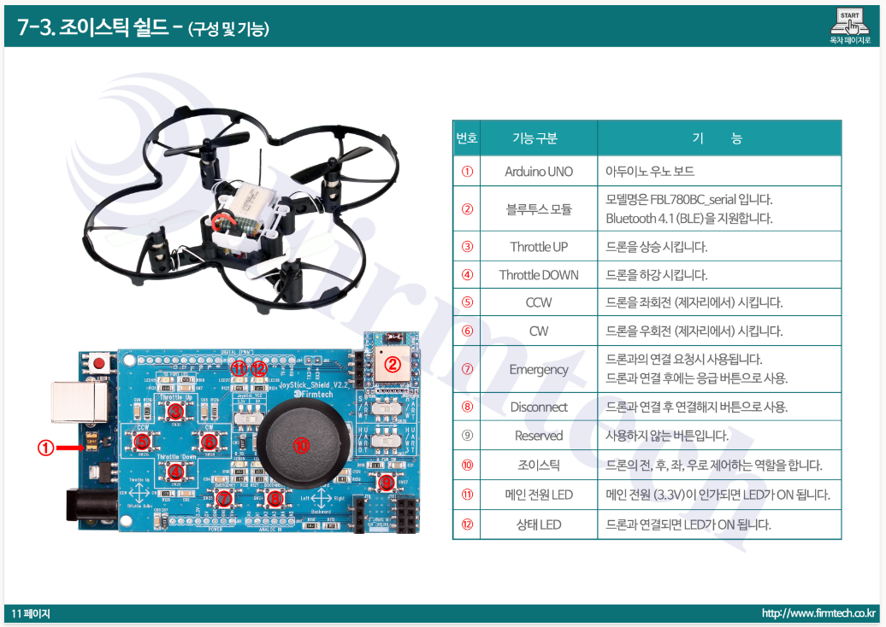

# 드론 키트 1호 블루투스 연결문제
* https://robotscience.kr/goods/view?no=15613

* FBL780BC_serial UART통신 (RX,RX,GND) 용도로 사용

---

# 조이스틱
```C++
SoftwareSerial bleSerial(A0, A1); // RX, TX
```

# Blutooth Bypass
```C++
#include <SoftwareSerial.h>

SoftwareSerial bleSerial(A0, A1); // RX, TX

void setup()
{
  Serial.begin(9600);
  Serial.println("BLE Shield Test Started!");
  bleSerial.begin(9600);
}

void loop() {
  if(bleSerial.available())
    Serial.write(bleSerial.read());
  if(Serial.available())
    bleSerial.write(Serial.read());
}
```

---

# 페어링
* 펌테크 드론 전원을 ON 합니다.
* PIO 9번 스위치를 눌러서 블루투스 연결을 진행합니다
* * 연결되면 "조이스틱 쉴드"의 Status LED가 ON 됩니다.
* PIO 10번 스위치를 눌러서 블루투스 연결 종료를 진행합니다.

---

* 조이스틱 페어링 방법 영상 : https://www.youtube.com/watch?v=_MwGeeGSlTQ
* 드론에 전원이 들어오면 드론 LED 깜빡임 (1초에 한번꼴)
* 드론이 연결되면 빠르게 깜빡임

---

* BT-connect
```C++
//-----------------------------------------------
//-----------------------------------------------
#include <SoftwareSerial.h>

#define OPERATION_STEP_0  0
#define OPERATION_STEP_1  1
#define OPERATION_STEP_2  2

SoftwareSerial bleSerial(A0, A1); // RX, TX
//-----------------------------------------------
unsigned int currentStep;
//-----------------------------------------------
void setup()
{
  Serial.begin(9600);
  bleSerial.begin(9600);

  for(int i = 5; i < 11; i++)
  {
    pinMode(i,INPUT);
    digitalWrite(i,HIGH);
  }
  
  currentStep = 0;
}

void loop()
{
  switch(currentStep)
  {
    case OPERATION_STEP_0:
      Serial.println("Connect Test");
      currentStep++;
    break;
    case OPERATION_STEP_1:
      if(!digitalRead(9)) //9번핀은 페어링 핀으로 이용됨
      {
        Serial.println("Pressed Connect Button");
        bleSerial.print("atd");
        bleSerial.print("083a5c1f015b"); //블루투스 주소 입력부분
        bleSerial.print("\r");
        currentStep++;
      }
    break;
    case OPERATION_STEP_2:
      if(!digitalRead(10)) //10번핀은 페어링 해제 핀으로 이용됨
      {
        Serial.println("Pressed Disconnect Button");
        bleSerial.print("ath");
        bleSerial.print("\r");
        currentStep = OPERATION_STEP_1;
      }
    break;
  }
}
```

---


* 12: 블루투스 연결시 불켜지는 부분
* 7: 블루투스 연결 - 연결후엔 긴급버튼으로 사용됨
* 8: 블루투스 연결끊기

---

```C++
void checkThrottle()
{
  //throttle: 감소시 하강, 증가시 상승
  if(!digitalRead(6))
  {
    if(throttle > 59)
      throttle -= 20;
    else if(throttle > 3)
      throttle -= 4;
  }
  else if(!digitalRead(5))
  {
    if(throttle < 20)
      throttle = 20;
    else if(throttle < 181)
      throttle += 20;
  }
}
* 스로틀은 최대 20,
```
---

```c++
void checkThrottle()
{
  //throttle: 감소시 하강, 증가시 상승
  if(!digitalRead(6))
  {
    if(throttle > 0){
        throttle --;
    }
  }
  else if(!digitalRead(5))
  {
    if(throttle < 20){
        throttle ++;
    }
  }
}
```