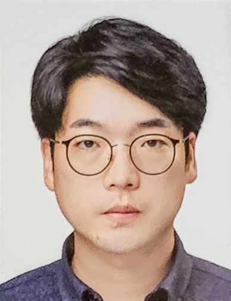

# 소개
- 이름 : 조건희
- 계원예술대학교 겸임교수(2015)
- 원더랩 개인사업(2018)

---

# 연역
- 계원예술대학교 졸업
- 홍대영상대학원 수료
- 웹에이전시 업무경력
- 계원예술대, 명지전문대 교육경력

<!-- - 2004~2008 계원 조형 예술대학 졸업
- 2008~2010 픽스다인 재직
- 2010~2011 유플리트 재직
- 2008~2012 학점은행제 졸
- 2012~2014 이트라이브 재직
- 2013~2015 홍익대학교 영상대학원 게임콘텐츠과 수료
- 2015~2017 원더랙션 개업
- 2015~ 계원예술대학교, 디지털미디어 디자인과 겸임교수
- 2018~ 원더랩 개업
- 2019~2022 명지전문대학, 디지털 커뮤니케이션 디자인과 출강 -->

---

# 웹 에이전시
- 코크 플레이
- TTL
- 밀러 맥주
- SKW
- 스포티지R
- 이자녹스
- 영 삼성 라이프 (접근성)
- 외 25개 사이트 플래시 제작

---

# 디지털 미디어 전시
- DMC홍보관
- 런던 한류박람회 KBEE 2013
- 쿠바 국제박람회 FIHAV 2014
- 외 전시회 키오스크 컨텐츠 제작

---

아두이노 피지컬 컴퓨팅 디바이스

