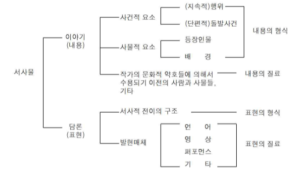

* 출처: https://koreascience.kr/article/JAKO201421154208635.pdf
# 채트먼의 서사구조

---

* 출처: https://m.blog.naver.com/PostView.naver?isHttpsRedirect=true&blogId=muffkib&logNo=66781103
* 내러티브 : 시간과 공간에서 발생하는 인과 관계로 엮어진 실제 혹은 허구적인 사건들의 연결을 의미한다. 소설 속에서는 오직 문자 언어로만 이루어지는 이 언술이 영화에서는 이미지, 대사, 문자, 음향 그리고 음악 등으로 이루어져 있다. 즉 영화에서의 내러티브는 이야기를 조직하기 위하여 채택되는 전략, 약호와 관습을 (미장센과 조명 등도 포함해) 지칭한다. 흔히 스토리텔링(storytelling)과 동일한 개념으로 간주되기도 하지만 실제 이보다 더 큰 범위를 의미하는 것이다.
* 내러티브에 관한 연구 : 영화의 내러티브에 관한 연구는 1920년대 민담에서의 행위와 내러티브 기능에 관한 블라디미르 프롭의 연구와 1950년대 신화의 구조에 관한 레비스트로스의 연구의 영향 아래에서 시작되었으며, 특히 영화이론가들에게 있어 내러티브 연구의 중요한 초점은 헐리우드 - 1930년대에서 1950년대까지의 고전 내러티브 영화 - 에 있었다. 이 시기 헐리우드 영화에 있어서의 내러티브는 대단히 표준화된 패턴의 집합을 따르는 경향이 있는데, 이 패턴은 ‘질서 / 무질서 / 회복’ 의 삼항도식으로 규정지을 수 있다. 현대 영화에선 이런 단순한 플롯에서 벗어난 새로운 패턴 - 쿠엔틴 타란티노의 <펄프픽션>같은 - 이 종종 나타나기도 하는데, 아직도 여전히 위의 기본 패턴은 유효하다.
* 제라르 쥬네트 : 제라르 쥬네트의 작업(1980)에 많이 의존하고 있다. 쥬네트는 세 종류의 내래이션을 명료하게 구분하고 있는데, 내러티브(narrative), 디제시스(diegesis), 내래이트하기(narrating) 가 그것이다.
먼저 그는 ‘내러티브’를 하나의 사건을 이야기 하려는 시도를 가리키는 것으로 사용한다. 그리하여 영화에 있어 내러티브는 내러티브적 진술로서의 영화, 내러티브 텍스트로서의 영화의 기능을 말하는 것이 된다.
그의 두번째 용어인 ‘디제시스’는 특정한 이야기를 만들어내는 사건의 연쇄와 그 사건들의 다양한 관계를 말한다. 그러므로 영화에서 디제시스는 스크린 위에 투사되는 이야기와 스토리 라인, 시각적 미장센 모두를 가리킨다.
마지막으로 ‘내래이트 하기’는 언술행위를 가리키는데, 영화에서의 말하는 행위, 즉 내러티브에 동기 부여하는 캐릭터들을 가리킨다. 다른 말로 하면 내러티브는 우리에게 내래이트 되고 우리는 내래이트 하기의 행위를 목격하는 것이다.
사실 구조주의 서사학에 관한 이러한 쥬네트의 분류가 처음엔 그리 쉽게 이해되지 않을지 모르지만, 각 용어에 대한 확실한 개념 이해가 선행된다면 결코 어렵지만은 않을 것이다.

---

5. 내러티브의 효과적인 전개를 위한 , 반복-레피티션Repetition / 복제-더플리케이션
반복은 관객의 심리를 맥빠지게 한다. 그렇기 때문에 효과적인 반복을 위해서 약간의 변화를 이용한 연출이 필요하다.
 
Repetition
레피티션은 반복하다의 의미로 두색 이상을 사용하여 일정한 질서에 기초한 조화를 부여함으로써 통일감이나 융화감을 끌어내는 기법이다.

즉, 2가지 이상의 연출을 한 단위로 하여 되풀이 함으로써 조화로운 결과를 도출해 내는 것이다.

 
 더플리케이션
지루함을 없애기 위해 반복안에서 크고 작은 변화를 주면서 표현을 한다.
A - A' - A'' -B - A'''
 

[참고 문헌]
1.영화 예술 (데이비드 보드웰, 크리스틴 톰슨/ 주진숙, 이용관 역) - 이론과 실천
2.영화의 이해 (L. 자네티/ 김진해 역) - 현암사
3.영화학, 어떻게 할 것인가 (자끄 오몽 外/ 강한섭 역) - 열린책들
4.영화 사전- 이론과 비평 (수잔 헤이워드/ 이영기 역) - 한나래
출처 : http://www.changwon.ac.kr/~cine/movie/study/

6. 정리 안된 부분

Dran : Act

Past - Present - Future

Motive  <- Pain

Intention 의도, 방향성 그러나 Goal은 아니다.  - Main Intention / Sub Intention

Goal : END 목표

Disturbance : 방해요소 / 반드시 필요하다.

Struggle : 투쟁

Adjustment : 조정 / 화해 (Goal에 대한 수위)

Effect on Audience

Anticipation : 예측 ( 관객을 교육)

Suspence : 긴장감이라고 하기엔 무리가 있고, Goal 로 이루어 질 수 있는가 없는가에 대한 분위기

Forward Movement : 순방향 제시

---

* 출처 : http://contents2.kocw.or.kr/KOCW/data/document/2020/pusan/imyungho0224/9.pdf

---

