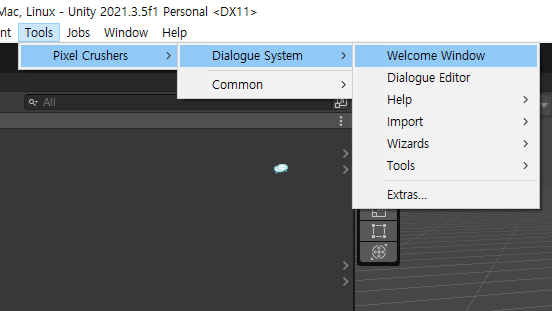

# Dialogue system
[asset store](
https://assetstore.unity.com/packages/tools/ai/dialogue-system-for-unity-11672)

---

# Welcome window


* [document](https://www.pixelcrushers.com/dialogue_system/manual2x/html/)
* [video tutorial](https://www.pixelcrushers.com/dialogue-system/dialogue-system-tutorials/)

---

# demo scene

```
Assets > Plugins > Pixel Crushers > Dialogue System > Demo > Scene
```

---

# Dialogue Manager

```
Project window | Plugins > Pixel Crushers > Dialog System > Prefabs
```
* dialogue manager 가 있어야 동작함
* 없으면 NullException error

---

# Dialogue database

```
project window | Create > Pixel Crushers > Dialog System > Dialog Database
```


---

* Actors에서 등장인물 추가
* Conversations에서 대화 추가
* ```Inspector window | Actor``` 대화 주체
* ```Inspector window | Conversant``` 대화 상대

---

# 시작하자마자 대화 

* Dialogue System Trigger 컴퍼넌트 추가


* Actor와 Conversant 추가
* Trigger - On Start : 시작하자마자 대화

---

# 랜덤 말풍선
* Dialogue Actor 컴퍼넌트 추가

```
Project window | assets > Plugins > Pixel Crushers > Dialogue System > Prefabs > Standard UI Prefabs > Tamplate > Bubble
```
* Bubble Tamplate Standerd Bark UI 사용
* Dialogue Actor > Bark UI Settings > Bark UI에 드래그 드롭

* Bark On Idle 컴퍼넌트 추가

---

# 오디오 재생
[동영상 튜토리얼 - Entrytag](https://youtu.be/oDF7DonAoz8)
[포럼글](https://www.pixelcrushers.com/phpbb/viewtopic.php?t=2250)

* Dialogue > conversations 에서 대화 선택
* inspector창의 Sequence 부분에 Audio Source를 드래그 드롭
* 오디오 수량이 많다거나 1:1 대응되지 않는경우 '동영상 튜토리얼' 참조

---

# Trigger, Interaction
[video tutorial](https://youtu.be/ZxppOvEwOaI)


---

# auto playing
[forum](https://www.pixelcrushers.com/phpbb/viewtopic.php?t=996)

Dialogue Manager GameObject
```
Display Settings > Input Settings > Always Force Response Menu - untick
```

```
Display Settings > Subtitle Settings > Show PC Subtitle During Line - tick
```

If the player only has one response, it will play automatically. Show PC Subtitle During Line shows the player's response as a subtitle.

---

# Actor text color

```C#
using UnityEngine;
using PixelCrushers.DialogueSystem;

public class ActorSubtitleColor : MonoBehaviour {
    public Color subtitleColor;
    
    void OnConversationLine(Subtitle subtitle) {
        if (subtitle.speakerInfo.transform == this.transform) {
            subtitle.formattedText.text = "<color=" + Tools.ToWebColor(subtitleColor) + ">" + 
                subtitle.formattedText.text + "</color>";
        }
    }
}
```
스크립트를 대상 Actor에게 componunt로 적용하고 색상을 선택

---

# Start conversation
```c#
using System.Collections;
using System.Collections.Generic;
using UnityEngine;
using PixelCrushers.DialogueSystem;

public class Starter : MonoBehaviour
{
    public DialogueSystemTrigger trigger;
    public Transform actor;
    public Transform conversant;
    
    void StartConversation()
    {
        Debug.Log("game start");
        trigger = this.gameObject.GetComponent<DialogueSystemTrigger>();
        DialogueManager.StartConversation(trigger.conversation, actor, conversant);
    }
    private void Update()
    {
        if (Input.GetKeyDown(KeyCode.T))
        {
            StartConversation();
        }
    }
}
```

---

# Custom Sequence Commend
[video tutorial](https://youtu.be/t8Ma1N9RadI)

```
project window | Assets > Plugins > Pixel Crushers > Dialog System > templates > Scripts
```
* ```SequenceCommendTemplate.cs``` 복사
* ```SequenceCommend새이름``` 형식으로 클래스명 변경
* Sequence에 ```새이름();``` 형식으로 작성하면 작동

---


