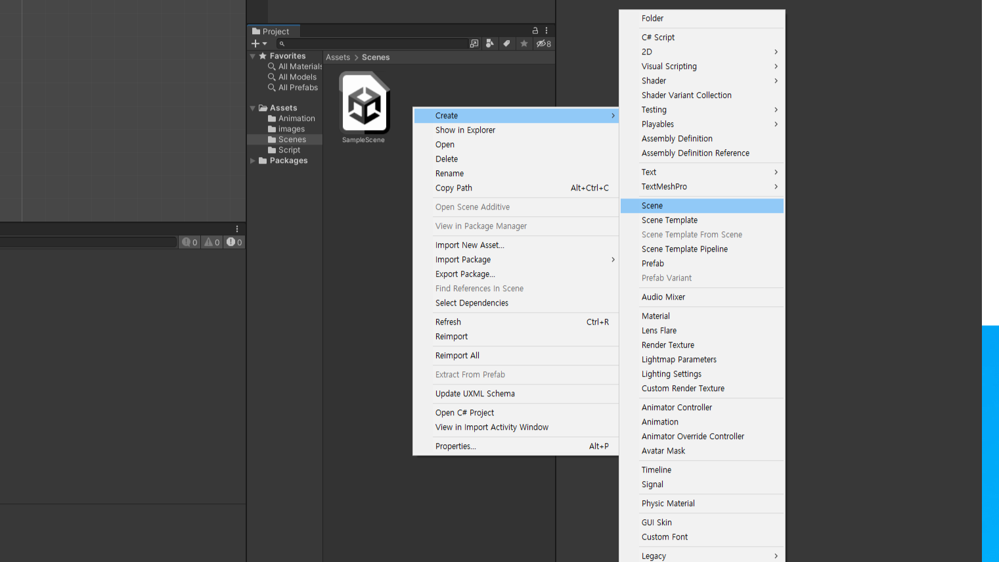
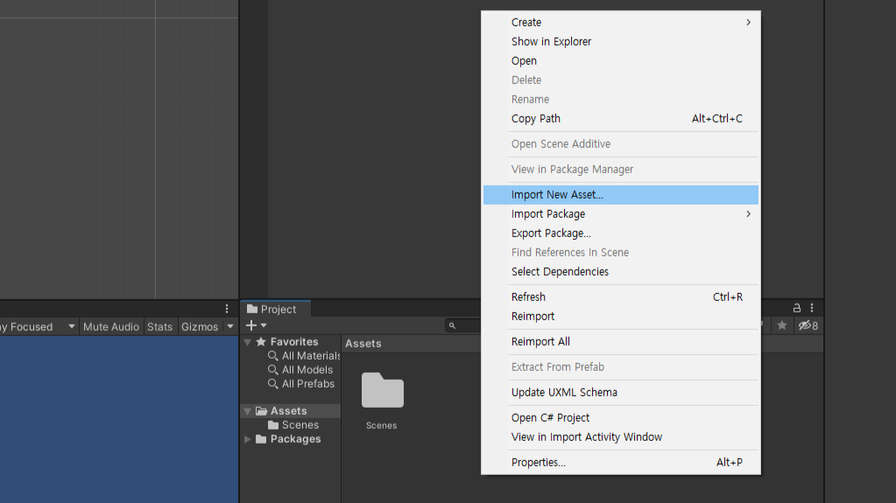
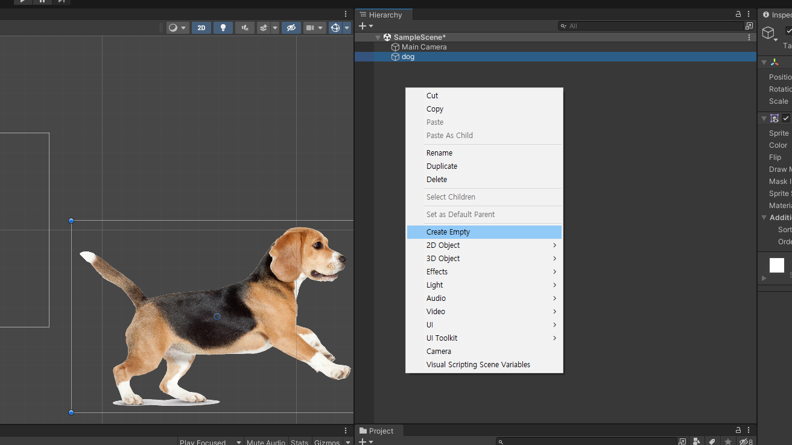
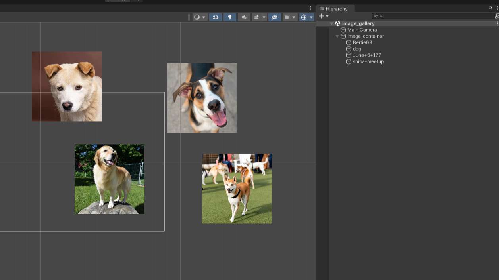
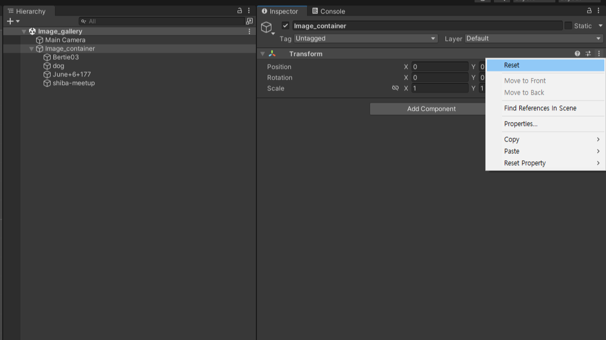
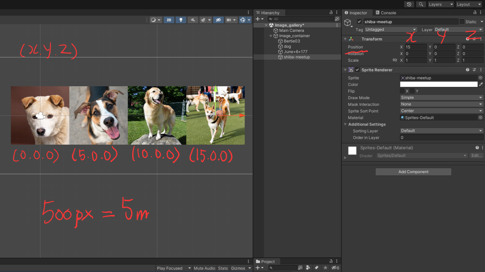
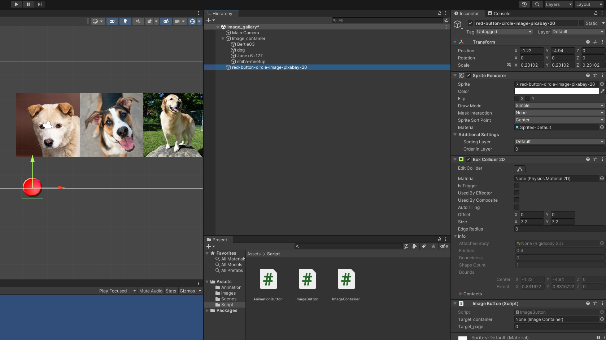
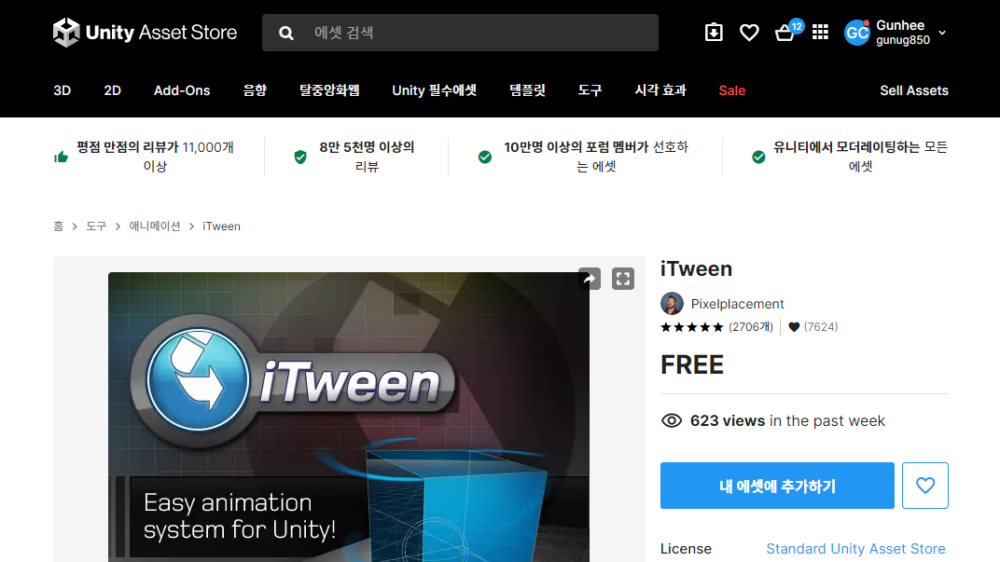
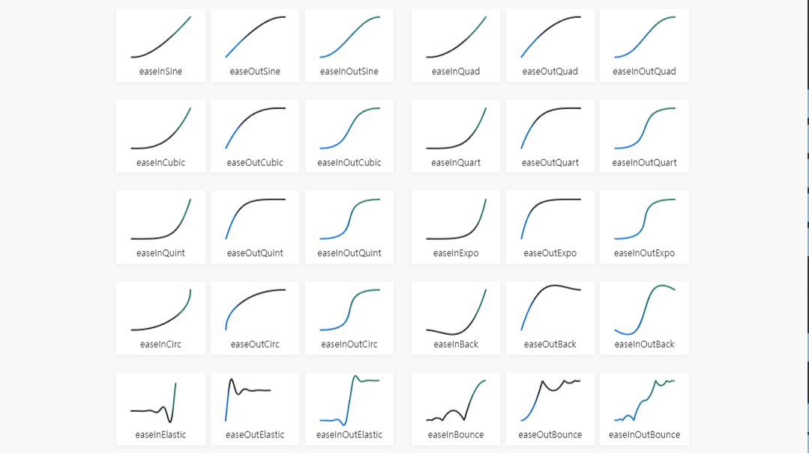

# 이미지 갤러리 만들기

---

# 새로운 Scene 만들기

- Project 창 빈공간 마우스 우클릭
- Create > Scene 선택
- 새 Scene의 이름은 `image_gallery`로 변경

---

# 이미지 검색
- Google에서 500px * 500px 이미지 5장을 다운로드
- 500px = Unity 5m
- 검색예 ```dog jpg imagesize:500x500```

---

# Image 가져오기

- Project 창에서 마우스 우클릭 ```import new asset...```

---

# Empty Game Object 만들기

- GameObject는 유니티내의 최소 기본단위
- 빈 게임오브젝트 (Empty Game Object)는 빈 폴더와 같은 역할
- Hierarchy창 마우스 우클릭 ```creat empty```
- 빈 게임오프젝트 이름을 ```image_container```로 변경

---

# Object 배치하기

- 준비된 이미지를 Scene으로 드래그 드랍
- Hierarchy창에서 그림들의 이름을 복수선택 하여 ```image_container```안으로 이동

---

# image_container 영점 맞추기

- Hierarchy창에서 image_contianer 선택
- Inspector창에서 transform우측 ```...``` > Reset 으로 좌표 재설정

---

# 내부 그림 위치 조정하기

- 그림의 (x,y,z)위치를 각각 조정하여 나란히 있도록 배치
- 영점(0,0,0) 부터 시작하여 5씩 증가하도록 배치 (500px == 5m)
- (0,0,0), (5,0,0), (10,0,0), (15,0,0), (20,0,0)

---

# C# script 작성
- ImageContainer.cs
```C#
private int current_page = 0;
public void movePage(int page_num){
    Vector3 new_position = new Vector3(0 - page_num * 5, 0, 0);

    this.gameObject.transform.position = new_position;
}
```

---

- ImageContainer.cs
```C#
public void prevPage(){
  if(current_page > 0){
      current_page --;
      movePage(current_page);
  } 
}
public void nextPage(){
  if(current_page < 4){
      current_page ++;
      movePage(current_page);
  }
}
```

---

- ImageButton.cs
```C#
public ImageContainer target_container;
public int target_page;

private void OnMouseDown()
{
    Debug.Log(target_page+"버튼눌림");
    target_container.movePage(target_page);
}
```

---

# 작성된 script 전달
- 작성된 ImageContainer.cs를 드래그 드랍으로 Hierarchy창에 있는 image_continer에 전달

- 버튼 이미지를 scene에 올리고 ```add component``` Physics 2d > box collider 2d 추가
- 작성된 ImageButton.cs를 드래그 드랍으로 버튼 이미지에 전달
- Target_page 부분의 숫자를 각각의 버튼 순서에 맞게 입력 (0부터 시작)

---

# iTween 사용해보기

- [에셋스토어 링크 ](https://assetstore.unity.com/packages/tools/animation/itween-84)
- [사용 설명서 링크](http://www.pixelplacement.com/itween/documentation.php)
- https://assetstore.unity.com 에서 iTween을 검색하여 무료버전 다운 가능

---

# Script에 iTween 내용 추가

- 기존 직접 움직이는 부분은 주석처리하여 작동 하지 않도록 한 후 하단에 추가
```C#
//this.gameObject.transform.position = new_position;
//기존 직접 움직이는 부분은 주석처리하여 작동 하지 않도록 한 후 하단에 추가

iTween.MoveTo(this.gameObject, iTween.Hash("position", 
new_position, "easetype", iTween.EaseType.easeOutElastic, "time", 1.0f));
current_page = page_num;
```

---

# ease type 변경
- https://easings.net/

- iTween.EaseType.`easeOutElastic` 부분에 입력하여 다른 움직임 적용 가능

---

- 참고용 영상 : 오래전 제작된 영상입니다. 수업내용과 상이한 점이 많습니다. 문서만으로 내용이 어려울때 참고만 하세요.
<iframe width="560" height="315" src="https://www.youtube.com/embed/AOFBlWIzzm8" title="YouTube video player" frameborder="0" allow="accelerometer; autoplay; clipboard-write; encrypted-media; gyroscope; picture-in-picture; web-share" allowfullscreen></iframe>