PlasticSCM

---

* https://www.plasticscm.com/
* 유니티 아이디로 로그인
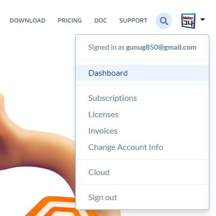

---

* Cloud
* configure / user and groups

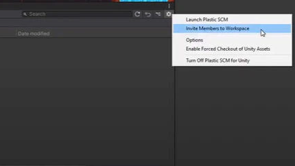
* plasticSCM창 / 톱니바퀴 / invete members to workspace
* 그룹원 추가 및 초대메일 발송 (resend invitation)
* install cloud edition
* Plastic SCM 프로그램 실행시켜서 유니티 아이디로 로그인
* 클라우드 에디션 설치 없이 웹사이트 로그인 만으로 가능

---

### 1.3 Plastic SCM 설치.
- 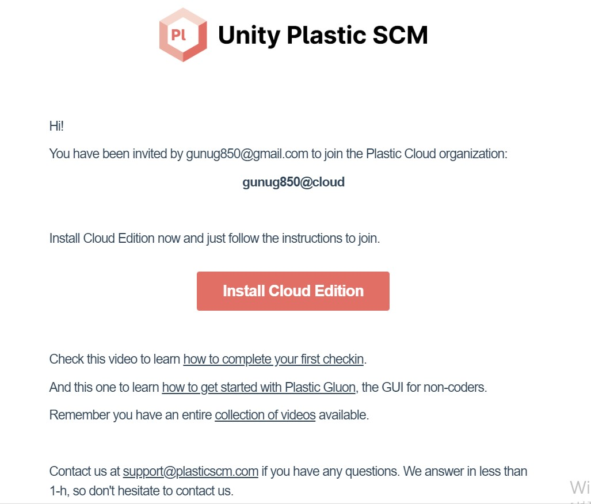 
- 본인 메일로 발송된 Plastic SCM 초대장을 연다.
- 메일 클릭 후, 설치 버튼을 누른다.
- 설치 버튼 클릭 후, 보이는 화면에서 'cloud edition' (좌측의 아이콘) 클릭하여 설치. 
 
- 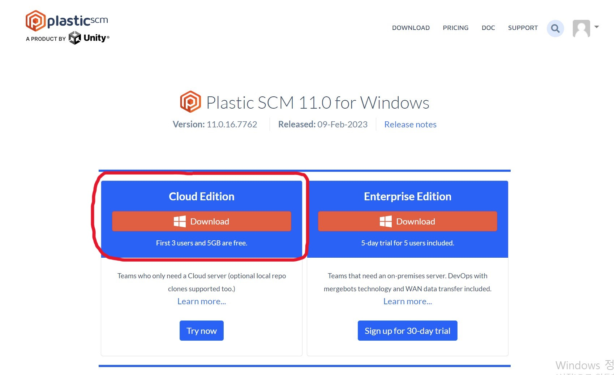 

---

## 12. Plastic SCM 새 조직 추가 / Unity 연결
 

#### 1. Unity ID 페이지에서 "Organizations"으로 이동
https://id.unity.com/en/organizations

 

- Add new 버튼 클릭하여 새로 만들기

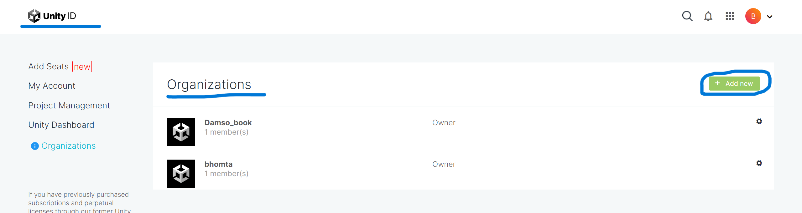

---

- 조직 이름(Organization Name)과 분야(Industry) 선택 후 생성(Create) 버튼 클릭.

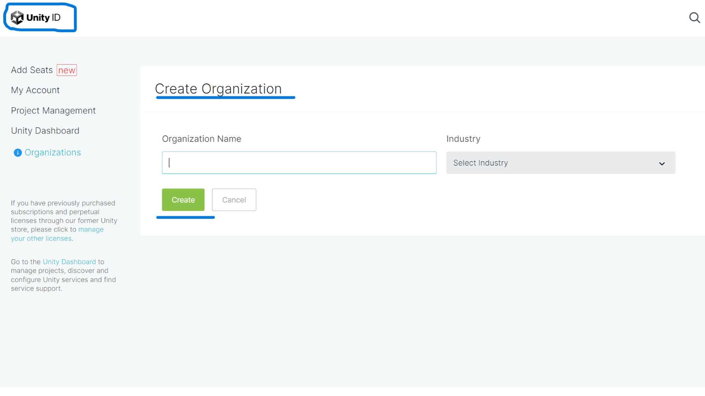

---

#### 2. 유니티 대쉬보드에서  새 프로젝트 생성

 

-Create Projcet 클릭하여 새 프로젝트 생성

https://dashboard.unity3d.com/organizations/14568800501890/settings/projects

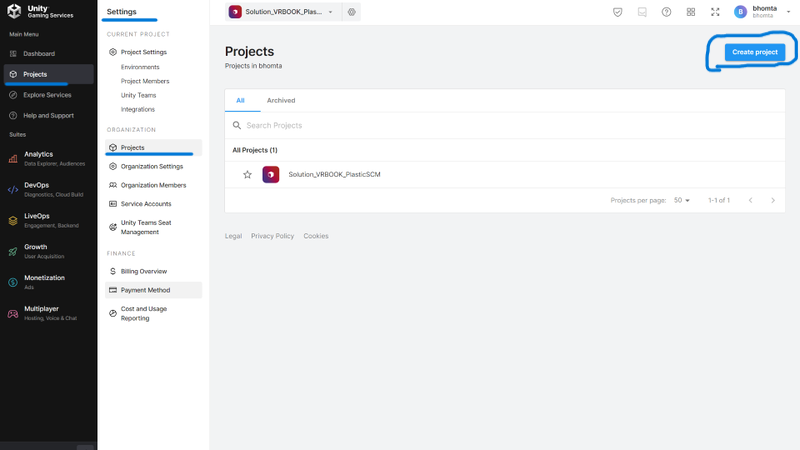

---

- 프로젝트 이름 입력, 질문에 대한 답변은 'NO' 입력 후,
 'Create Projcet' 클릭

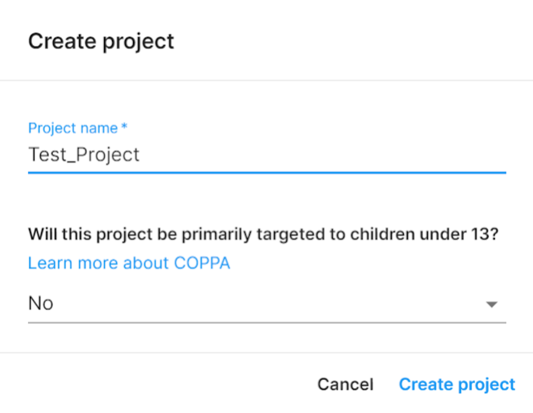

---

#### 3. Plastic SCM과 Unity 연결을 위한 결제(무료체험)
 

- 생성 완료 후, 왼쪽 메뉴바에 'DevOps'를 클릭하여 이동
https://dashboard.unity3d.com/organizations/14568800501890/plastic-scm/about

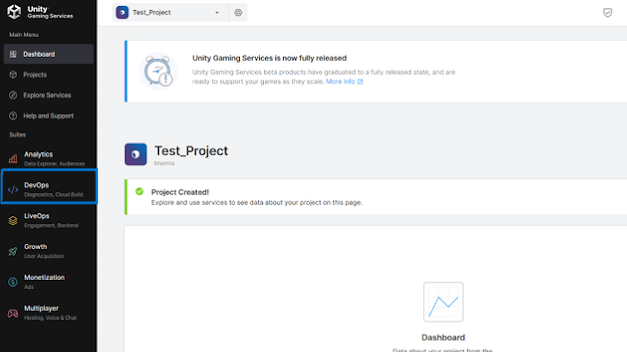

---

- 'DevOps' - 'Plastic Scm Cloud Edition' - 'Overview'로 이동 후 'Try for free' 클릭- 

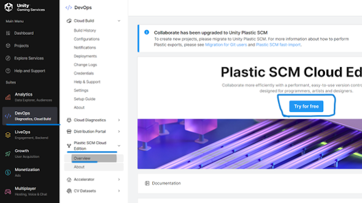

---

- Continue to purchase → Next Step

	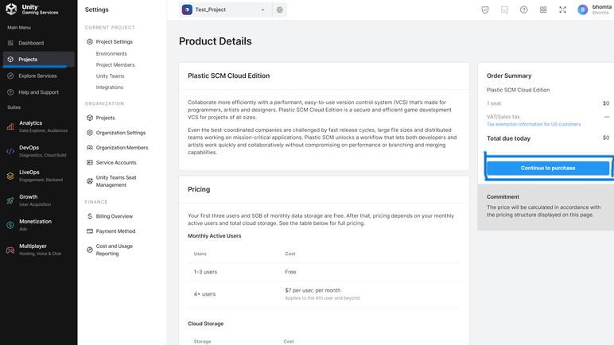

---

- 원하는 조직(Organization) 선택 후 Proceed to payment 클릭.

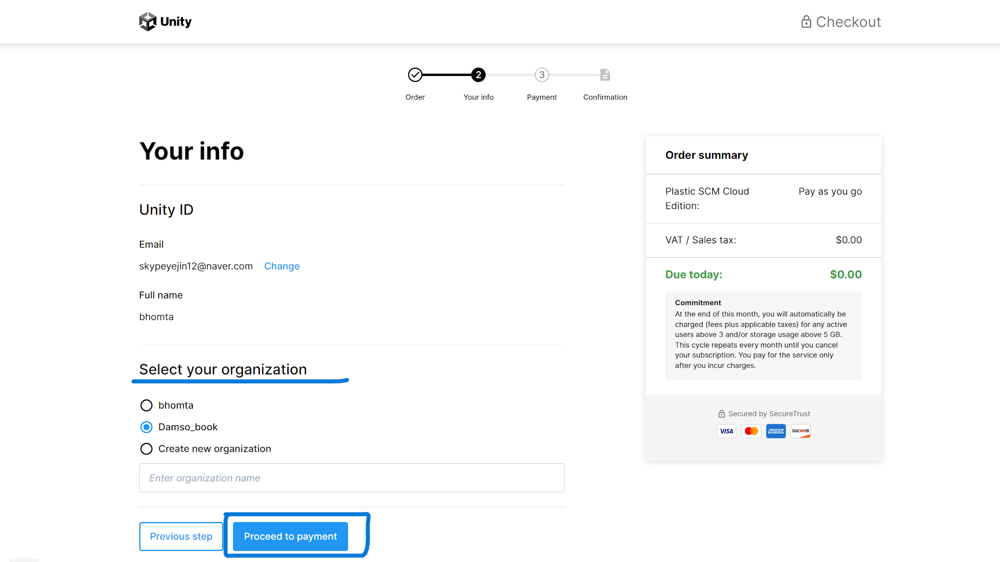

---

- 해당되는 카드 정보 입력 후 Place Order 클릭 후 결제 완료.

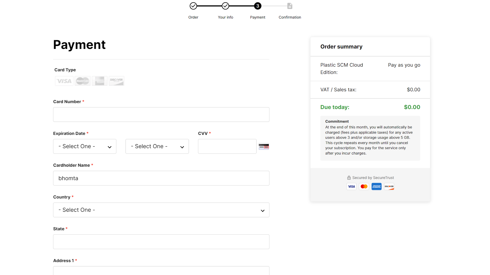

---

#### 4. Plastic SCM 활성화 

- 조직이름, Datacenter은 Asia Northeast - Japan 입력 Create하여 Plastic Cloud 생성하기.

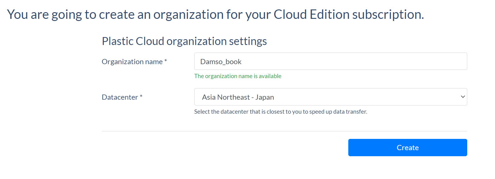

---

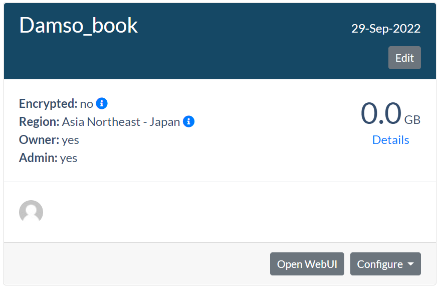

---

#### 5. 유니티 연결

- window - Plastic SCM 하여 관리창 열기 또는 Plastic SCM아이콘 클릭
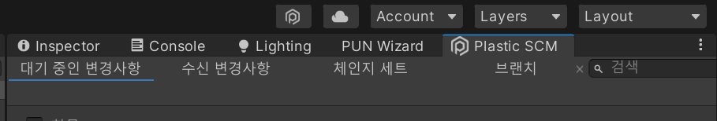

---

- 이미 조직에 속해 있는 경우, 
드롭다운해서 조직 선택 후 확인 클릭.

- ※ 없을 경우, 새로운 레파지토리 / 워크스페이스 생성

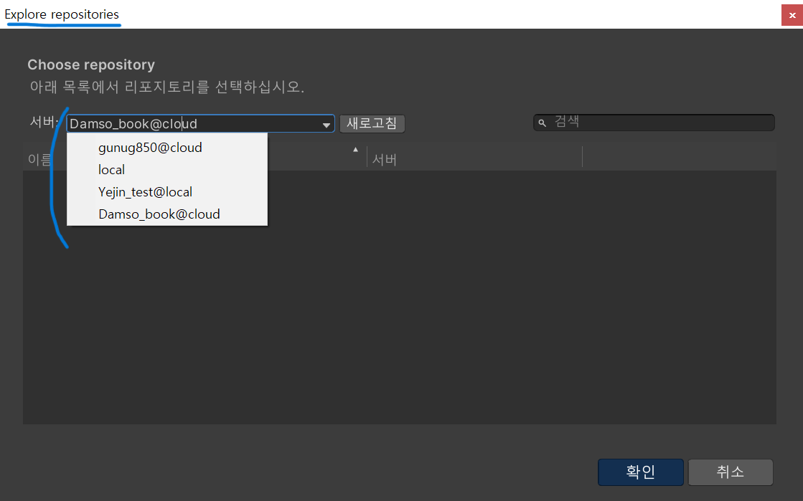

---