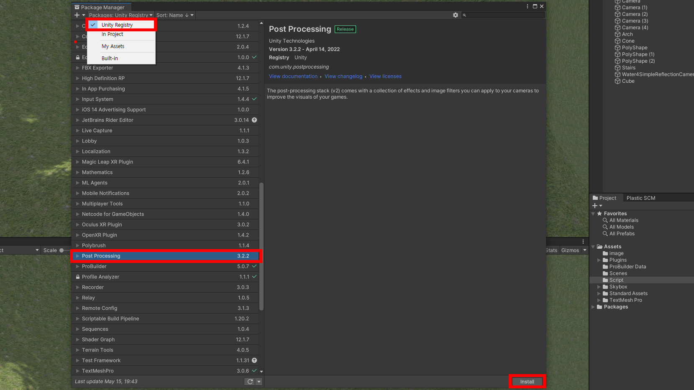
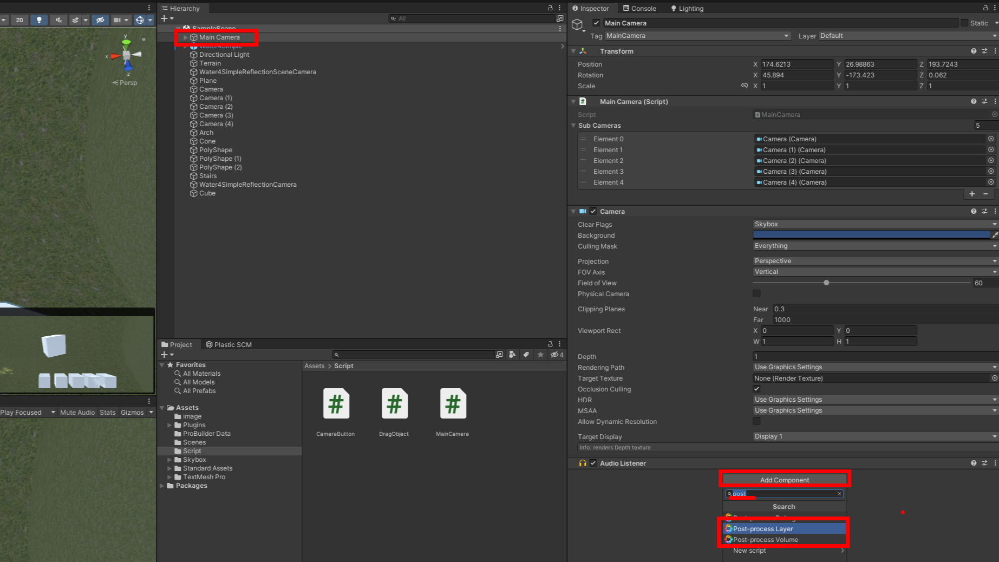
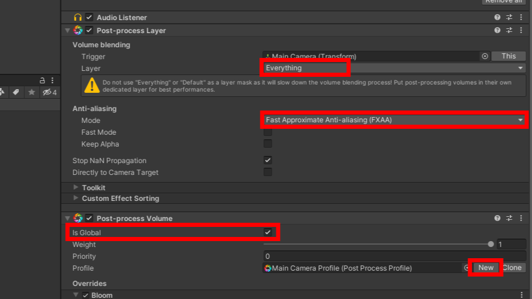
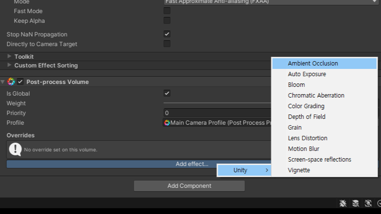

# post processsing

---

- Menu | Window > package manager
- Packages:Unity Registry > post processing
- instrall 선택하여 포스트 프로세싱을 설치

---

- MainCamera 선택
- Inspector의 Add Component 선택
- post로 검색하여 post-processing layer와 post-processing volume 컴퍼넌트 추가

---

# post-process layer
- Layer :  Everything
- Anti-aliasing : Fast Approcimate Anti-aliasing (FXAA)
# post-process volume
- is Global : check
- Profile : New 선택하여 새로운 Post Process Profile 생성

---

- post-process volume 컴퍼넌트 Add effect... 클릭하여 이펙트 추가가능

---

- 메뉴얼 한글 : https://docs.unity3d.com/kr/2019.4/Manual/BestPracticeMakingBelievableVisuals8.html#ao

---

- Antialiasing
- - fast appriximate Anti-aliasing 빠르고 품질 낮음
- - Temporal Anti-aliasing 느리고 품질 좋음
- Ambient Occlusion : 그림자와 음영의 강도조절
- Auto Exposure : 자동노출
- Screen Space Reflection : 반사체의 경우에 사물을 반사함 (높은 metallic과 smoothness를 갖은 material)
- Depth of field : 아웃포커싱 기능
- - focus distance : 포커스가 맞는 위치
- - aperture : 포커스 시작지점
- - focal length : 포커스 끝지점

---

- MotionBlur : 이동하는 사물의 블러기능
- Eye adaptation - Vignette : 눈 조리개 역활을 하여 실제 눈으로 보는거 같은 연출
- Bloom : 빛을 더욱 화사하게
- - intensity : 0.5
- - Threshold(Gamma) : 1.4
- - Soft Knee : 0.5
- - Radius : 2.6
- - Anti Flicker 채크 / 카메라가 움직일때 번쩍임을 막아줌

---

- Color Grading : 컨트라스트, 휴 등을 조정할 수 있음
- - tonemapper : flimic(ACES)
- - pointExposure(EV) 0.4
- User Lut : 텍스쳐를 입혀서 화면 왜곡
- Chromatic aberration : 주목선 같은 효과
- Grain : 아날로그 인쇄물이나 실제 촬영시 생기는 노이즈를 추가
- Vignette : 테두리 음영 표현
- dithering

---

