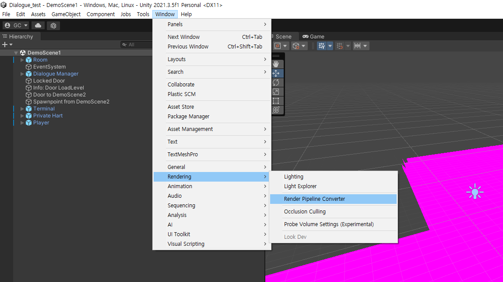

test
# URP upgrade

---

* URP 12 이하 (예 2020.3.37f1)

```Edit > Render Pipeline > Universial Render Pipeline > Upgrade project meterial to UniversalRP meterial```


---

* URP12 이상 (예 2021.3.5f1)

```Window > Rendering > Render Pipeline Converter```
* 모두 체크하고 ```initialize Converters```
* ```Convert Assets```

