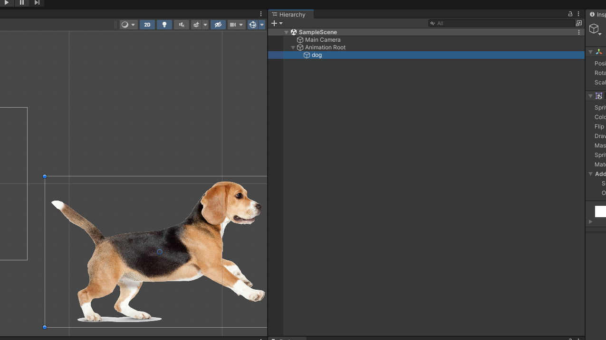
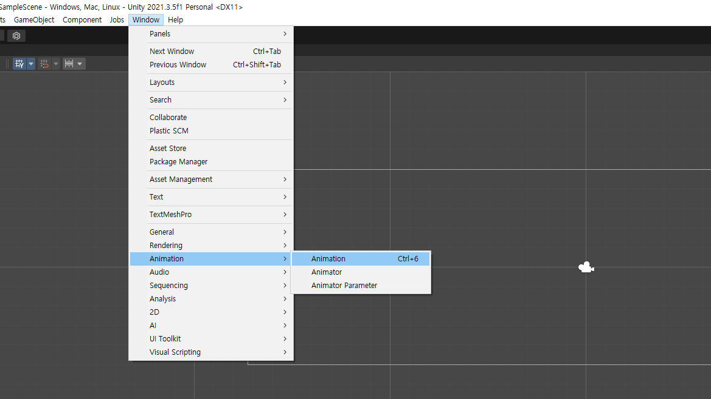
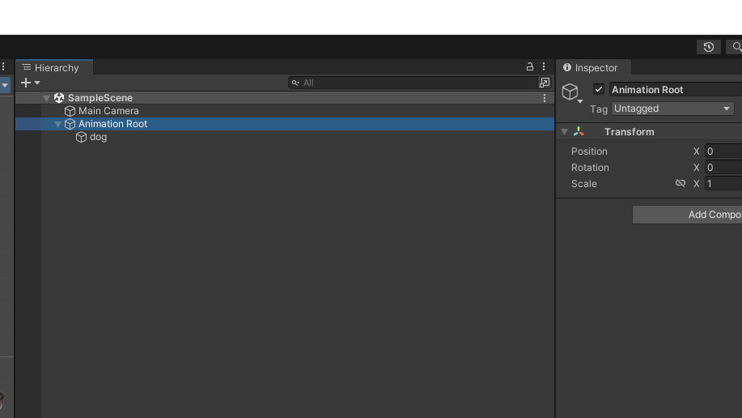
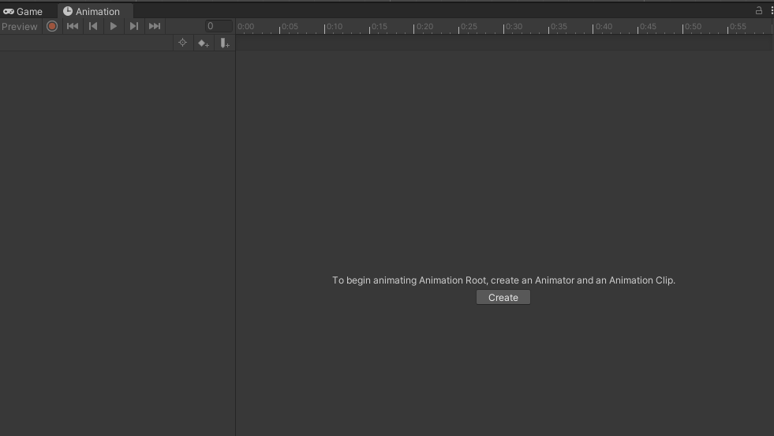
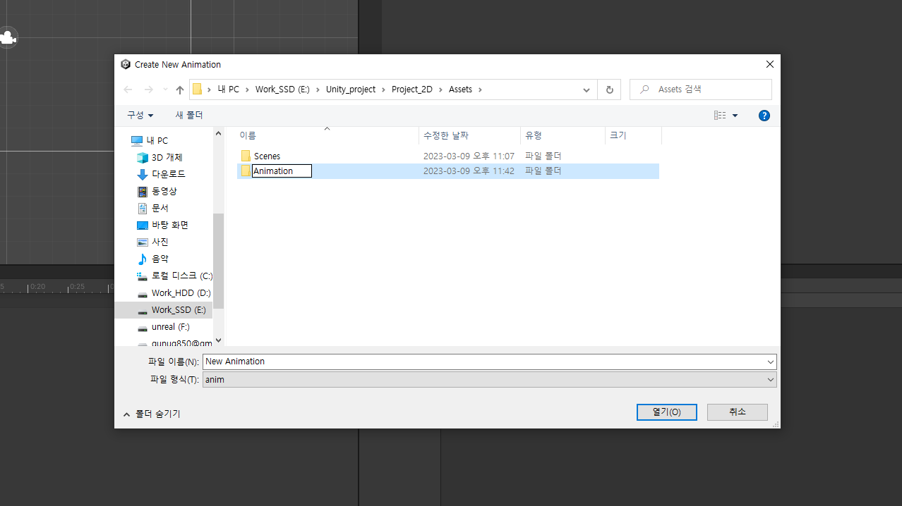
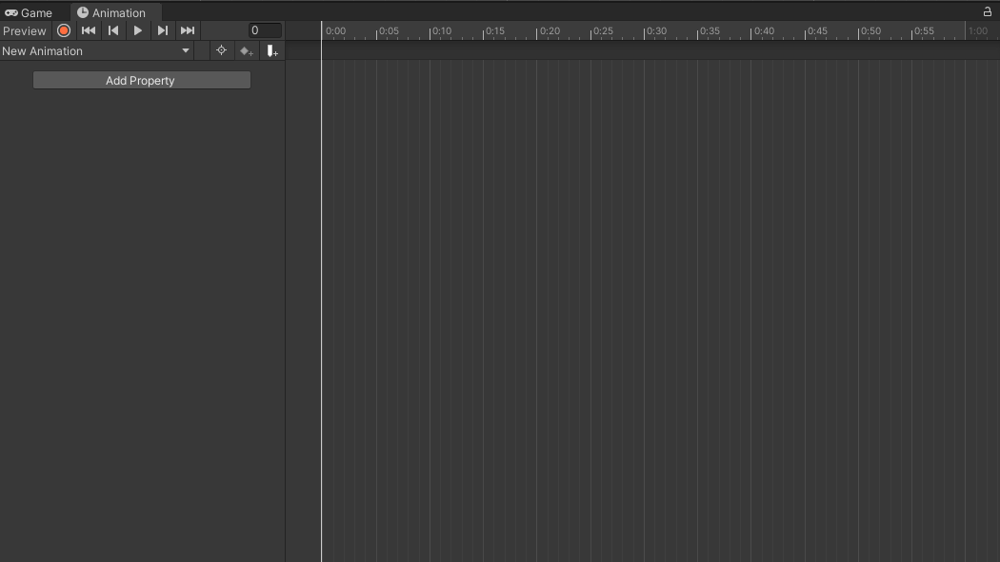
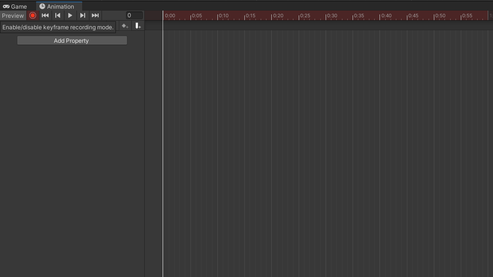
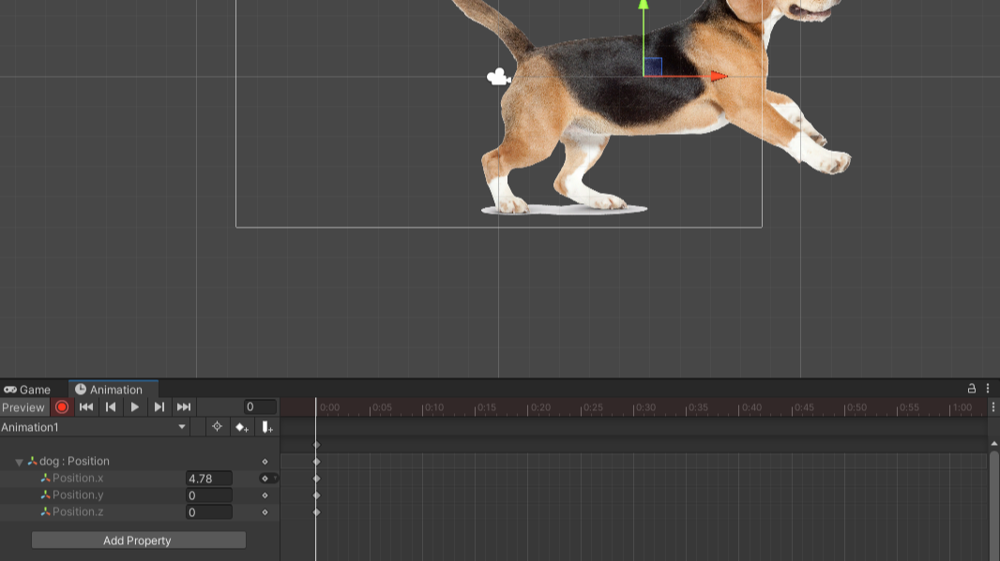
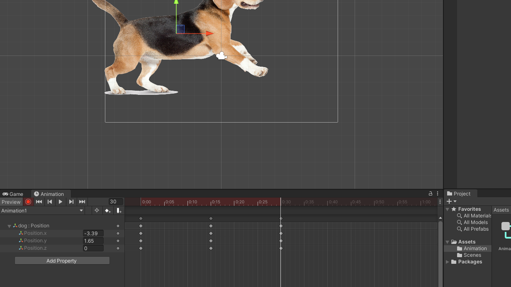
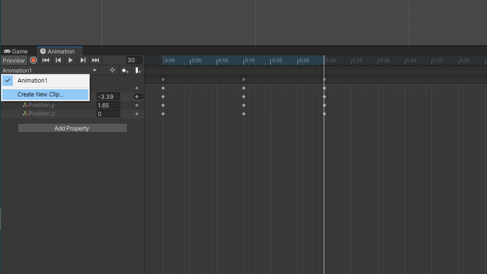

# 2D Animation

---

# Empty Game Object 만들기
- GameObject는 유니티내의 최소 기본단위
- 빈 게임오브젝트 (Empty Game Object)는 빈 폴더와 같은 역할
- Hierarchy창 마우스 우클릭 ```creat empty```


---

- 빈 게임오브젝트의 이름을 ```Animation Root```로 변경
- Sprite명(예시의 경우는 Dog)을 드래그 드랍하여 Animation Root 안에 집어 넣기 (폴더안에 파일 넣는것과 동일)


---

# Animation 창 열기
- Menu | Window > Animation > Animation

- Animation창의 이름부분을 드래그하여 Game창 옆에 두고 탭이동하여 사용

---

# Animation 만들기
- 주의! ```Animation Root```가 선택되어 있는지 있는지 꼭 확인


---

- Animation 창의 ```Create``` 클릭


---

- Create를 클릭하자마자 뜨는 위치에 Animation 폴더를 만들고 그 안에 들어가서
- 파일의 이름은 ```Aniamtion1```로 입력한다음 ```저장```


---

- Animation1 파일이 생성되고 나면 Animation 창에 편집할수 있는 타임라인이 나타남


---

- 상단의 녹화버튼(빨간동그라미)를 누르면 녹화가 시작됨
- 토글버튼으로 클릭 할때마다 on, off 상태가 바뀜



---

- 녹화상태에서 객체를 이동, 회전, 크기조절, 색상조절 등을 하게 되면 타임라인(time line)에 키프레임(key frame이 생김
- frame: 동영상을 연속적인 정지 이미지의 집합이라 보았을때 한장의 이미지에 해당
- time line: 동영상의 내용이 시간에 따라 어떻게 변화하는지 기록하는 곳
- key frame: 프레임 중에서도 상태가 기록되어 있어 중요한 역할(key의 역할)을 하는 프레임


---

- Animation 창의 time line(시간이 표시된곳)을 클릭하여 시간을 변경 -> 캐릭터의 상태를 변경
- 같은 방식으로 계속 애니메이션을 만들어 나갈 수 있음

- 타임라인의 끝에 도달하여 더 긴 애니메이션을 만들지 못할때, ```Ctrl + 마우스 휠```로 타임라인의 스케일을 조정할 수 있음

---

# Animation 추가하기
- Animation을 여러개 만들어 여러가지 애니메이션을 적용 가능
- Animation | 애니메이션 이름 > Create New Clip

- 새 애니메이션이 만들어지면 애니메이션 이름을 클릭하여 전환할 수 있음