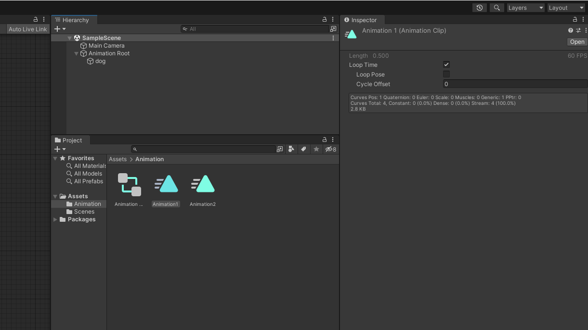

# 2D Animator

---

# Animator 창 열기
- Menu | Window > Animation > Animator

- 애니메이터는 애니메이션들을 모아서 디렉팅 하는 역할을 함
- 각각 떨어져 있는 애니메이션을 순차로 재생하거나 재생 순서를 바꾸는 것이 가능

---

# Animator에 Animation 추가
- Project창에서 Animation(날아가는 삼각형 아이콘)을 드래그 드랍으로 Animator에 추가 가능


---

# Animator에서 Animation 삭제
- 삭제할 Animation을 선택후 키보드의 Delete 키를 누르거나 (맥은 Shift + back space)
- 마우스 우클릭하여 ```delete``` 선택


---

# Animation간에 Transition 만들기
- 마우스 우클릭하여 ```Make Transition``` 선택
- 마우스에 따라다니는 화살표를 다른 Animation을 클릭하여 연결

- 우클릭을 했는데 Make Trasition이 보이지 않을때 : 여러 애니메이션을 복수선택(드래그)한 후 우클릭 하면 나타남 (Unity 버그)

---

# Animation간에 Transition 삭제하기
- Trasition을 마우스로 클릭하여 선택 (파랗게 표시됨)
- 키보드의 Delete 키 (맥은 Shift + back space)


---

- transition을 선택하고 inspector | transitions > - 버튼을 클릭하여 삭제 할 수도 있음


---

# Parameters (매개변수)
- parameters : 어떤 일을 하는데 있어서 요인이 되는 변수
- Animator | Parameters > + > Int를 선택하여 새 Int(정수)타입의 parameter를 생성합니다.
- parameter의 이름을 'motion'으로 변경합니다.


---

# Conditions (상황)
- Conditions : 특정 상황을 판단하고 행동하는 방식
- Animator | transition(animation1에서 animation2로 향하는 화살표가 그려진 선) 선택
- Inspector | Conditions > + 를 눌러서 condition 추가
- motion Equals 1로 설정


---
- Animator | transition(animation2에서 animation1로 향하는 화살표가 그려진 선) 선택
- Inspector | Conditions > + 를 눌러서 condition 추가
- motion Equals 2로 설정


---

# Animation의 looptime 해제
- Project창에서 Animation(삼각형이 이동하는 아이콘)선택
- Inspector | Loop Time > 체크해제
- 모든 Animation을 같은 방식으로 선택하여 체크해제


---

# Has Exit Time 해제
- Animator | transition(animation1에서 animation2로 향하는 화살표가 그려진 선) 선택
- Inspector | Has Exit Time > 체크해제
- Animator | transition(animation2에서 animation1로 향하는 화살표가 그려진 선) 선택
- Inspector | Has Exit Time > 체크해제
