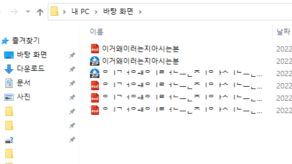
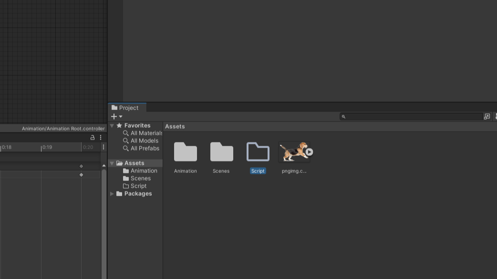
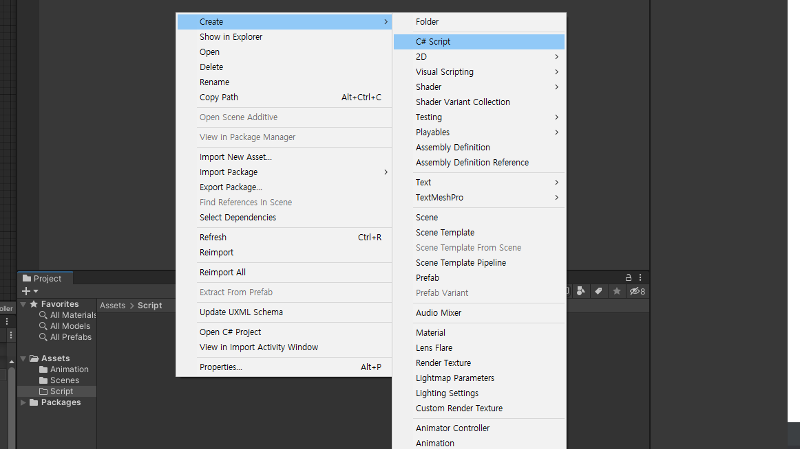
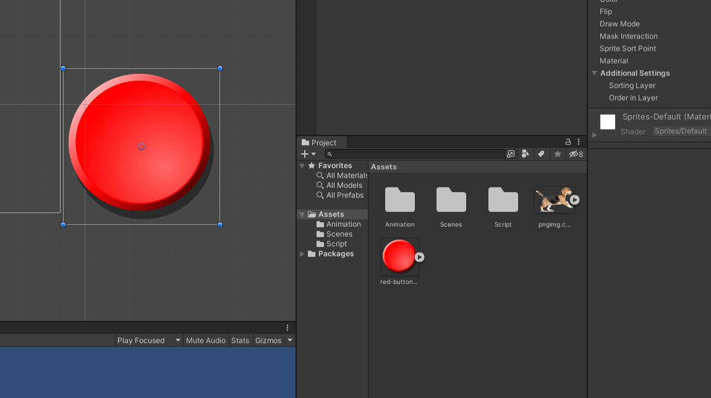
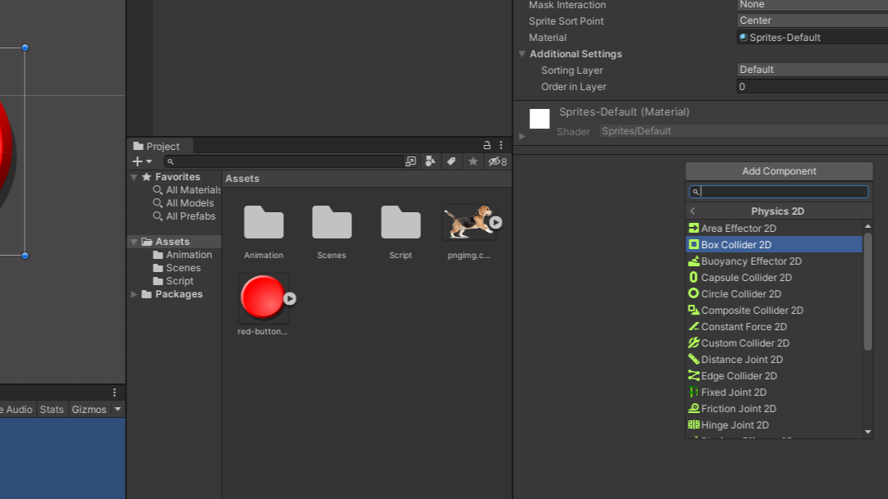
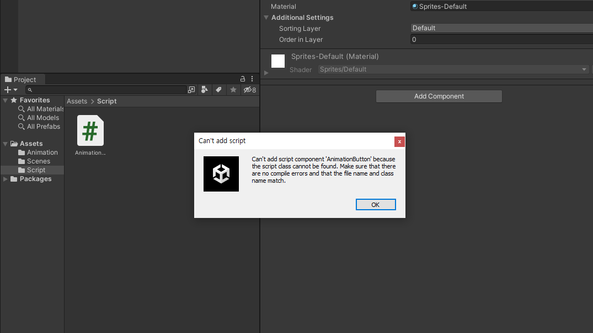
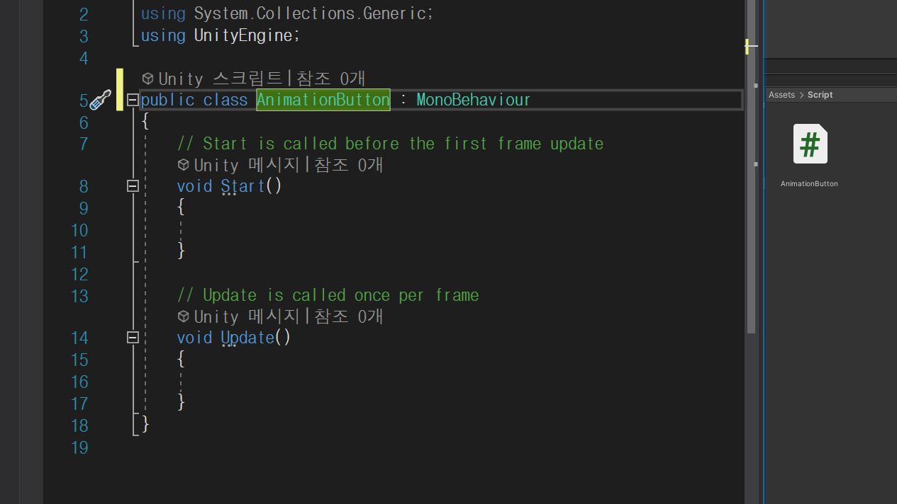

# C# script

---

# 파일명, 폴더명, C# script 금지사항

- 한글 사용
- 숫자로 시작
- 특수문자(/\,."'*) 사용
- 띄어쓰기 사용

---

# C# 스크립트용 폴더 생성

- Project | Assets 를 클릭하여 폴더 안으로 이동
- 빈공간 마우스 우클릭 Create > Folder 선택하여 폴더 생성
- 이름을 Script로 지정하여 이곳에 C# script를 모음

---

# C# 스크립트 생성

- Script 폴더 더블클릭하여 안으로 이동
- 빈공간 마우스 우클릭 Creast > C# Script 선택하여 스크립트 생성
- 스크립트 이름을 'AnimationButton'으로 지정

---

# 눌리는 버튼 만들기

- 버튼이 될 이미지를 Scene에 드래그 드랍

---

# 충돌체 컴퍼넌트 붙이기

- 버튼 이미지를 선택후 inspector창에서 Add component 선택
- Physics 2D > Box Collider 2D 선택하여 박스콜라이더2D 컴퍼넌트 추가
- 컴퍼넌트는 객체에 추가되어 특정 기능을 수행
- Box Collider(박스형 충돌체): 충돌체는 마우스와의 충돌, 다른 객체와의 충돌을 감지함

---

# 스크립트 컴퍼넌트 붙이기
- 버튼 이미지를 선택후 inspector창에서 Add component 선택
- 'AnimationButton'스크립트를 검색하여 선택

---

# 스크립트가 검색되지 않음, 경고창

- 스크립트 파일명과 스크립트 내부에 작성된 클래스명이 일치하지 않는경우

---

- 스크립트 파일명과 스크립트 내부에 클래스명(녹색부분)을 일치시켜 준다

---

# 스크립트 내용 작성
```C#
void OnMouseDown() //마우스 왼쪽클릭
{
    Debug.Log("mouse down!");
}
void OnMouseUp() //마우스 왼쪽클릭 해제
{
    Debog.log("mouse up!");
}
void OnMouseEnter() //마우스 올리기
{
    Debug.Log("mouse enter!");
}
void OnMouseExit() //마우스 내리기
{
    Debug.Log("mouse exit!");
}
```

---

# 접근제어자 (Access Modifier)

- public : 공공의 모든곳에서 접근 가능
- private : 개인의 자신만 접근 가능
- protected : 동일 패키지내의 클래스 또는 해당 클래스를 상속받은 외부 패키지의 클래스에서 접근이 가능

```
public int A = 10; //모든곳에서 접근 가능한 A라는 이름의 변수에 10이라는 숫자가 들어있습니다.
```

---

# 값 (value)
- 리터럴(Literal) : 값 그자체
- 필드(Field) : 클래스 또는 구조체에서 직접 선언되는 모든 형식의 변수. 값이 저장되는곳, 필드는 변수와 상수로 나눌 수 있다.
- 변수(var : variable) : 변하는 값
- 상수(const : constant) : 변하지 않는 값

---

# 객체 (Object)에 접근하기
- public 변수를 생성하여 객체를 inspector에 직접 드래그 드롭으로 지정
- GameObject.FindGameObjectsWithTag("태그명") : 해당 태그명을 가지고 있는 모든 오브젝트를 찾음. GameObject[] 형식
- GameObject.FindWithTag("태그명") : 해당 태그명을 가지고 있는 오브젝트 1개
- GameObject.Find("오브젝트명") : 해당 오브젝트 이름을 가지고 있는 오브젝트 1개

---

# Animator의 참조를 받고 버튼 기능 수행하기
```C#
   public Animator target_animator;

   void Start () {
       GameObject target_object = GameObject.Find("Animation Root"); //객체 이름으로 대상을 찾을 수 있음
       target_animator = target_object.GetComponent<Animator>(); //대상에 붙어있는 컴퍼넌트 Animation을 가져옴
   }	
   void OnMouseOver() //마우스를 버튼 위에 올리면
   {
       Debug.Log("mouse down! on button1");
       target_animator.SetInteger("motion", 1); //Animator의 motion 값을 1로 변경
   }
   void OnMouseOut() //마우스를 버튼 위에서 내리면
   {
       Debug.Log("mouse down! on button1");
       target_animator.SetInteger("motion", 2); //Animator의 motion 값을 2로 변경
   }
```
---

- 참고용 영상 : 오래전 제작된 영상입니다. 수업내용과 상이한 점이 많습니다. 문서만으로 내용이 어려울때 참고만 하세요.
<iframe width="560" height="315" src="https://www.youtube.com/embed/cTArD1n53Qg" title="YouTube video player" frameborder="0" allow="accelerometer; autoplay; clipboard-write; encrypted-media; gyroscope; picture-in-picture; web-share" allowfullscreen></iframe>