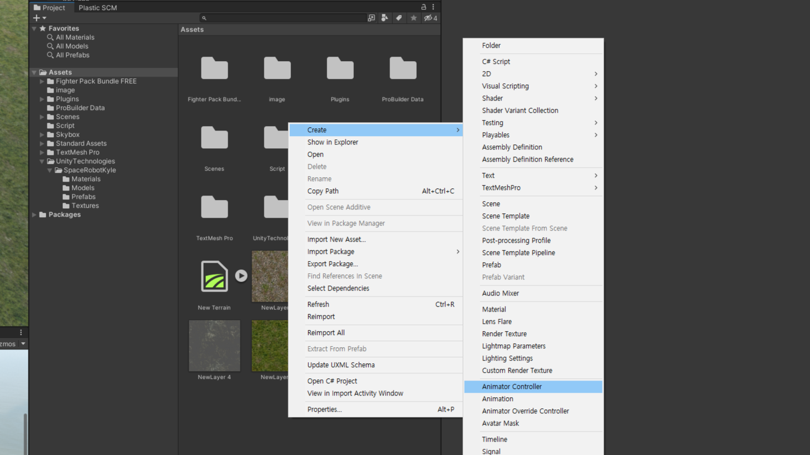
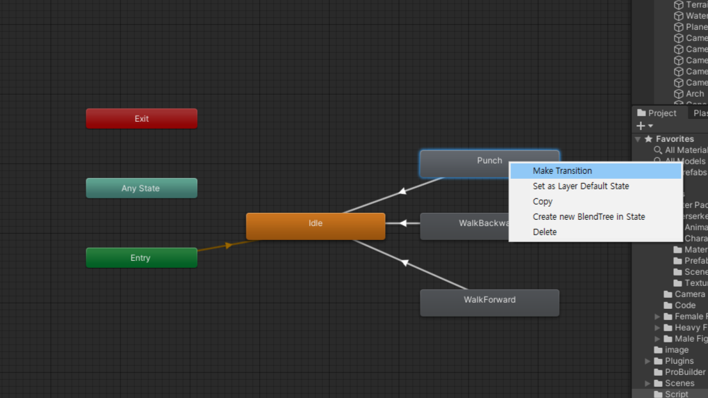

# 3D 휴머노이드 애니메이션

---

# Space robot kyle

- https://assetstore.unity.com/packages/3d/characters/robots/space-robot-kyle-urp-4696
- Asset store에서 Unity에서 열기 import하여 Project에 들여오기

---

# material error

- Unity Technologies / SpaceRobotKyle / Materials / Robot_Color 선택
- Inspector창 Shader 선택
- Standard로 변경

---

# rigging setting

- Unity Technologies / SpaceRobotKyle / Models / Robot Kyle 선택
- Inspector > Rig > Animation Type : Humanoid 선택
- Avatar Defination : Create From This Model 선택
- Configure 선택

---

# rigging test

- Mappings에 모두 초록색인지 확인 (붉은색이 있으면 리깅 실패)
- Muscles & Steeings에서 슬라이더를 이용해서 리깅 테스트
- Done을 눌러서 빠져나오기

---

# scene으로 올리기

- Unity Technologies / SpaceRobotKyle / Prefabs / Robot Kyle 선택
- 드래그하여 Scene 창으로 이동

---

# Animator 만들기

- Projector창 빈공간 마우스 우클릭
- Create > Animator Controller 생성
- 'robot_kyle_animator'로 이름변경

---

# Animator 적용하기

- Hirarchy 창 Robot kyle 선택
- Inspector 창 Controller에 새로만든 Animator 드래그 드랍

---

# Fight pack bundle free

https://assetstore.unity.com/packages/3d/animations/fighter-pack-bundle-free-36286
- Asset store에서 Unity에서 열기 import하여 Project에 들여오기

---

# Animator 창 열기

- Menu | Window > Animation > Animator 선택하여 애니메이터 창 열기

---

# Animation 등록하기

- Project | Fighter Pack Bundle FREE / Berserkder Fighter Me... / Animations 선택
- 안에 있는 animation들을 각각 드래그하여 animator 창으로 이동

---

# Script 작성
- AnimatorControl.cs 파일을 생성하여 작성
```C#
using System.Collections;
using System.Collections.Generic;
using UnityEngine;

public class AnimatorControl : MonoBehaviour
{
    private Animator target_animator;
    private void Start()
    {
        target_animator = GetComponent<Animator>();
    }
    void Update()
    {
        if (Input.GetKeyDown(KeyCode.Q))
        {
            Debug.Log("Q");
            target_animator.Play("Punch");
        }
        if (Input.GetKeyDown(KeyCode.W))
        {
            Debug.Log("W");
            target_animator.Play("WalkBackward");
        }
        if (Input.GetKeyDown(KeyCode.E))
        {
            Debug.Log("E");
            target_animator.Play("WalkForward");
        }
    }
}
```

---

# Animator 세팅

- Animator 창에서 애니메이션에서 마우스 우클릭 Make Transition
- idle로 돌아올 수 있도록 선을 연결