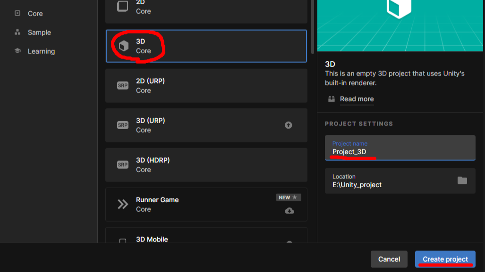

# 3D Project 만들기

---

- Unity Hub > projects > New Project
- 프로젝트명은 Project_3D
- Create project를 눌러서 프로젝트 생성

---

# 3D 화면 이동하기
- Alt + left mouse : 화면의 가운데를 기준으로 회전
- Alt + middle mouse : 화면을 상하좌우로 이동
- Alt + right mouse : 화면의 확대/축소
- right mouse + q,w,e,a,s,d : 공간이동 (FPS 스타일)
- +shift : 이동속도가 빨라짐

---

# 객체 끌어오기, 이동하기
- Ctrl + Alt + F : 현재 보고 있는 화면의 중앙으로 객체가 이동
- 객체 선택 후 F : 객체가 한가운데에 오도록 화면이 이동

---

# 카메라 이동하기
- GameObject > align with view : 현재 보고 있는 위치로 카메라를 이동
- GameObject > align view to selected : 현재 선택되어 있는 위치로 눈(view)을 이동