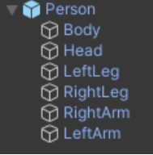
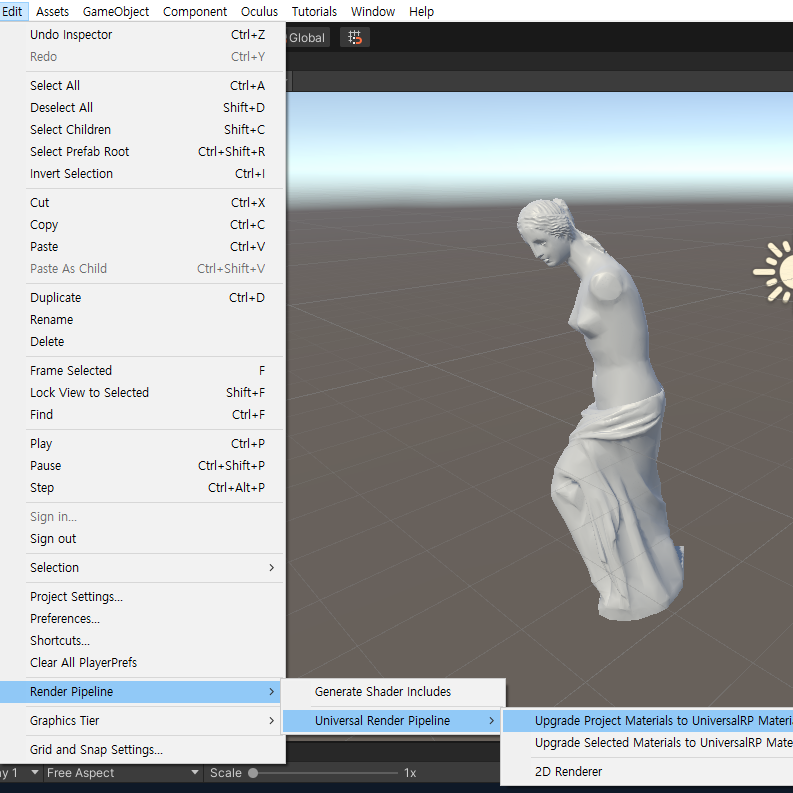
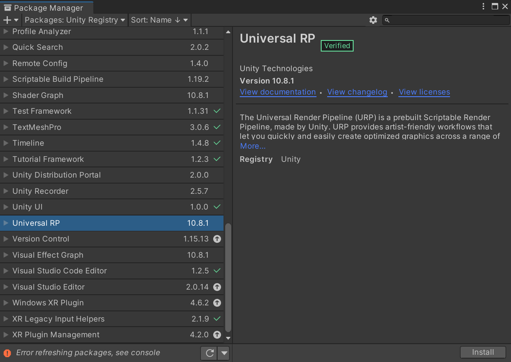
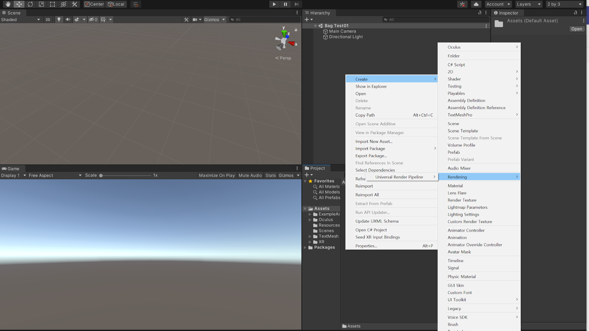
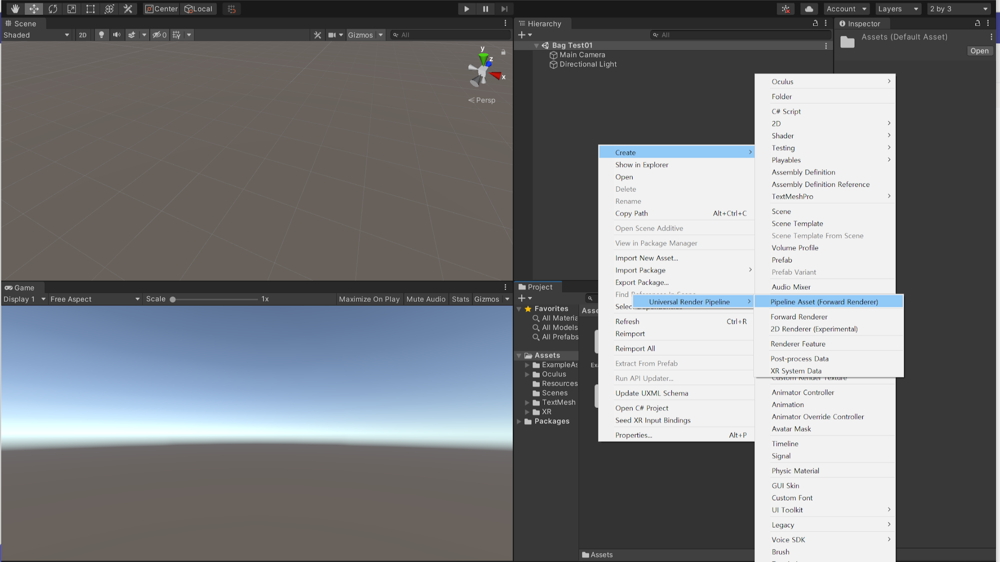
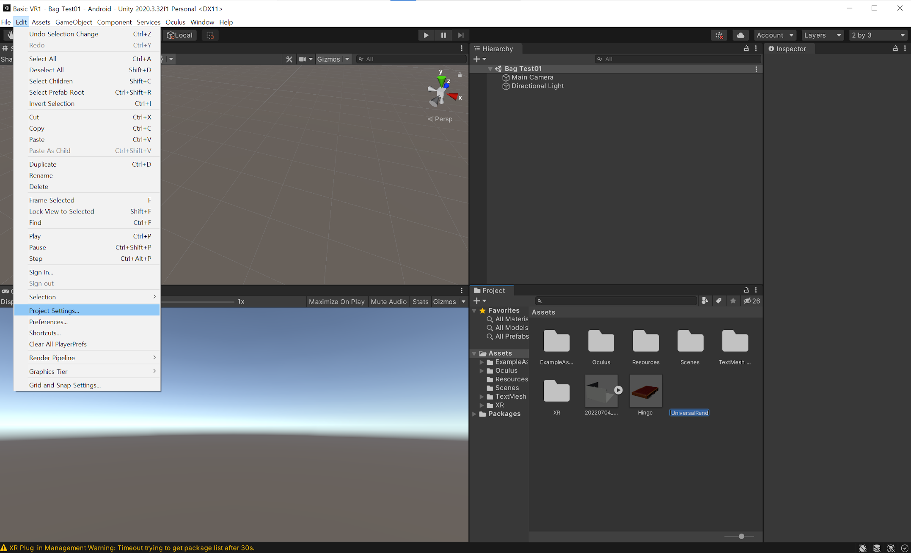
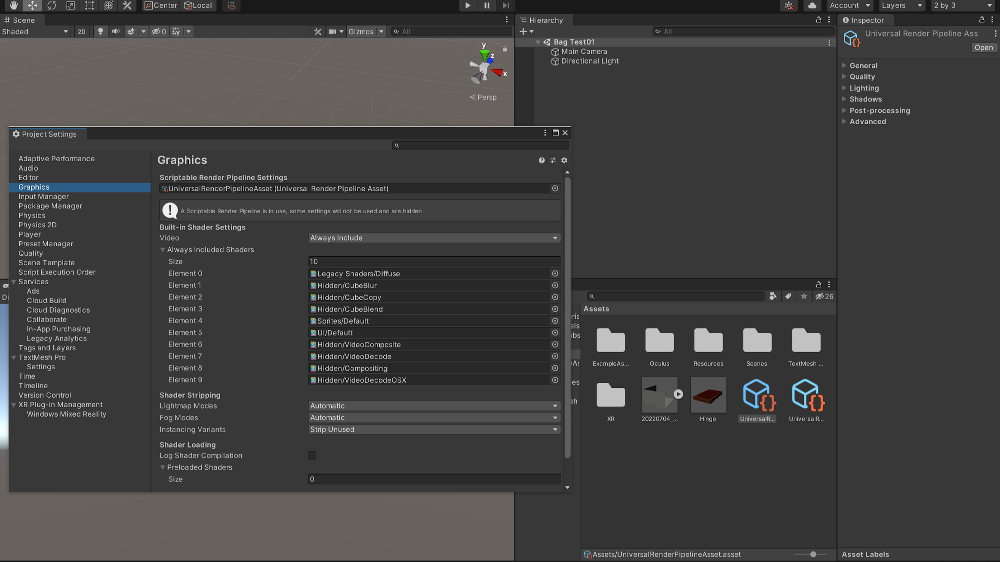

# 프로그램 다운로드

### 1.1 유니티 설치. _(첫화면-유니티 허브)_

1.1.1 유니티 로그인. 페이스북 
1.1.2) 유니티 학생 라이센스로 다운받기
###### 학생 라이센스 링크: https://unity.com/kr/products/unity-student
※ 학생증이 없어도 로그인 후 유니티 허브에서 오픈 가능.

######  버전: 2020.3.37f1 다운로드

---

### Prefab으로 만드는 법?

Hierarchy창에 있는 Person Object를 Prefab으로 저장해 두고 싶은 폴더에 drag&drop 해줍니다.

--> Object 아이콘 색상이 하늘색으로 하이라이팅 됩니다.



---

## 5. URP



https://rainyrizzle.github.io/kr/AdvancedManual/AD_URP.html
<br> 
https://docs.unity3d.com/Packages/com.unity.render-pipelines.universal@7.1/manual/upgrading-your-shaders.html

---

## 13. 유니티 총알 충돌 폭발 이펙트

- Unity 2D [Tag 사용] <br>
https://astoration.gitbooks.io/sihs-shootinggame/content/8c77c_cc28_-_cd1d_c54c_c5d0_b9de_c73c_ba74_d3ed_bc.html
https://malbongcode.tistory.com/25 <br><br>
 
- Unity 3D [Tag 사용] <br>
https://koreanfoodie.me/632
-Unity 3D [Raycast 충돌 감지]
https://ansohxxn.github.io/unity%20lesson%203/ch2-3/

---

- Raycast 관련 구체적인 설명
https://kukuta.tistory.com/391
 
- Raycast 쉬운 설명
https://novlog.tistory.com/55
 
- Raycast를 활용한 총알 피격 감지
https://onecoke.tistory.com/entry/%EC%B4%9D%EC%95%8C-%ED%94%BC%EA%B2%A9-%ED%8C%8C%ED%8B%B0%ED%81%B4-%EB%B0%9C%EC%83%9D%EC%8B%9C%ED%82%A4%EA%B8%B0-Raycast-RaycastHit

- 폭발 효과 최적화 참고 링크
https://wergia.tistory.com/203

---


```C#
Console.WriteLine("글"); //C# 기본제공 로그방법
Debug.Log("글"); //Unity3d에서 console에 출력되는 로그방법
```

---

* https://learn.unity.com/tutorial/creating-ui-buttons?language=en# 학습용
* https://docs.unity3d.com/Manual/render-pipelines.html 웹문서 학습용

---

### 1).Unity Universal RP 설치 및 Import

1. Package Manager에서 Import하기

window - Package Manager - Universal RP - Install - Import
※ 좌측상단에 Packages에서 Unity Registry 로 설정하기

---

### 2). Assets창에서 Rendering 설정

 


 ---

Asset창에서 우클릭 후 - Create - Rendering - universal Render Pipeline - Pipeline Asset (Forward Renderer)


---
### 3). Project Setting하기

Edit - Project Settings

---

  
  Edit - Project Settings - Graphics(좌측 메뉴바) - Universal Render Pipeline Ass → Scriptable Render Pipeline Settings(여기로 드래그하여 넣기) 
  (Universal Render Pipeline Ass가 안보일 경우 Assets창에서 검색하기(검색 후 제일 왼쪽에 있는 것으로 넣기)Scriptable Render Pipeline Settings은 상단에 위치하고 있음)
    
---

#### Universal RP 후 오브젝트가 핑크색으로 변할 경우
  
  Edit - Render Pipeline - Universal Render Pipeline - Upgrade Project Materails to UniversalRP Materials
클릭 후 안내창이 뜰 경우 - Proceed(진행)

---
# Scene 이동

[참고용 유튜브](https://www.youtube.com/watch?v=JCyJ26cIM0Y)
* DontDestroyOnLoad 관련부분
```` c#
    public static VrSceneManager Instance;
    // Start is called before the first frame update
    private void Awake()
    {​​​​
        Debug.Log(Instance);
        if(Instance != null)
        {​​​​​​​​​​​
            Destroy(Instance.gameObject);
        }​​​​​​​​​​​
        Instance = this;
        DontDestroyOnLoad(Instance.gameObject);
    }​​​​​​​​​​​​​​​​​​
 ````
asyncOperation.allowSceneActivation = false;로 설정되어 있으면.asyncOperation.progress가 0.9에서 멈춘다.

---