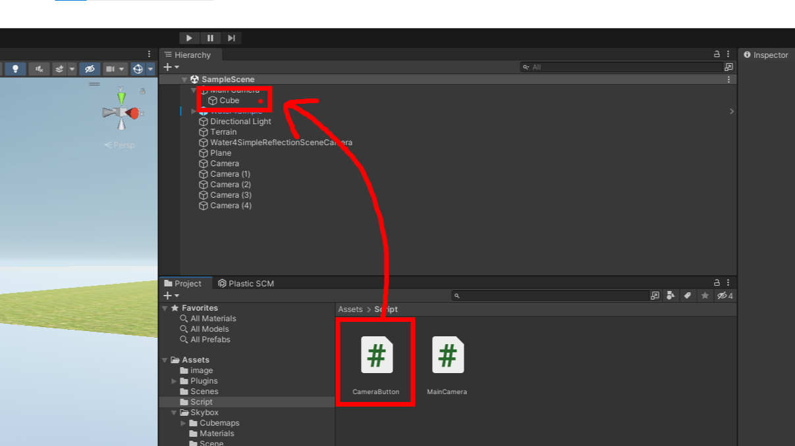

# 카메라 이동

---

# 카메라 생성

- Hierarchy창 마우스 우클릭
- Camera 선택하여 새 카메라 생성 (5번 반복하여 5개의 카메라 생성)

---

# 카메라 뎁스설정

- MainCamera 선택후 Inpector창에서 Camera > Depth를 1로 변경
- 다른 서브 카메라들은 기본값(0) 그대로 두기. MainCamera만 변경

---

# 카메라 배치

- Scene에서 위치이동 (마우스 오른쪽버튼 홀드, wasdqe키를 이용한 이동)
- 원하는 위치에서 Camera를 선택한다음
- Menu | GameObject > Align With View (시선에 맞추어 정렬하기) 선택
- 이 방식으로 5개의 카메라를 각각의 위치에 배치

---

# iTween 다운로드, 임포트

- [에셋스토어 링크 ](https://assetstore.unity.com/packages/tools/animation/itween-84)
- [사용 설명서 링크](http://www.pixelplacement.com/itween/documentation.php)
- https://assetstore.unity.com 에서 iTween을 검색하여 무료버전 다운 가능

---

# C# script 생성
- 새 C# script "MainCamera.cs"를 생성하고 다음을 입력
```C#
using System.Collections;
using System.Collections.Generic;
using UnityEngine;

public class MainCamera : MonoBehaviour
{
	public Camera[] subCameras; 
	//public Camera subCameras;
	public void MoveCamera(int index){
        //메인 카메라의 위치를 서브 카메라의 위치로 이동 시킨다.
        //1. 메인 카메라 위치 this.gameObject.transform.postion
        //2. 서브 카메라 위치 subCameras[숫자].gameObject.transform.position
        //메인 카메라 위치 = 서브 카메라 위치;
        //this.gameObject.transform.position = subCameras[index].gameObject.transform.position;
        //this.gameObject.transform.eulerAngles = subCameras[index].gameObject.transform.eulerAngles;
        //rotation. 오일러각, 쿼터니언
        iTween.MoveTo(this.gameObject, iTween.Hash("position", 
            subCameras[index].gameObject.transform.position, "easetype", 
            iTween.EaseType.easeOutBack, "time", 5.0f));

        iTween.RotateTo(this.gameObject, iTween.Hash("rotation", 
            subCameras[index].gameObject.transform.eulerAngles, "easetype", 
            iTween.EaseType.easeOutBack, "time", 5.0f));
	}
}
```
---

# 스크립트를 카메라에 등록

- 만들어진 Script를 MainCamera에 드래그 드랍으로 등록

---

# 스크립트에 카메라를 등록

- MainCamera 선택
- MainCamera 스크립트에 sub cameras에 숫자 5 입력
- 좌측의 세모 눌러보면 칸이 확장되고 camera를 넣을수 있음
- 5개의 카메라 모두 드래그 드랍으로 등록

---

# C# script 생성
- 새 C# script "CameraButton.cs"를 생성하고 다음을 입력
```C#
using System.Collections;
using System.Collections.Generic;
using UnityEngine;

public class CameraButton : MonoBehaviour
{
	public MainCamera target_camera;
	public int target_index = 0;
	void OnMouseDown(){
		Debug.Log("버튼 눌림");
		//MoveCamera(0); 호출
		target_camera.MoveCamera(target_index);
	}
 }
```

---

# 큐브 버튼 생성

- MainCamera 선택
- 마우스 우클릭 3D Object > Cube로 Cube 생성

---

# 큐브 배치

- 카메라의 촬영 방향에 맞추어 카메라의 촬영범위에 들어갈 수 있도록 큐브를 이동

---

# 큐브에 스크립트 등록

- 만들어진 CameraButton.cs를 큐브에 드래그 드랍으로 등록

---

# target camera 참조 할당

- Cube선택후 inspectort의 target camera에 MainCamera를 드래그 드랍

---

# 큐브 복제, target index 값 입력

- 복사(ctrl+c) 붙여넣기(ctrl+v)로 큐브를 복제
- target index가 각각 0,1,2,3,4가 될 수 있도록 입력

---

- 참고용 영상 : 오래전 제작된 영상입니다. 수업내용과 상이한 점이 많습니다. 문서만으로 내용이 어려울때 참고만 하세요.
<iframe width="560" height="315" src="https://www.youtube.com/embed/wKFDvj2ATRg" title="YouTube video player" frameborder="0" allow="accelerometer; autoplay; clipboard-write; encrypted-media; gyroscope; picture-in-picture; web-share" allowfullscreen></iframe>