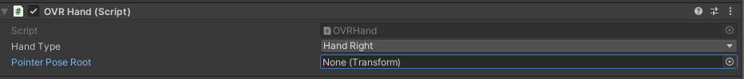
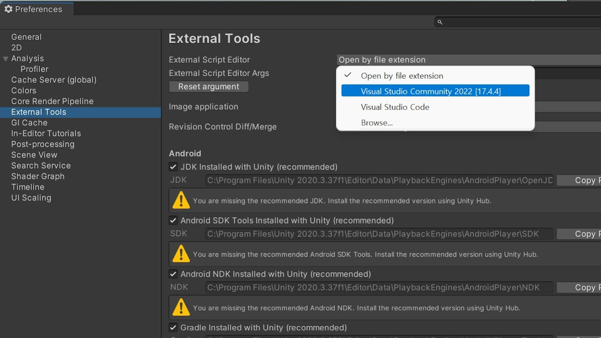
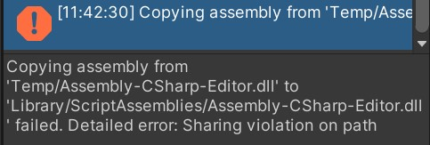
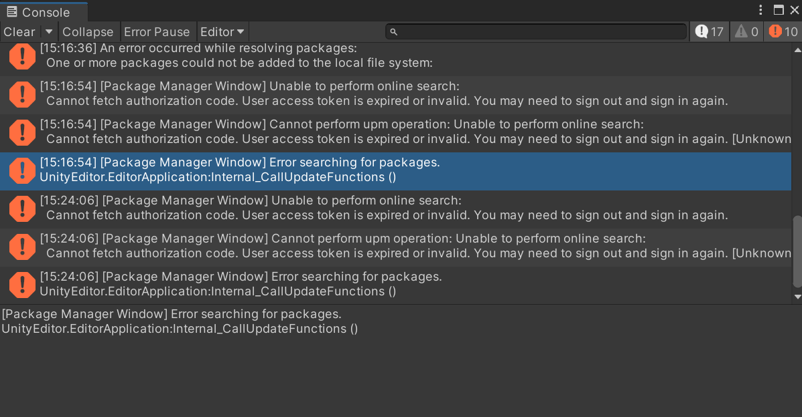

## 8. 유니티 오류모음   

- 씬 이동 시, DontDestroyed에 New gameobject 가 두 개 생겼을 때,

OVRHandprefab - OVR Hand - Pointer Pose Root가 None일 때 
→ Root안에 Transform 추가.

---

# Unity errors 모음

---
error_1

- ##### CS파일 오픈 오류- visualstudiocode상에서 열리는 경우.
###### 맨 위의 메뉴 [Edit] - preferences - External tools/ visalstudio 선택

---
error_2

해결방법: 유니티 껐다가 켜면 됨.

---

# Unity 오류 발생 시 해결방법 모음

---
#### Console에 해당 오류가 뜬 경우, 또는 Package Manager에서 정상적으로 Import하지 못할 경우
* Package Manager 에서 생긴 오류로 자주 생기는 문제임
 
* 해결방법 : Unity Hub에서 로그아웃 후 재로그인