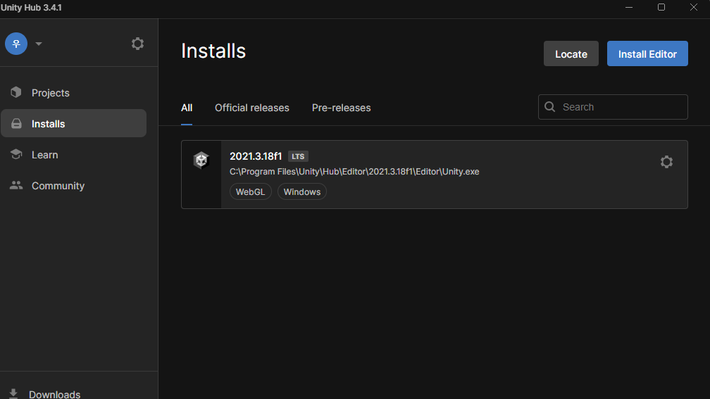
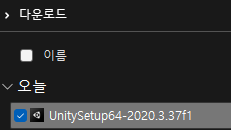
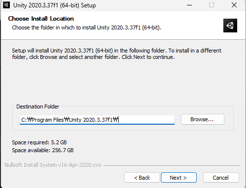
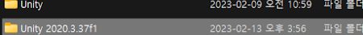
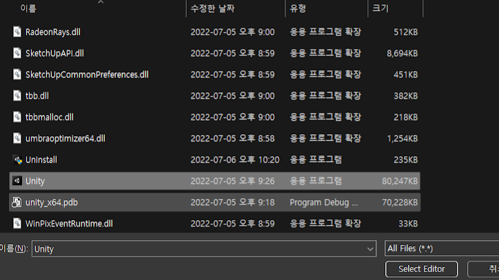
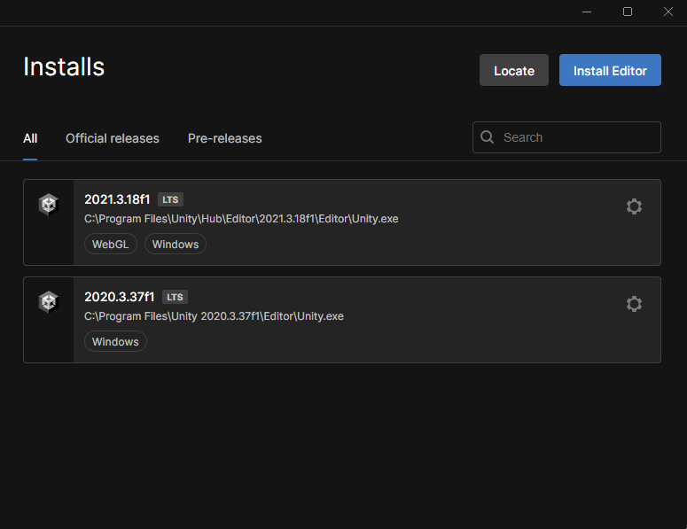

# Unity 특정 버전 설치
- 기본 Unity 설치에 문제가 있을 경우 참고
- 특정 버전을 설치해야 할때 참고

---

 
- Installs 탭

---

 
- installs Editor 클릭

---

- Archive > Long-Term Support

---

- 웹 페이지에서 버전을 선택

---

- Unity Editor Windows 를 클릭
- Mac은 경우 아래로 내려가 Unity Editor Mac 사용

---

- 다운로드 받은 설치파일을 실행

---

- 설치중간에 Unity Editor의 설치위치를 알아둘 것

---

- 설치가 완료되면 Unity Hub의 install > Locate를 클릭

---

- 설치된 위치를 찾고

---

- Unity실행파일을 선택하고  select Editor 를 클릭

---

- 설치가 완료되고 Unity hub에도 등록 완료