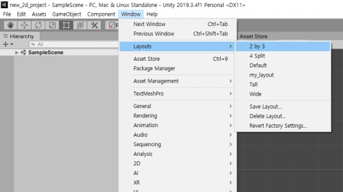
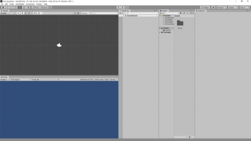
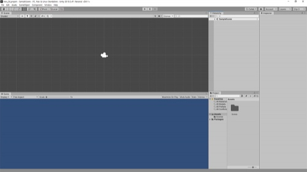
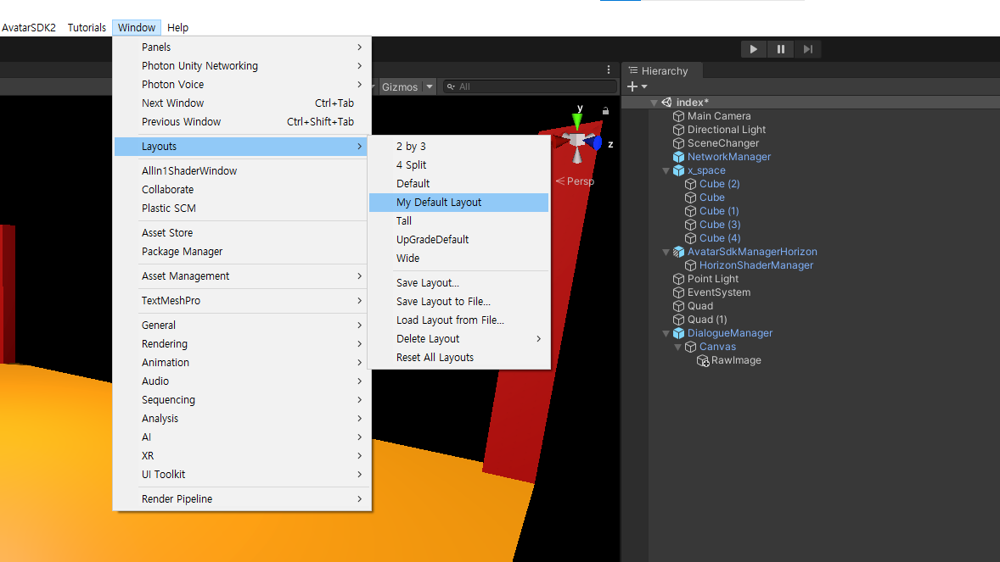

# 레이아웃 변경
- 기본 레이아웃은 수업에 적합하지 않습니다.

---

 
- Menu | Window > Layouts > 2 by 3

----

- Project창의 이름을 드래그 하여 Hierarchy 밑에 드랍합니다. (드래그 드랍)

---

- 그림과 같은 모양이 되면 레이아웃을 저장합니다.
- Menu | Window > Layouts > Save Layout
- 이름은 'My Default Layout'으로 지정합니다.

---

- 수업중 레이아웃이 흐트러지면
- Menu | Window > Layouts > My Default Layout
- 선택하여 복구 할 수 있습니다.