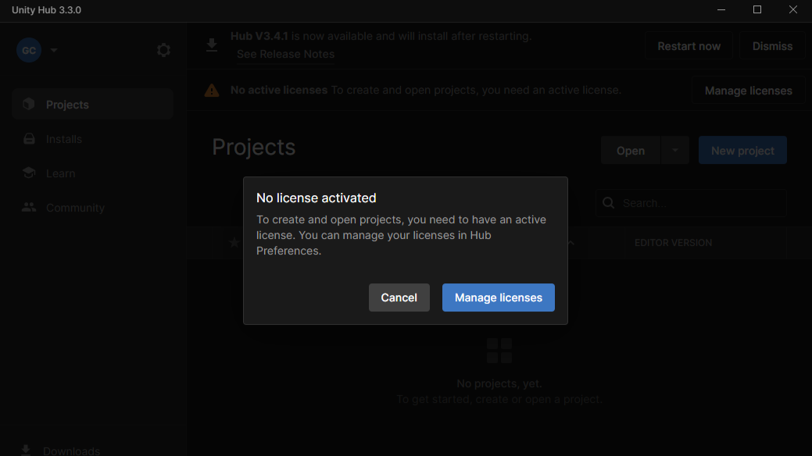
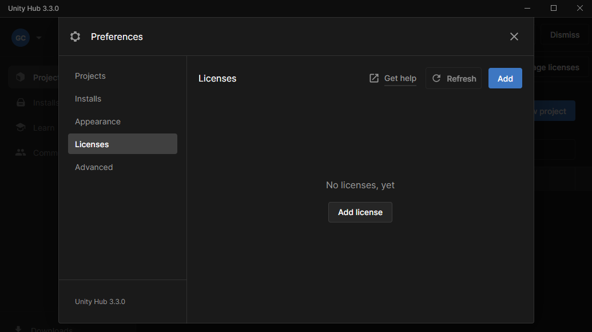
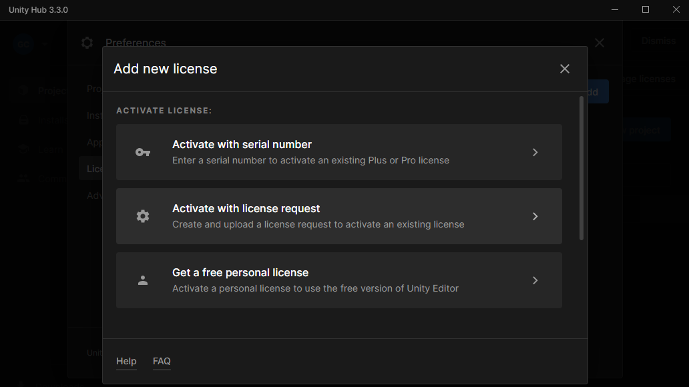
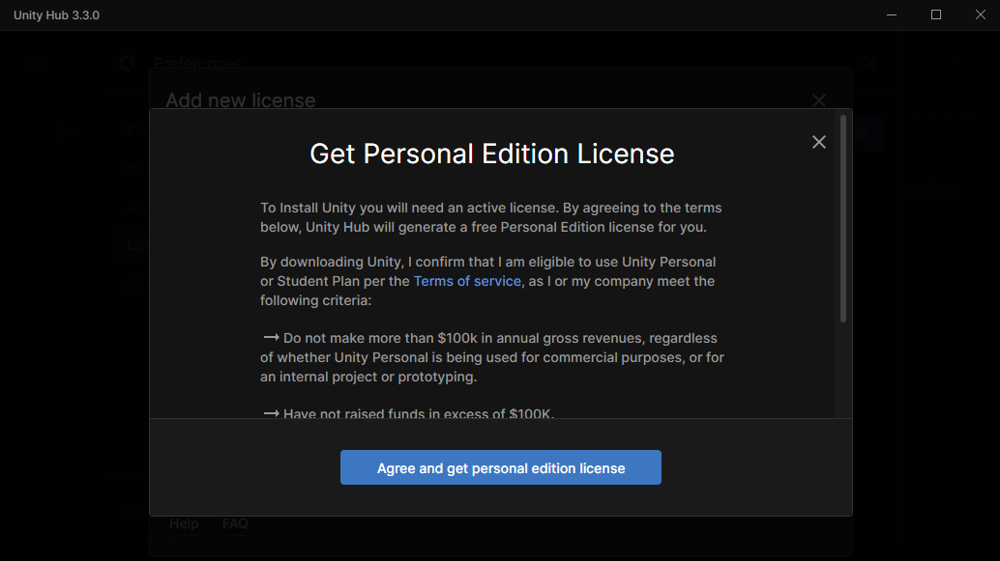
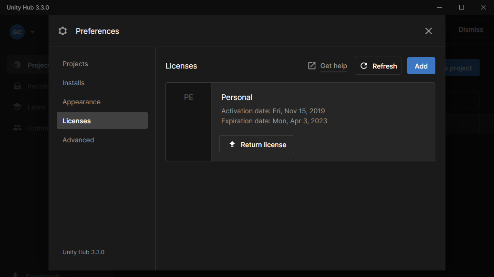

# Unity 라이센스 취득하기

---

## 유니티 라이센스
* 유니티 첫 설치라면 Sign in 및 라이센스 취득이 필요

---

* Licenses > Add license 클릭

---

* Get a free personal license 클릭

---

* Agree and get personal edition license 클릭

---

* 라이센스 취득이 완료되면 Licenses에 Personal이 표시됨
* X 버튼을 클릭하여 창 닫기