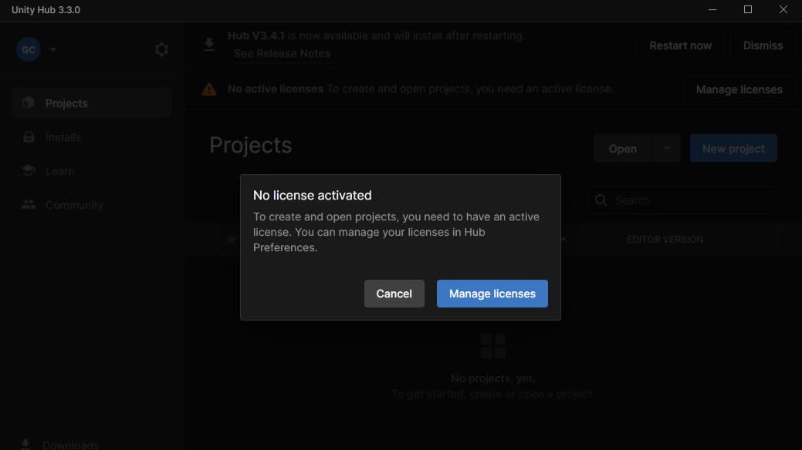

# 새 프로젝트 만들기

---

* Projects > New Project

---

# 유니티 라이센스
* 유니티 첫 설치라면 Sign in 및 라이센스 취득이 필요

* no lisence activated 창이 뜬다면 교안의 "Unity 라이센스 취득하기"를 참고하여 진행
* 아니라면 다음으로 진행

---

# 프로젝트 선택

* 2D 프로젝트 / 프로젝트명은 Project_2D / Create project를 눌러서 프로젝트 생성

---

* 로딩창이 나오고 프로젝트 시작

* 프로젝트를 처음 만들었을때는 로딩이 오래걸릴 수 있습니다.
* 다음에 실행할 때는 좀더 빨리 켜집니다.
