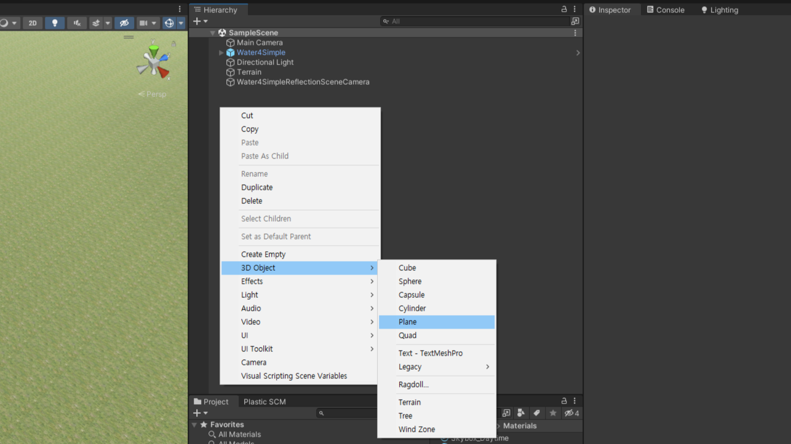
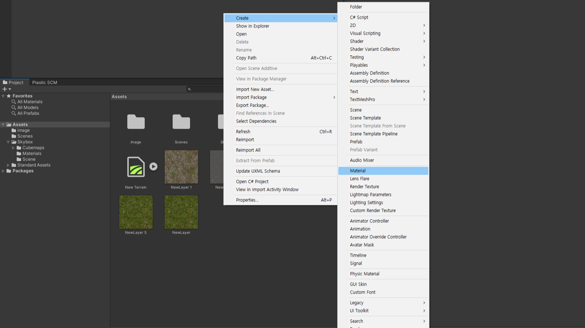
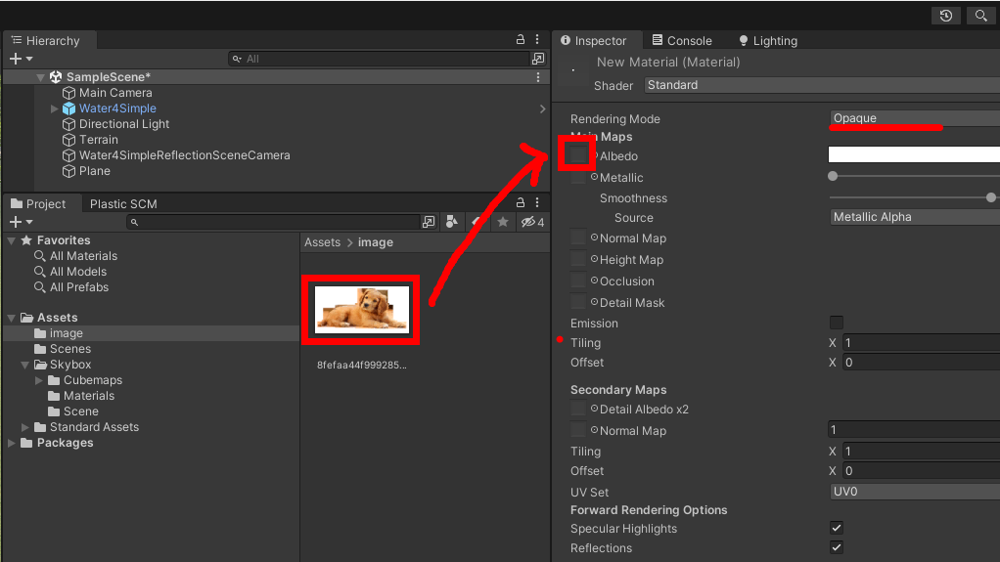
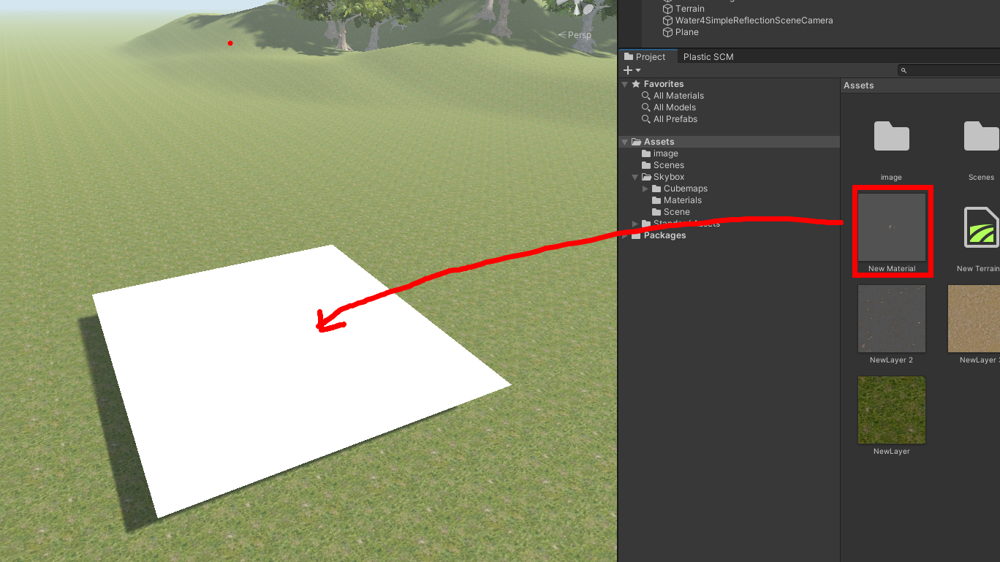
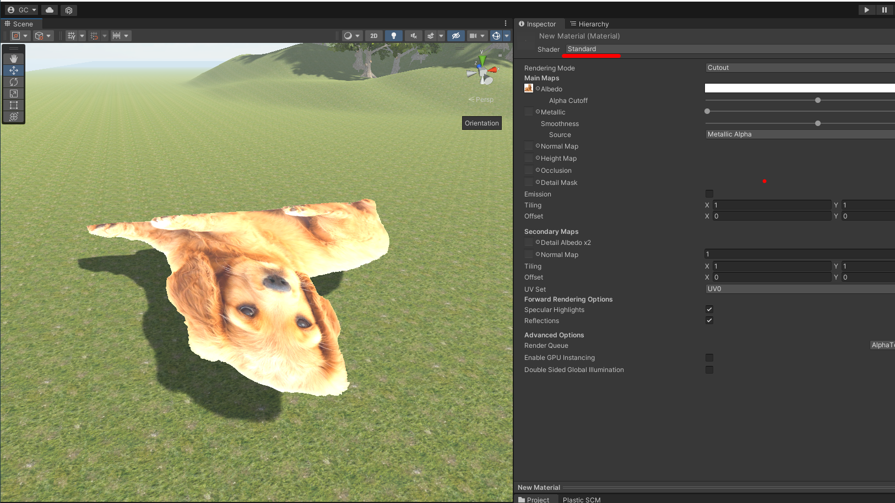
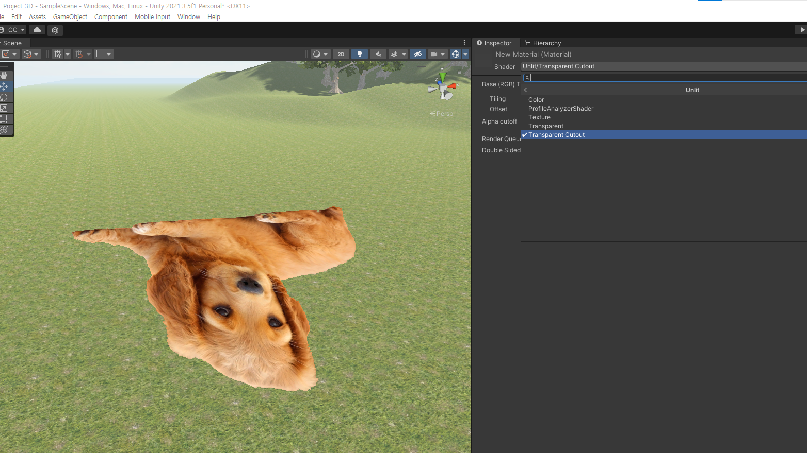

# 반투명 이미지 객체 만들기

---

- Hierarchy창 빈공간 마우스 우클릭
- 3D Object > Plane

---

- Project창 빈공간 마우스 우클릭
- Create > Material
- 만들어진 Material을 선택하여 inspector창에 정보 띄우기

---

- 투명이 있는 png 이미지를 Material의 albedo 좌측 네모칸에 드래그 드랍
- Rendering Mode를 cutout으로 변경

---

- 만들어진 Material을 Panel에 드래그드랍하여 적용

---

- shader > standard는 빛을 받아 밝아지고 어두워짐

---

- shader > unlit > transparent cutout 으로 변경하면 빛을 무시함
