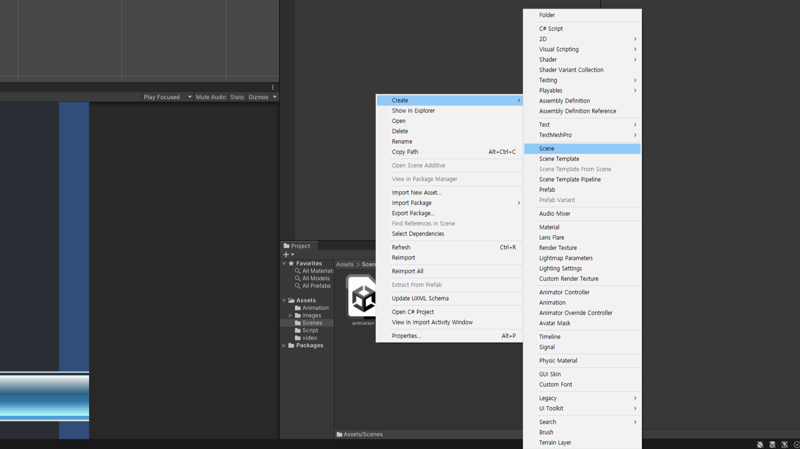
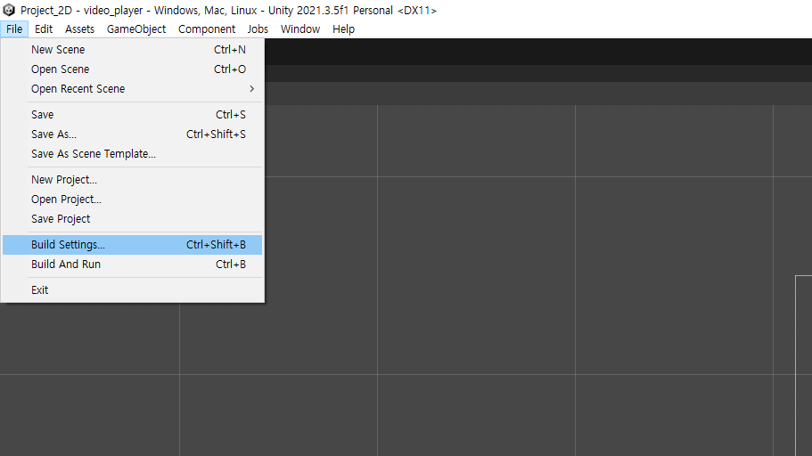
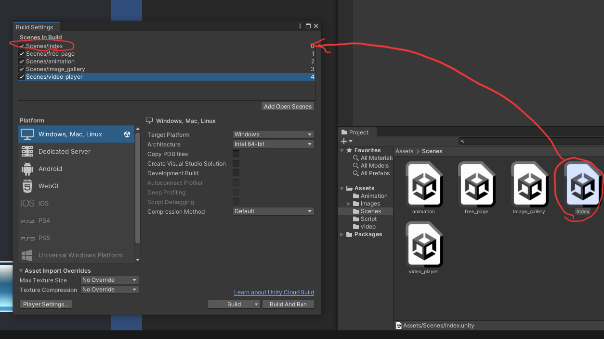
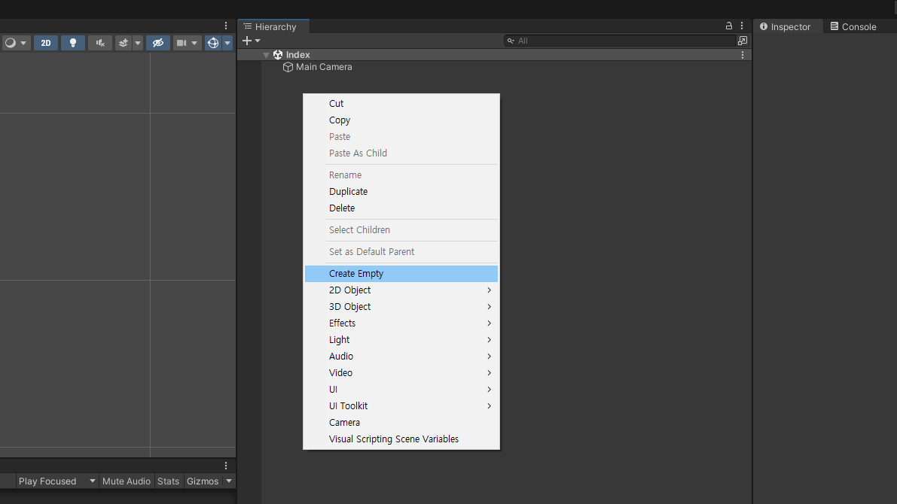
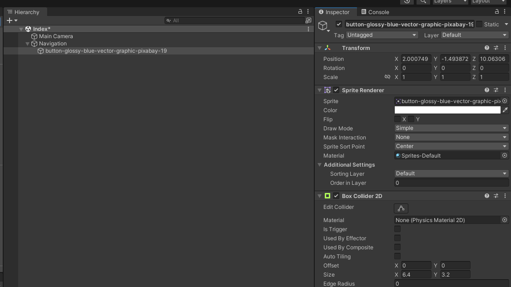
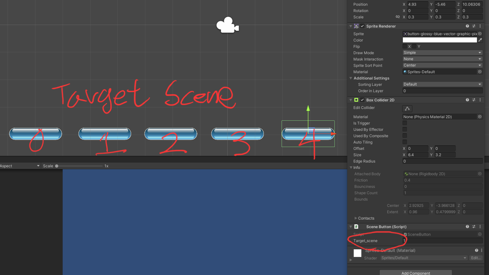
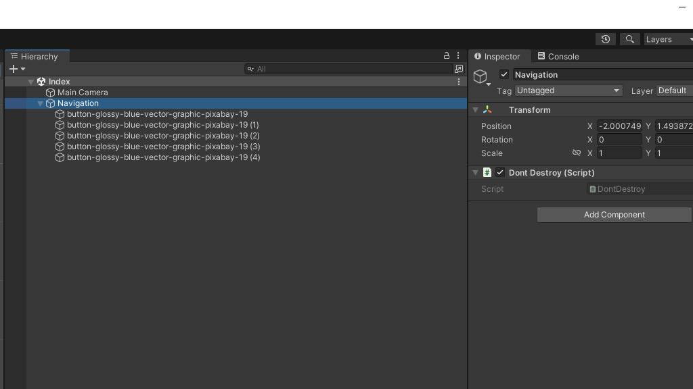

# SceneManager

---

# 새 Scene만들기

- Project창 빈공간 마우스 우클릭
- Create > Scene으로 새 Scene만들기
- 이름을 index로 변경

---

# Build settings 실행

- Menu | File > Build Settings 선택하여 build Setting창 띄우기

---

# Scenes in build에 Scene등록
- 기존에 다른 Scene이 있다면 마우스 우클릭, remove select로 삭제

- Project 창에 있는 Scene을 드래그하여 순서대로 배치
- ```index, 자유주제, 애니메이션, 이미지 갤러리, 비디오 플레이어```

---

# Empty Object 생성
- index Scene 더블클릭하여 열고 들어가기

- Hirarchy창 마우스 우클릭 Create Empty
- 이름은 Navigation으로 변경

---

# 버튼 추가

- Project창에서 버튼 그림을 드래그 드랍으로 Navigation에 추가
- Inspector | addComponent > Physics 2D > BoxCollider2D 추가

---

# 버튼용 C# Script 생성
- Project창 우클릭 Create > C# Script 선택하여 새 스크립트 만들기
- 스크립트 이름은 ```SceneButton```
- 다음의 내용을 작성후 버튼 이미지에 Script 전달

---
- SceneButton.cs
```C#
using System.Collections;
using System.Collections.Generic;
using UnityEngine;
using UnityEngine.SceneManagement; //SceneManagement를 사용하기 위하여 using에 추가

public class SceneButton : MonoBehaviour
{
    public int target_scene = 0;
    private void OnMouseDown()
    {
        Debug.Log("버튼 눌림");
        SceneManager.LoadScene(target_scene, LoadSceneMode.Single);
    }
}

```
---

# target_scene 번호 바꾸기
- 버튼을 복제하여 5개로 만들고

- 각각의 target_scene을 0,1,2,3,4 로 변경

---

# Dont Destroy On Load
- C# script를 생성하고 이름을 DontDestroy로 변경
- Navigation에 Script를 전달

---

- DontDestroy.cs
```C#
using System.Collections;
using System.Collections.Generic;
using UnityEngine;

public class DontDestroy : MonoBehaviour
{
    public static GameObject dont_destroy_obejct = null;
    void Start()
    {
        if (dont_destroy_obejct == null)
        {
            DontDestroyOnLoad(this);
            dont_destroy_obejct = this.gameObject;
        }
    }
}
```