# Standard Assets
- [standard assets download](https://drive.google.com/file/d/1zmhziD4q0kKw98vWzvhBe_I3fhPDfREt/view?usp=share_link)
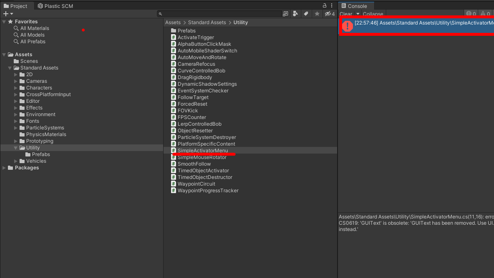
- 유니티 표준에셋 다운로드 받아서 실행, import로 들여오기
- 2021 버전부터 정식 지원이 중단되어 에셋 스토어에서 다운로드 불가
- Error가 나면 Utilty / SimpleActivatorMenu.cs 파일 삭제

---

# 지형(Terrain) 만들기
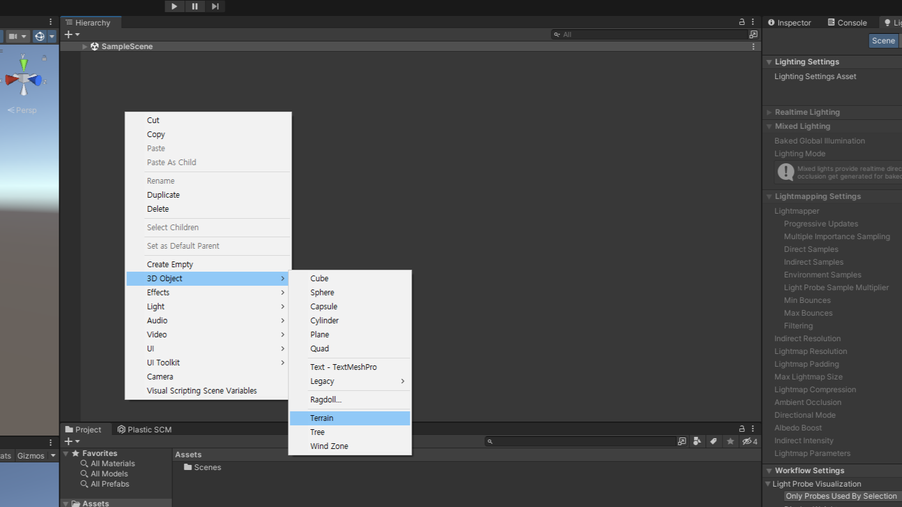
- Hierarchy창 마우스 우클릭
- 3D Object > Terrain 선택하여 지형(terrain)을 생성

---

# Raise or Lower Terrain
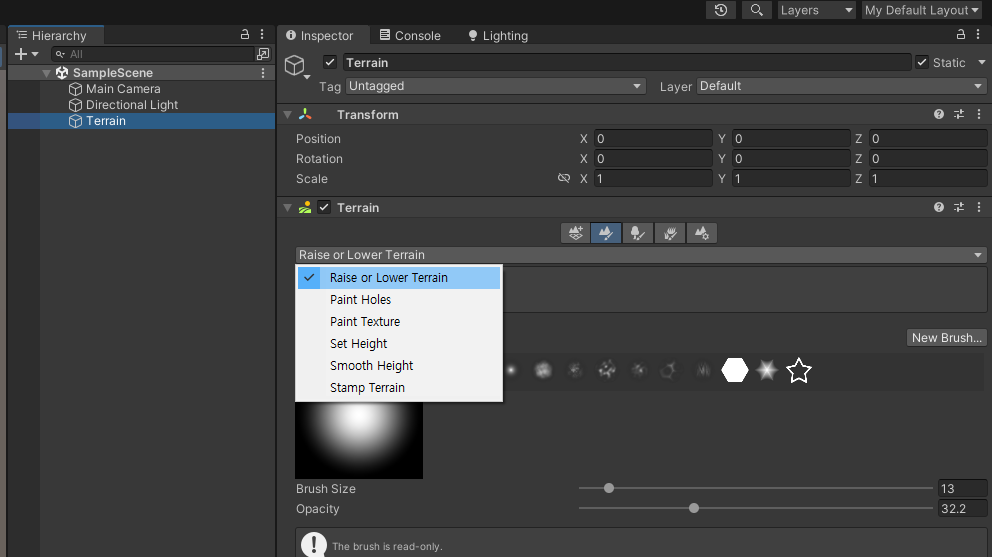
- Hierarchy창에서 terrain 선택
- inspector창에서 두번째 산에 붓 모양 아이콘 선택
- Raise or Lower Terrain
- click : 지형 높이기
- shift + click : 지형 낮추기
- Brush size : 한번에 높낮이를 조절할 수 있는 범위
- Opacity : 높낮이 조절되는 양

---

# Paint holes
- click : 구멍 만들기
- shift + click : 구멍 메우기

---

# Paint Texture
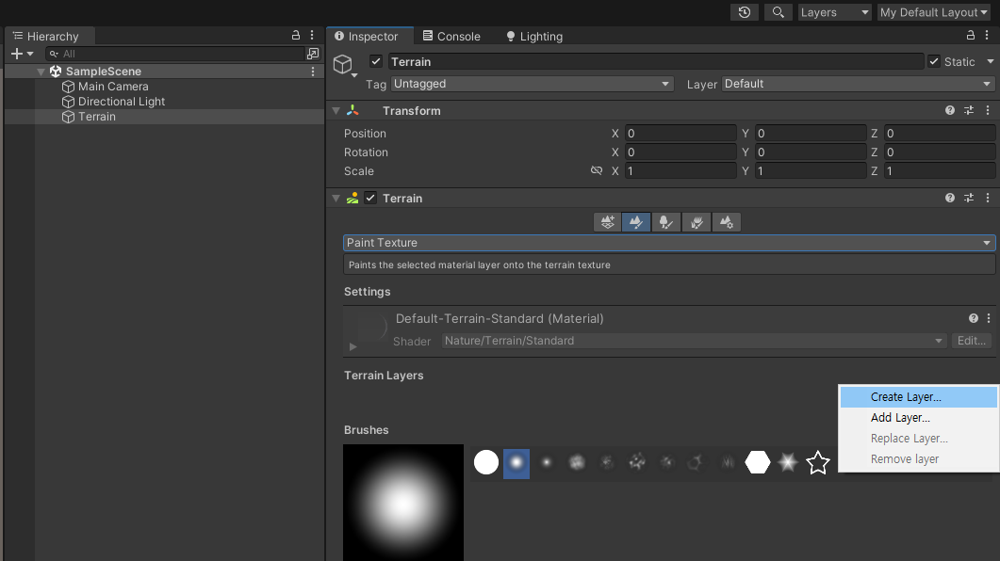
- Paint Texture 선택
- Terrain Layers > Edit Terrain Layers > Create Layer

---

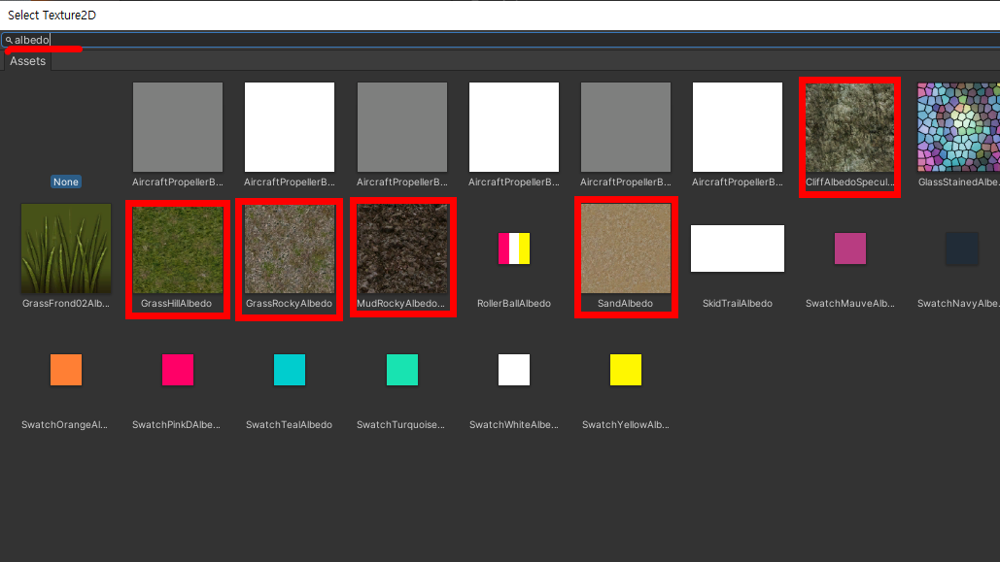
- Select Texture2D 검색창에 ```albedo``` 검색
- 나오는 Texture들 중 지면에 사용할수 있는 이미지를 더블클릭하여 등록
- 아무것도 나타나지 않을 경우, 첫페이지에 있는 ```standard assets``` 다운로드하여 import 할 것

---

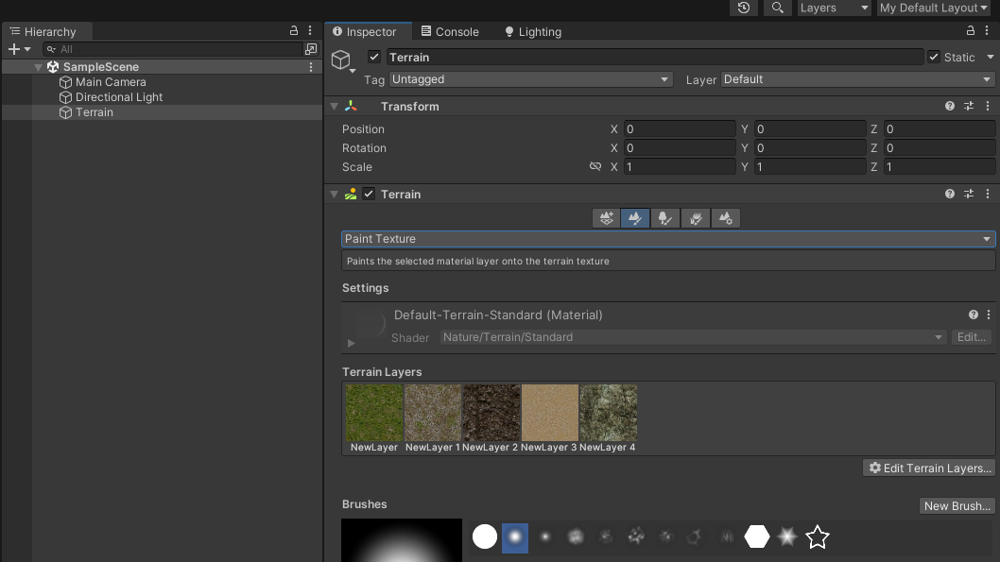
- 반복하여 모든 텍스쳐를 등록 완료하면 파렛트에서 물감 선택하듯 선택하여 지형에 칠 할 수 있음

---

# Set Height
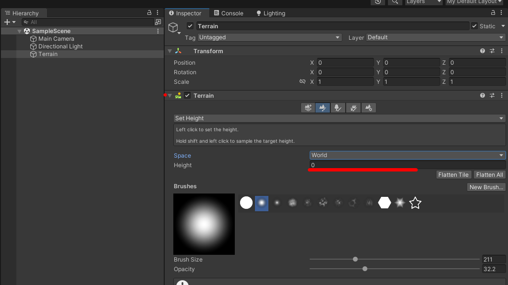
- Height 값을 입력하여 특정 높이로 지면을 맞춤
- 고지대 평지 만들기

---

# Smooth Height
- 급격한 변화로 모서리가 생겨 부자연스러운 지형을 부드럽게 변화

---

# Tree
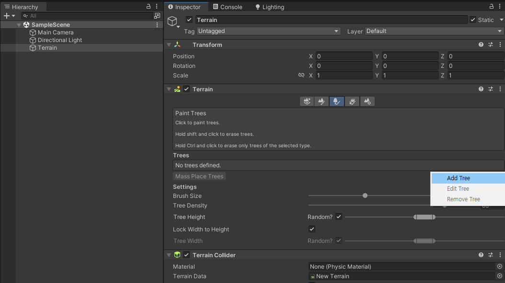
- 나무에 붓모양 아이콘 클릭
- Edit Trees > Add Tree 클릭

---

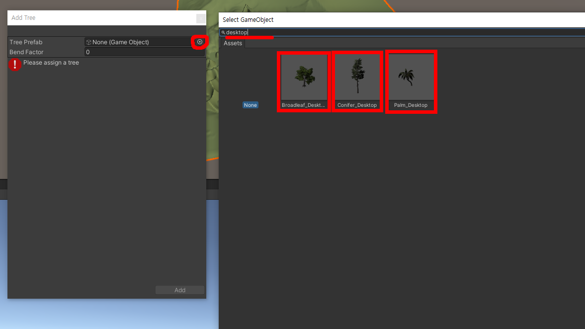
- Tree prefab 우측 동그라미 클릭
- Select GameObject창 검색창에 ```desktop``` 입력
- 다음의 3가지 나무를 더블클릭하여 사용가능
- 선택 후 Add Tree 창의 Add버튼 클릭
- 아무것도 나타나지 않을 경우, 첫페이지에 있는 ```standard assets``` 다운로드하여 import 할 것

---

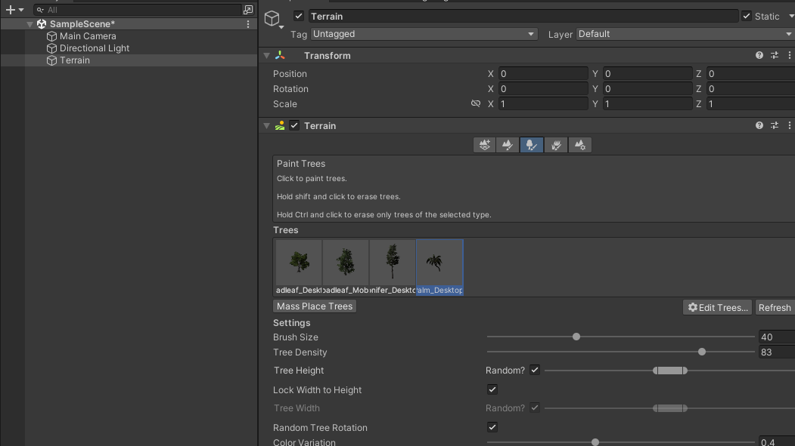
- 반복하여 여러나무를 등록해놓고 사용가능
- click : 나무 심기
- shift + click : 나무 지우기

---

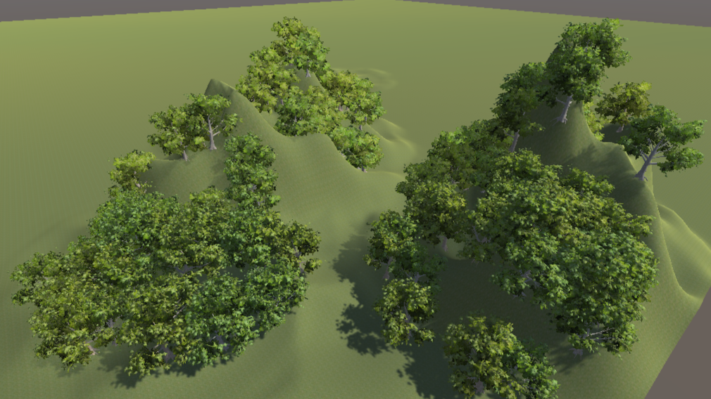
- 너무 많은 수량의 나무는 컴퓨터가 힘들어 할 수 있음. 한번 버벅거리기 시작하면 유니티 전체 반응속도가 느려져 아무것도 못하게 될 수 있으니 주의

---

# 물 만들기
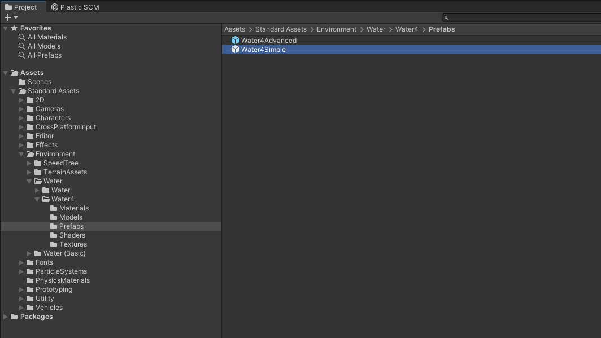
- Project 창
- Standard Assets / Environment / Water / Water4 / Prefabs / Water4Simple
- 드래그 드랍으로 Scene창에 내려놓기

---
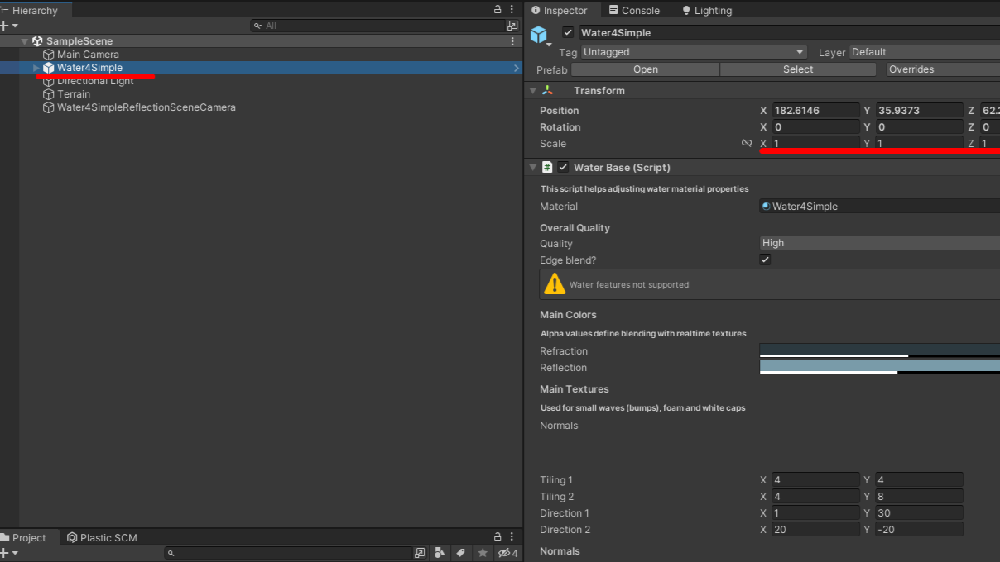
- X,Y,Z scale을 이용하여 원하는 크기로 조정하여 사용
- 여러번 드래그 하여 수량을 늘리면 컴퓨터가 매우 힘들어 함 

---

# Free HDR Sky
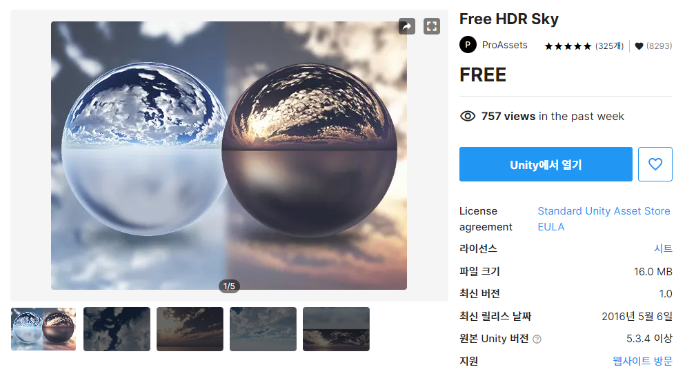
- 스카이박스 에셋 : https://assetstore.unity.com/packages/2d/textures-materials/sky/free-hdr-sky-61217
* Unity에서 열기 선택

---

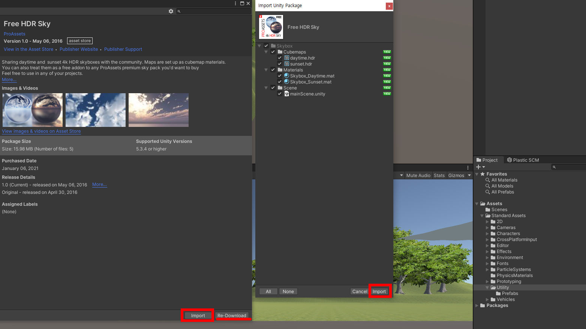
* Package Manager 창에서 download 클릭
* 다운로드가 완료되면 import버튼 클릭
* import Unity Package 창에서 import 버튼 클릭

---

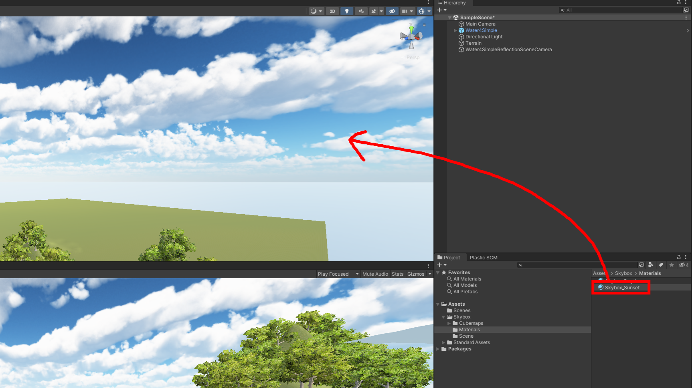
* Project창 Skybox / Materials / Skybox_Sunset
* Scene창에 드래그 드랍

---

# 안개
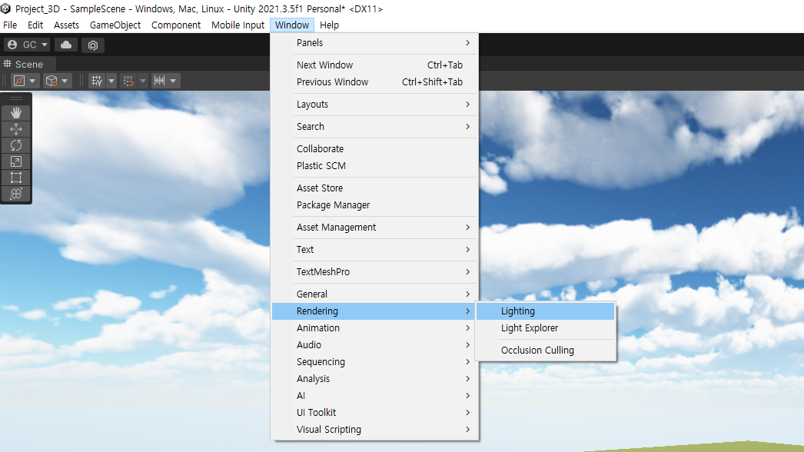
* Menu | Window > Rendering > Lighting

---

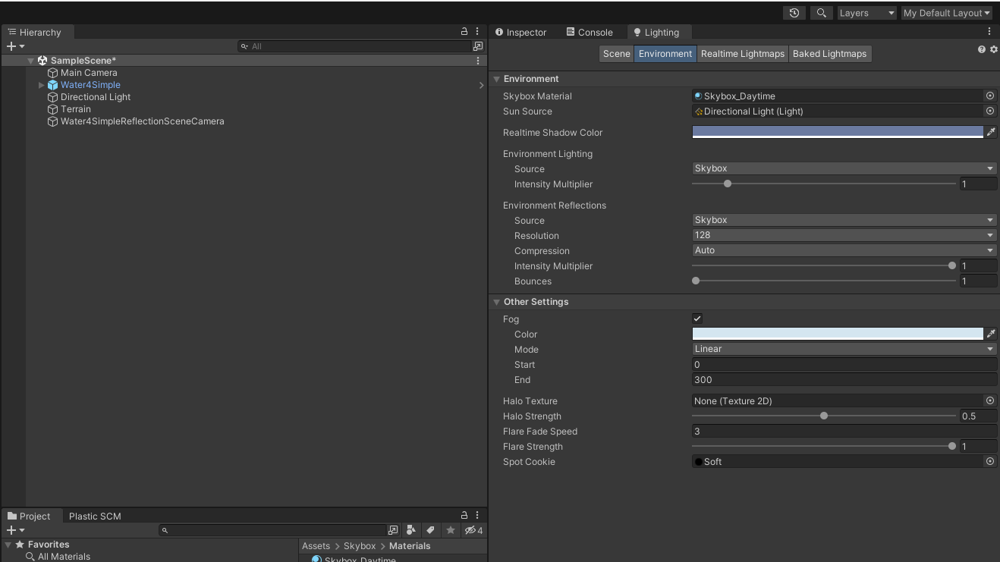
* Environment 탭, fog 체크
* color옆 스포이트 모양 아이콘 클릭, Skybox의 수평선 선택하여 수평선의 색이 안개가 되도록 설정
* Mode를 Linear로 변경
* Start와 End 값을 조정하여 안개 조정

---

- 참고용 영상 : 오래전 제작된 영상입니다. 수업내용과 상이한 점이 많습니다. 문서만으로 내용이 어려울때 참고만 하세요.
<iframe width="560" height="315" src="https://www.youtube.com/embed/X7ueRtfIyqs" title="YouTube video player" frameborder="0" allow="accelerometer; autoplay; clipboard-write; encrypted-media; gyroscope; picture-in-picture; web-share" allowfullscreen></iframe>