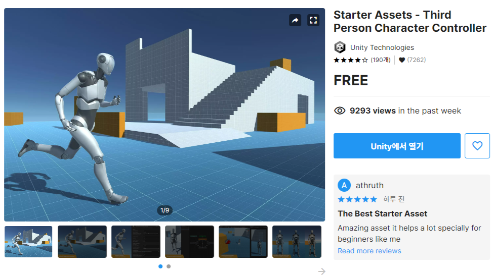

# Third Person asset

- asset store : https://assetstore.unity.com/packages/essentials/starter-assets-third-person-character-controller-196526
- import 하고 나면 프로젝트를 urp로 업그레이드 하려고 하는데 시작부터 urp가 아니었으면 사용하면 안될듯

---

