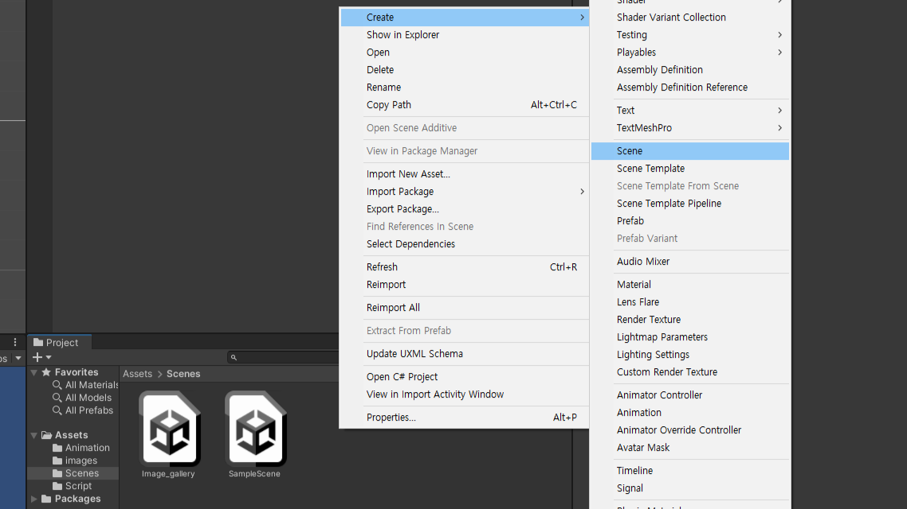
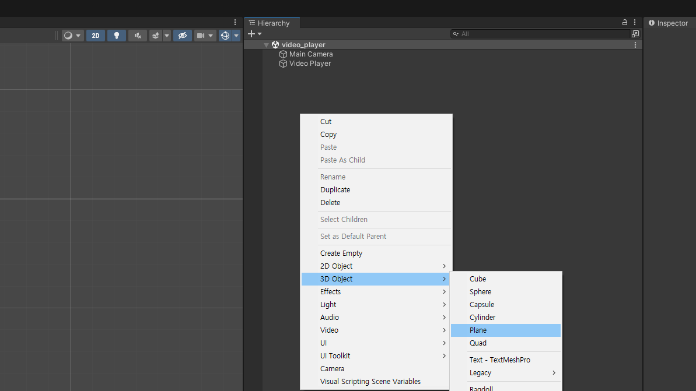
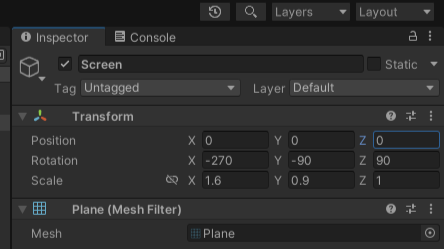
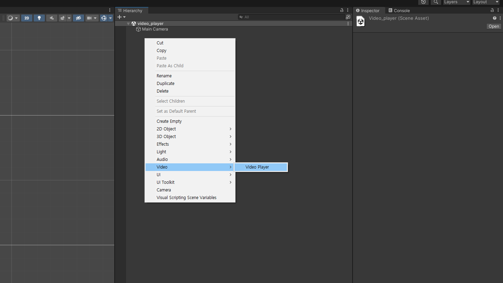
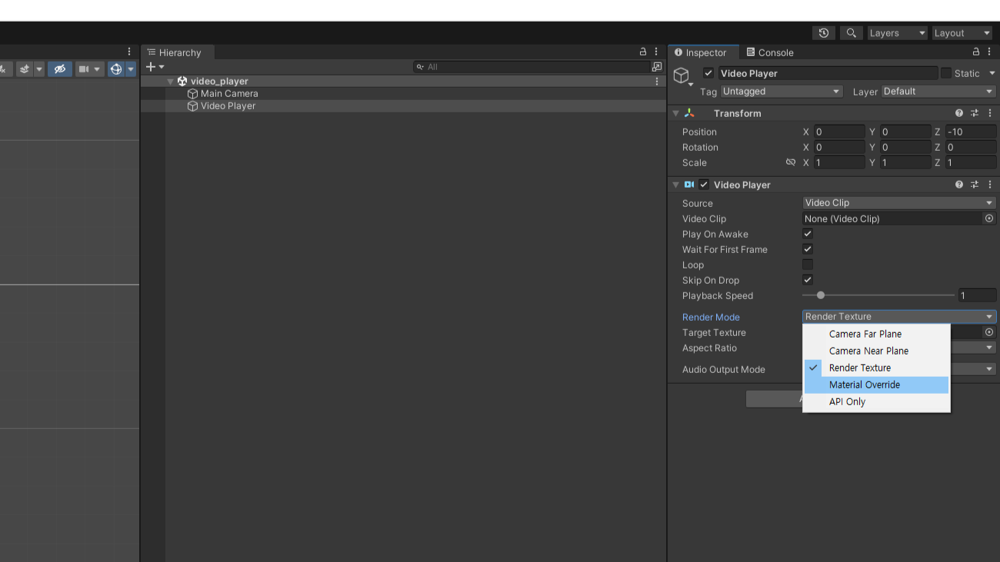
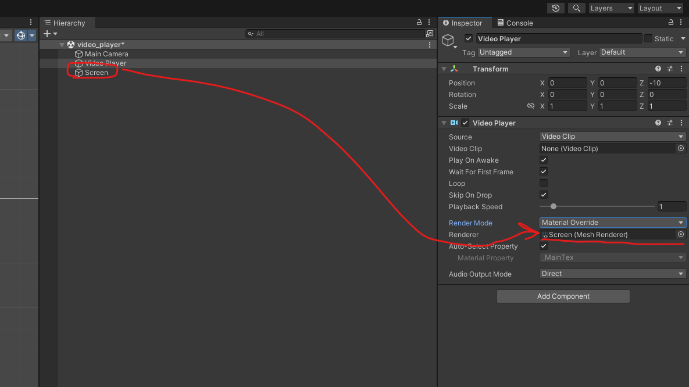
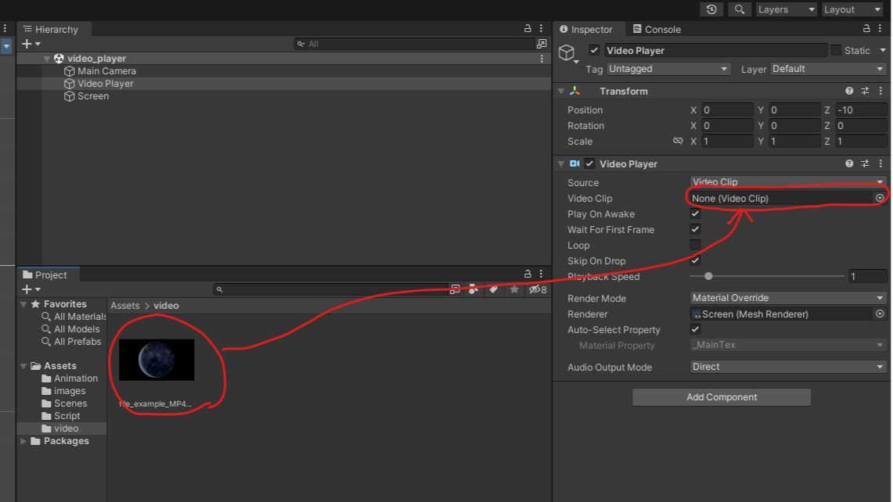
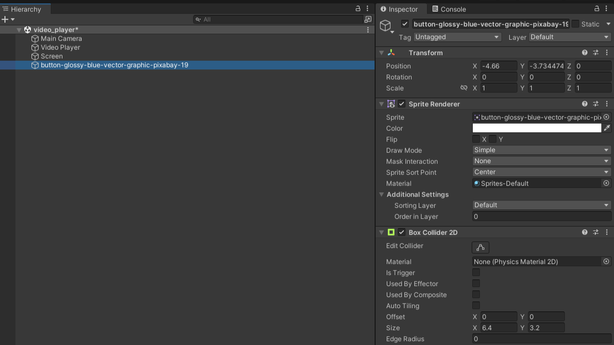

# 비디오 플레이어 만들기

---

# 샘플 동영상 다운
- 샘플 동영상 다운 받는 곳 :  https://file-examples.com/index.php/sample-video-files/
- MP4 > 1.5MB 480x270 다운로드
- Project 창 마우스 우클릭 import new assets 선택하여 project에 동영상 추가

---

# 새 Scene 만들기

- Project 창 마우스 우클릭
- Create > Scene으로 새 Scene 만들기
- Scene의 이름은 `video_player`로 지정
- 생성된 Scene을 더블클릭 열기

---
# Plane 생성

- Hierarchy 창 마우스 우클릭
- 3D Object > Plane 선택
- 이름을 Screen으로 변경

---
# Plane 위치변경

- hierarchy창에서 Plane(이름 Screen)선택 inspector창에 표시
- Transform.Position : 0,0,0
- Transform.Rotation : -270,-90, 90
- Transform.Scale : 1.6, 0.9, 1

---

# VideoPlayer 생성

- Hierarchy 창 마우스 우클릭
- Video > Video player 선택

---

# RenderMode 변경

- Renderer Mode > Meterial Override 선택

---

# Material target 연결

- Hierarchy에서 VideoPlayer 선택 inspector에 상세 띄우기
- 만들어둔 Plane(이름 Screen)을 inspector창 Randerer에 드래그 드랍

---

# Video Clip 연결

- Hierarchy창 VideoPlayer를 선택 inspector에 상세 띄우기
- Project창 VideoClip을 찾아서 incpector창 Video Clip에 드래그 드랍

---

# 버튼만들기

- 버튼 이미지를 Scene으로 드래그 드랍
- inspector의 add component > Pyshics 2d > box collider 2d 추가

---

# C# Script 만들기
- Project창 마우스 우클릭
- Create > C# script로 스크립트 생성
- 스크립트 파일명은 VideoButton으로 변경

---
- VideoPlayer.cs
```C# script
using System.Collections;
using System.Collections.Generic;
using UnityEngine;
using UnityEngine.Video; //VideoPlayer를 사용하기 위하여 using 추가

public enum ButtonType //열거형
{
    Play, Stop, Pause
}

public class VideoButton : MonoBehaviour
{
    public ButtonType type;
    public VideoPlayer target_player;
    private void OnMouseDown()
    {
        if (type == ButtonType.Play) //type이 Play 라면
        {
            Debug.Log("play 버튼 눌림");
            target_player.Play();
        }
        if (type == ButtonType.Stop) //type이 Stop 라면
        {
            Debug.Log("Stop 버튼 눌림");
            target_player.Stop();
        }
        if (type == ButtonType.Pause) //type이 Pause 라면
        {
            Debug.Log("Pause 버튼 눌림");
            target_player.Pause();
        }
    }
}
```
---

# 볼륨버튼 만들기


---

- 새 스크립트명은 VolumeButton
```C# script
UnityEngine; 
using UnityEngine.Video;

public class toggle : MonoBehaviour {
    public Sprite vol_on;
    public Sprite vol_off;
    public VideoPlayer target_player;
    private bool isVolOff = false;
    private SpriteRenderer target_renderer;
    private void OnMouseDown(){
        if (isVolOff){
            target_renderer.sprite = vol_off;
            target_player.SetDirectAudioMute(0, true); //0번 AudioClip의 음소거 참(true)
        }
        else{
            target_renderer.sprite = vol_on;
            target_player.SetDirectAudioMute(0, false); //0번 AudioClip의 음소거 거짓(false)
        }
        isVolOff = !isVolOff;
    }
    void Start(){
        target_renderer = this.gameObject.GetComponent<SpriteRenderer>();
    }
}
```

---

- 참고용 영상 : 오래전 제작된 영상입니다. 수업내용과 상이한 점이 많습니다. 문서만으로 내용이 어려울때 참고만 하세요.
<iframe width="560" height="315" src="https://www.youtube.com/embed/n6LdoAaMyGw" title="YouTube video player" frameborder="0" allow="accelerometer; autoplay; clipboard-write; encrypted-media; gyroscope; picture-in-picture; web-share" allowfullscreen></iframe>