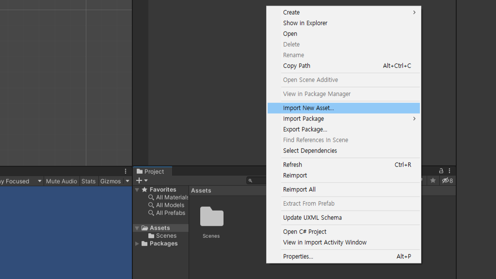

# Unity 3d 각 창의 기능

---


---


---

# 2D모드와 3D모드의 전환

- unity는 3D, 2D 모두 기본적으로 3D world에 기반합니다.
- 2D 버튼을 통하여 2D 3D환경을 변경할 수 있습니다.

---

# 3D 모드 Scene에서 이동하기
- 2D project라고 하더라도 각 객체의 깊이(depth)를 조정하기 위해서는 3D모드를 사용

---


- 마우스 오른쪽버튼을 누른 상태에서
- W:전진, S:후진, A:왼쪽이동, D:오른쪽이동, Q:하강, E: 상승
- 참고 : https://docs.unity3d.com/Manual/SceneViewNavigation.html

---

동작 | 3버튼 마우스 | 2버튼마우스, 트랙패드 | 1버튼 마우스, 맥 트랙패드
--|--|--|--
 이동 | Alt + 마우스 가운데버튼, 드래그 | Alt + Ctrl + 마우스 왼쪽버튼, 드래그 | Alt + Command + 마우스 왼쪽버튼, 드래그
선회(2D 모드에서는 동작하지 않음) | Alt + 마우스 왼쪽버튼, 드래그 | Alt + 마우스 왼쪽버튼, 드래그 | Alt + 마우스 왼쪽버튼, 드래그
 확대, 축소 | 스크롤휠 또는 Alt + 마우스 오른쪽버튼, 드래그 | Alt + 마우스 오른쪽버튼, 드래그 | 두 손가락 스와이프 스크롤 또는 Alt + 마우스 왼쪽버튼, 드래그

---

# Sprite 사용하기
- 컴퓨터 그래픽스에서 스프라이트는 영상 속에 작은 2차원 비트맵이나 애니메이션을 합성하는 기술이다. - 위키백과
- 2D프로젝트에서 Sprite로 scene에서 사용할 수 있는 이미지의 종류는 jpg, png가 있습니다.

---

# Image 가져오기

- Project 창에서 마우스 우클릭 ```import new asset...```

---


- 윈도우 탐색기에서 그림을 Project 창으로 드래그 드랍

---

# Sprite를 Scene에 배치하기
- Project 창에 있는 Sprite를 Scene 창으로 드래그 드랍

- Hierarchy 창에 드래그 드랍하여도 동일한 효과