<!--_color: white-->
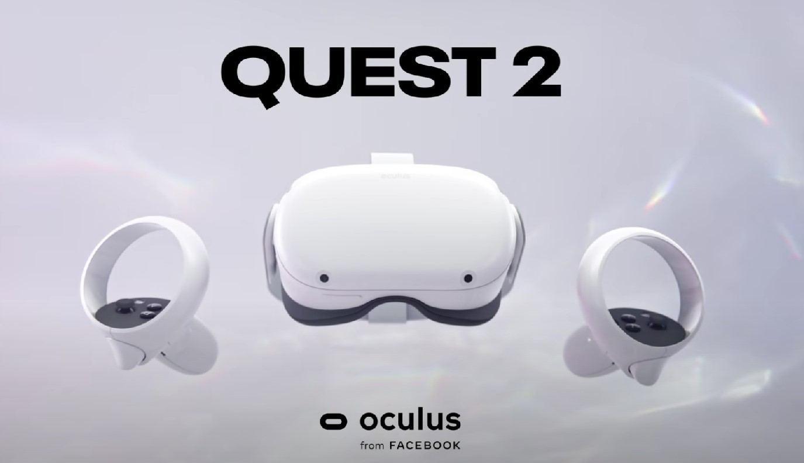

#  <!--fit--> Oculus Quest 2 
## Kaywon art University student study

---

### 1. 프로그램 다운로드
 - 1. 유니티 설치
 - 2. Oculus Quest 2 Oculus link
 - 3. Plastic CSM 다운로드(메일)

 - 2   유니티: VR 프로젝트 생성
- 1. Oculus integrations 설치
- 2. 빌드 세팅
- 3. VR 카메라 추가
 - 4. VR 핸드 추가

 ---

 ### 3  OculusQuest 2 사용법/작동법

 - 3.1 오큘러스 외관 설명
      -1) 헤드셋 설명
      -2) 컨트롤러 설명
 
 - 3.2 제품 사용법
     -1) 헤드셋 설명
     -2) 컨트롤러 설명
---

### 2.  유니티 상의 VR 프로젝트와 Oculus 연결 (혁재님 담당)

#### -2.1 유니티 VR 프로젝트 열기
#### -2.2 오큘러스 앱 열기, 로그인하기
#### -2.3 오큘러스 앱과 유니티 연결 

---

### 1.2 Oculus(Meta) Quest 2 설치.

2.1.1) 'Oculus link' 다운로드 _(오큘러스 앱 다운로드)_
https://www.oculus.com/download_app/?id=1582076955407037

---

# 3.  OculusQuest 2 사용법

 - 3.1 오큘러스 외관 설명
      -1 전체 외관 설명
      -2 헤드셋 설명
      -3 컨트롤러 설명

 - 3.2 제품 사용법
     -1 헤드셋 설명
     -2 컨트롤러 설명

---

#### 3.1 전체 구성요소

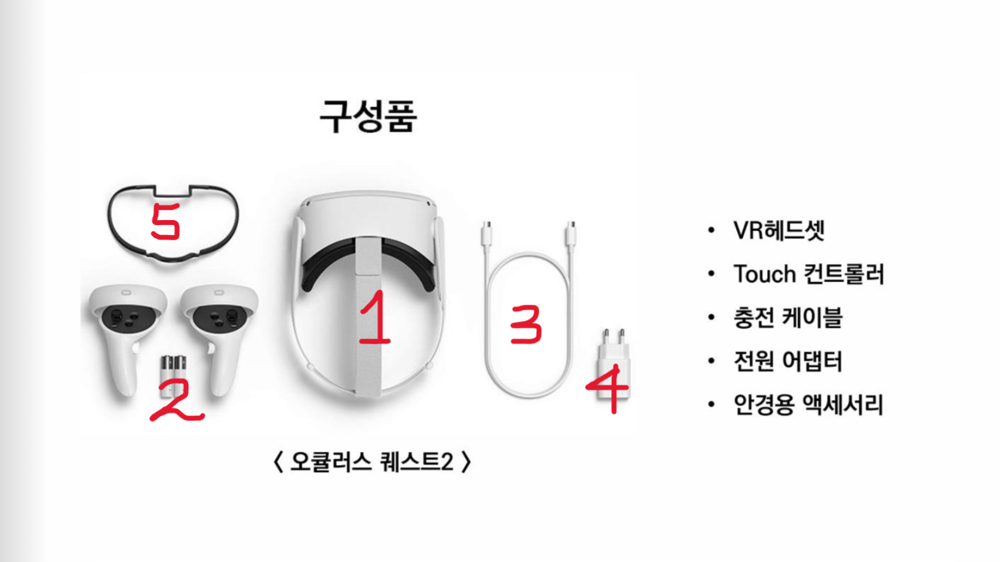

###### +이외에 컴퓨터와 헤드셋을 이어주는 USB-C타입이 있다.

---

### 3.2 오큘러스 외관 설명

###### - 구성: 헤드셋과 컨트롤러 2개로 이루어져 있음.

###### - 4시간 완충 후 2시간 사용가능.

---

#### (1) 헤드셋

- 전원/볼륨 조절 버튼 

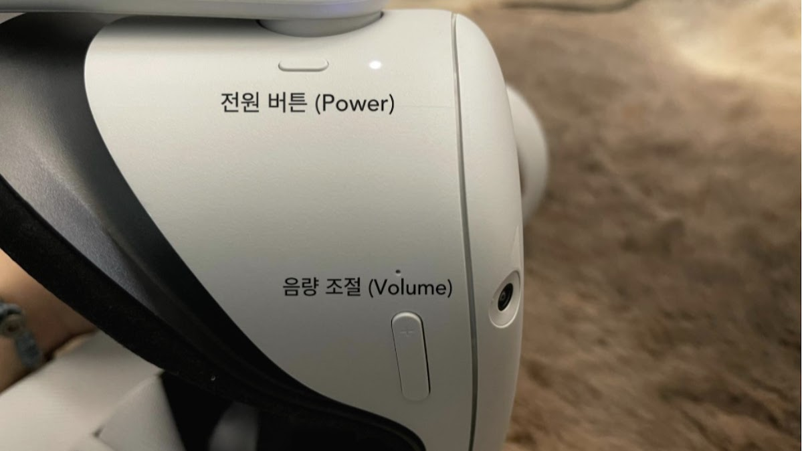

###### - 전원버튼: 제품 우측의 버튼을 꾹 2-3초간 눌러서 켠다. (하얀 빛이 나온다.)
###### - 음량조절 버튼: 하단에 볼륨을 조절할 수 있는 버튼이 있다.

---

- **헤드셋 쓰는 방법(헤일로 스트랩)**

   - 위로 들어서 쓰고 벗는 방식  

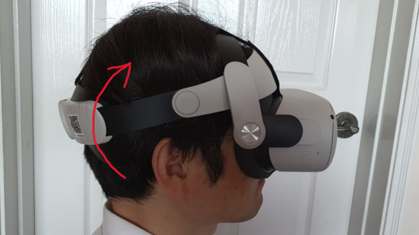

---

-  **헤드셋 충전/ PC연결** 

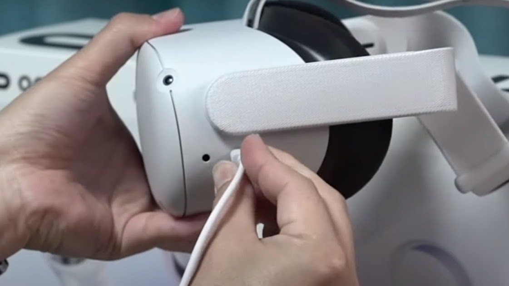

: 왼쪽의 USB-c 타입 단자에 연결한다.

---

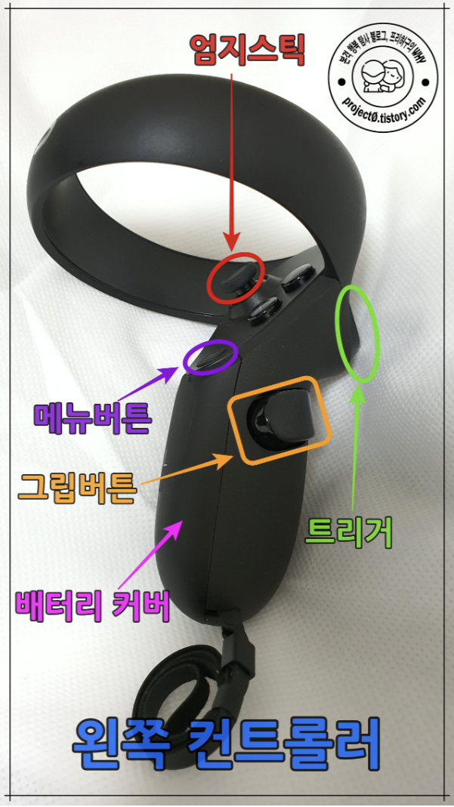
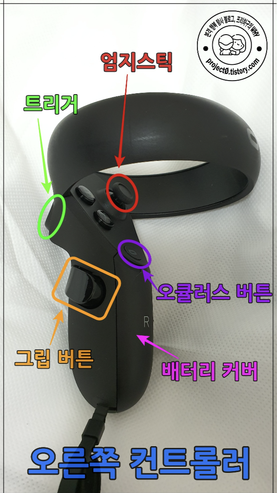

- **컨트롤러** : 

컨트롤러를 사용하여 가상의 물건들을 집거나 던질 수 있습니다.

---

 - **페어링 코드찾기**: 

홈의 UI 패널 안에서 우측에 주사위 모양 아이콘 클릭
settings 칸 클릭- 맨 밑 'About' 클릭- 맨 밑에 Pairing code 있음.
_영상 참고_ : https://www.youtube.com/watch?v=YxFbAVVaw78 

---

# meta quest - Quest Link

---
# 유의사항
* 전화번호가 아닌 이메일로 로그인할것
---
 |  |  | 
:-----:|:------:|:-----:|:------:
오큘러스 앱 설치 | 메뉴 > 기기 | 개발자모드 | 활성화

---

* 퀘스트 기기에서 usb디버깅 허용
* 파일접근 허용

---

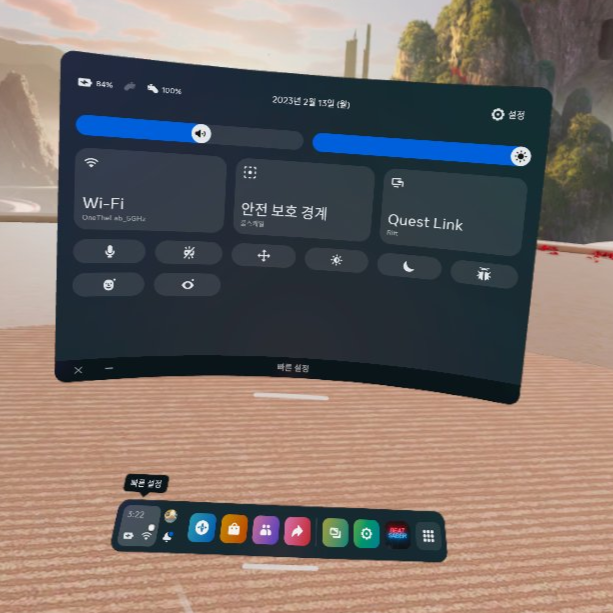 | 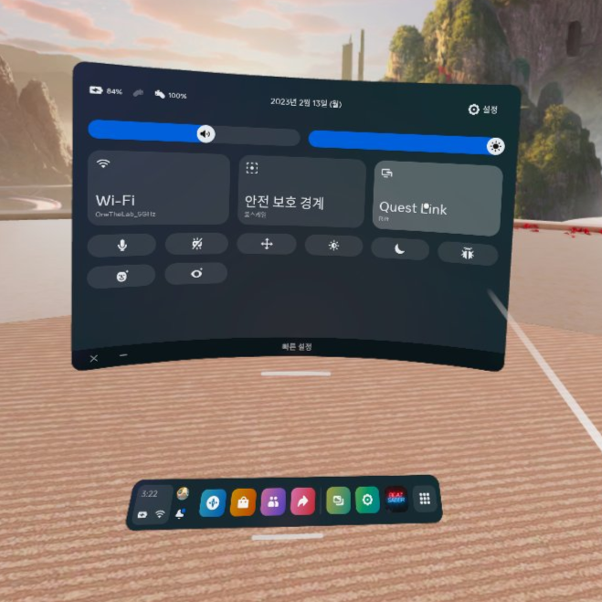
:-----:|:------:
빠른설정 | Quest Link

---

- 스페이스 센스 - 플레이 영역안에 사람이나 동물이 들어왔을시 윤곽 표현

https://store.facebook.com/ko-kr/help/quest/articles/in-vr-experiences/oculus-features/oculus-guardian/

---

## 4. 오큘러스 퀘스트2 공장 초기화 방법

- 오큘러스 퀘스트2 VR장비 초기화
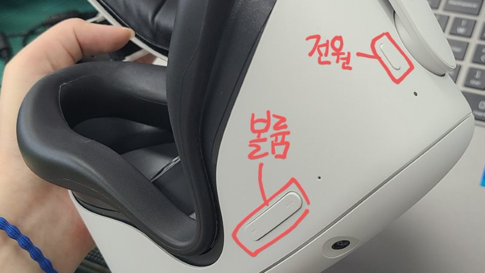

1. VR 장비 전원 끄기(전원 버튼을 꾹 누른 후 종료 클릭)
2. 전원을 끈 상태에서 아래의 화면이 나올 때까지 전원 버튼과 볼륨 
아래(-) 버튼 꾹 누르기

---

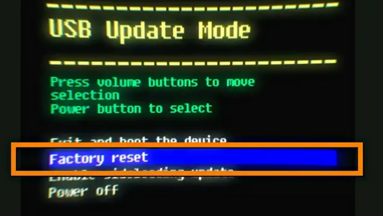

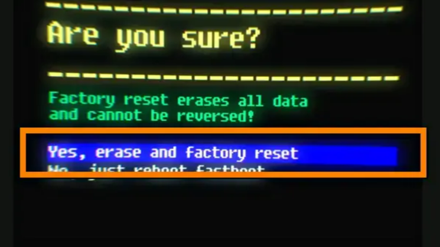

---

## 7. OVR Manager function

https://argos.vu/a-detailed-look-at-oculus-utilities-for-unity/

---

## 10. Object Collider 잡기 기능 + Photon view   

### - Cube 또는 유니티에서 제공하는 단순 형태의 오브젝트일 경우.
 

1). Hierarchy창에 우클릭 후 Create Empty하여 빈 GameObject 생성.

(원하는 이름으로 변경, 예제 = TestName)

    참고) Create Empty해서 만든 모든 오브젝트는 Position X,Y,Z를 0,0,0으로 초기화하기.

---
2). 해당 오브젝트(TestName) 안에 Touch hand Grab Interactable, Rigidbody, Grabbable, Physics Grabbable, Respawn On Drop 스크립트 추가

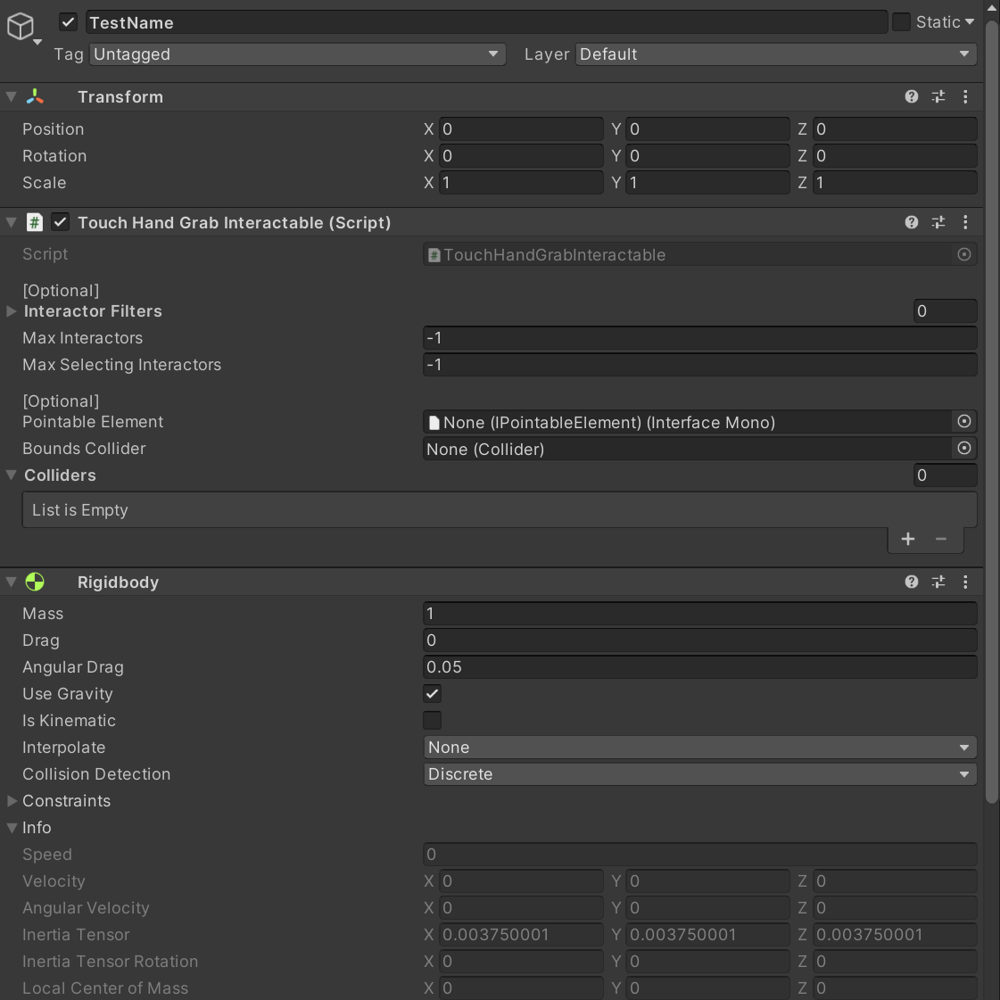

---

3). TestName(부모)에 Cube_Test(자식), Cube_Test_Collider(자식) 추가.

- Cube_Test(자식) : 
모델링 된 오브젝트.
- Cube_Test_Collider : 
Create Empty 하여 제작한 빈 오브젝트. (물건이름_Collider)

---

4). Cube_Test_Collider에 Mesh Filter, Box Collider 추가.

※ Box Collider의 Is Trigger 꼭 체크하기!

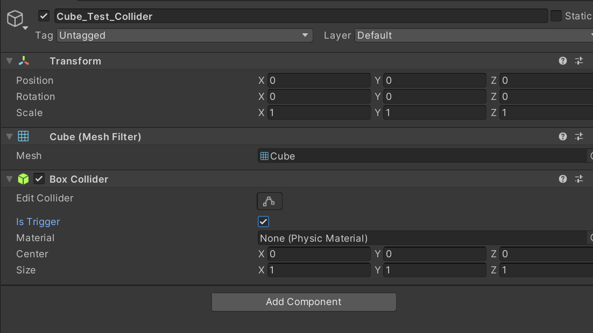 

---

5). TestName(부모)에서 위 사진과 동일하게 설정 

- Touch Hand Grab Interactable - Pointable Element에 
TestName(자기 자신)을 드래그 드롭.
bounds collider에 Cube_Test_Collider(자식)를 드래그 드롭.

- Grabbable - Transfer On Second Selection 체크.
- Physics Grabbable - Grabbable과 Rigidbody에 TestName(자기 자신)을 드래그 드롭.
- Respawn On Drop - 0.1로 설정. (만약 Rigidbody에 Use Gravity 꺼져있다면 꼭 체크하기.)

---

5). 

 

---

6). Cube_Test에 Mesh Collider추가.

- 오브젝트에 'Box Collider'가 있다면 지우기.
- Convex체크하기

*Cube_Test(자식) : 잡을 수 있는 부위.
*Cube_Test_Collider : 잡을 수 있는 범위.

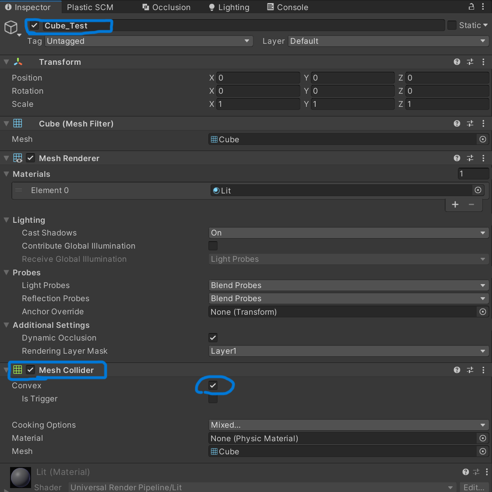 

---

7). TestName에서 Touch Hand Grab Interactable 스크립트 안 'Colliders'에 'Cube_Test'를 드래그 드랍.
 
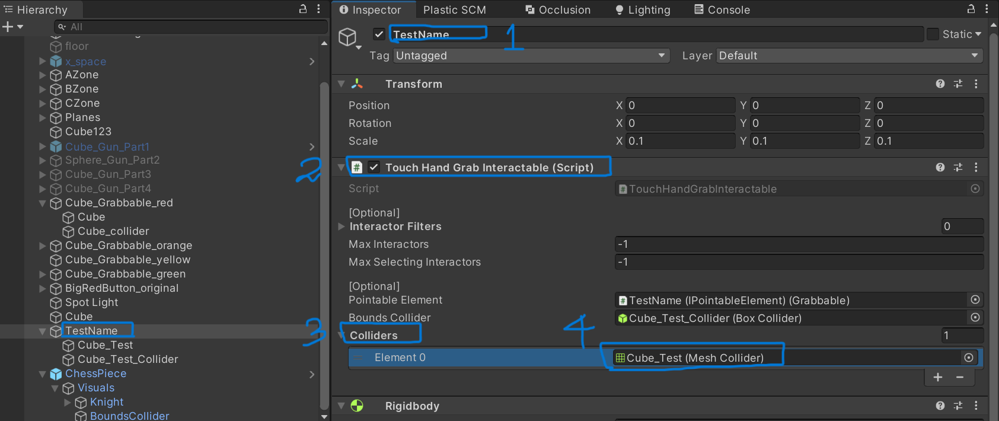 

---

### - 제작 모델링 오브젝트일 경우
 
1). Hierarchy창에 우클릭 후 Create Empty하여 빈 GameObject 생성.(원하는 이름으로 변경, 예제 = TestHorse)   

2). 해당 오브젝트(TestHorse) 안에 Touch hand Grab Interactable, Rigidbody, Grabbable, Physics Grabbable, Respawn On Drop 스크립트 추가.   

3). TestHorse(부모)에 Chesshorse(자식), Chesshorse_Collider(자식) 추가.

---

4).

-Chesshorse_Collider에 Mesh Filter
와 Box Collider 추가.
※ Mesh는 꼭 기본 Cube로 설정하기.
    
-Box Collider은 잡을 수 있는 범위라서 영역을 적절하게 조절하기.
Is Trigger 체크하기. 

**Collider 주의사항 참고

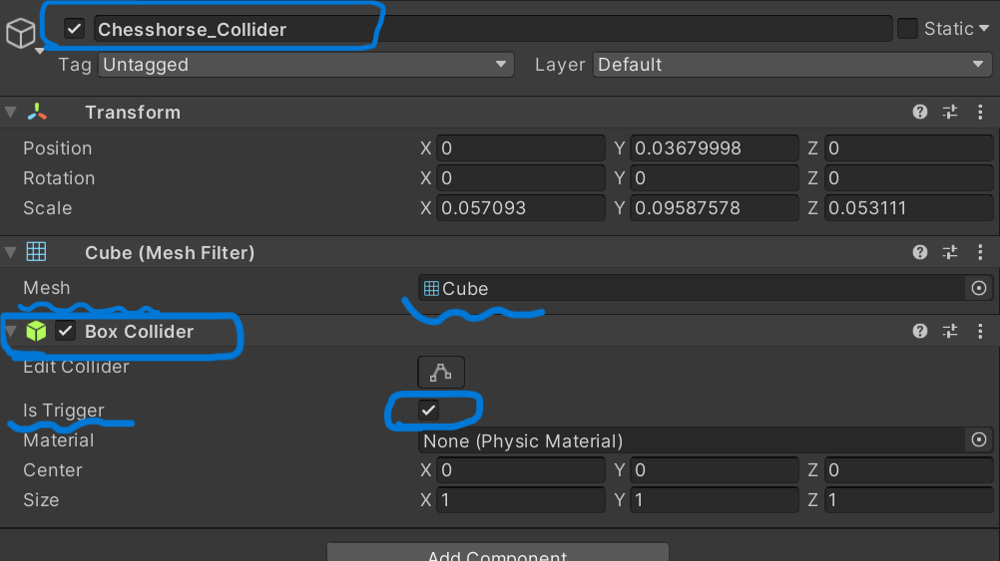

---

5). ->TestHorse(부모)에서 위 사진과 동일하게 설정.

#### -Touch Hand Grab Interactable 
- Pointable Element에 TestHorse(자기 자신)을 드래그 드롭,
boundscollider에 Chesshore_Collidr(자식)를 드래그드롭. 
#### -Grabbable 
- Transfer On Second Selection 체크
#### -Physics Grabbable 
- Grabbable과 Rigidbody에 TestHorse(자기 자신)을 드래그 드롭
#### -Respawn On Drop - 0.1로 설정 (만약 Rigidbody에 Use Gravity 꺼져있다면 꼭 체크하기)

---

5). 

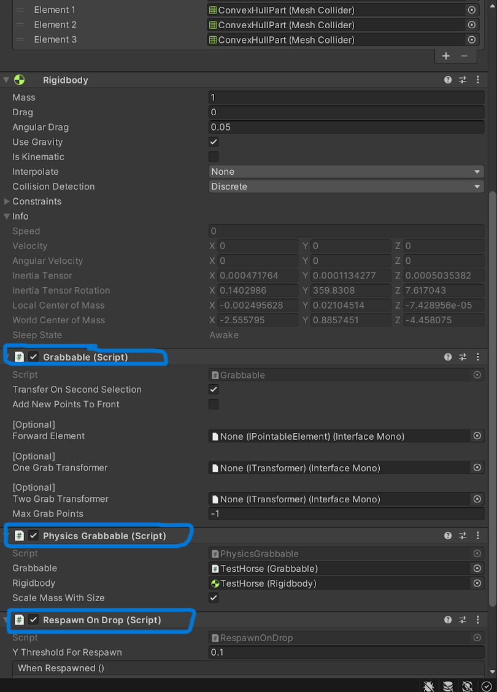 

---

6). 만약 적용할 모델링 조각이 
한 개일 때, 

-Chesshorse(모델링 된 오브젝트)에 Mesh Collider 추가하기.
(Convex 체크).

(적용할 모델링이 한 개 이상일 때는 아래 설명을 참고)

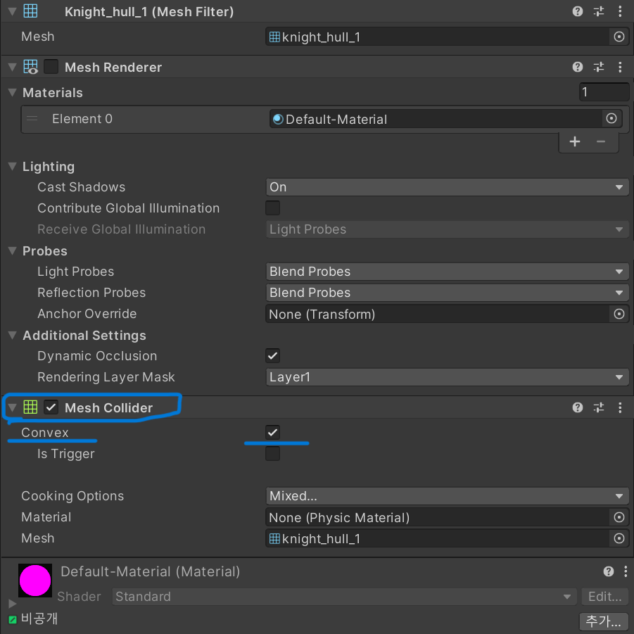 

---

7-1). 만약 적용할 모델링 조각이 한 개 이상일 때, 
- 빈 오브젝트 생성 후, 'KnightCollider'(원하는 이름:부모)로 변경하기.

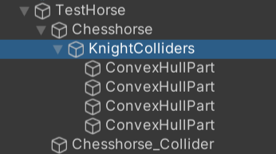 

- KnightCollider(부모)안에 ConvexHullPart(자식) 생성하기. 
*자식은 모델링 파트 수만큼 생성

---

7-2). 'ConvexHullPart'
(자식 : 모델링 된 오브젝트 조각)에 'Mesh Collider' 생성
(Mesh는 모델링과 맞게 설정)

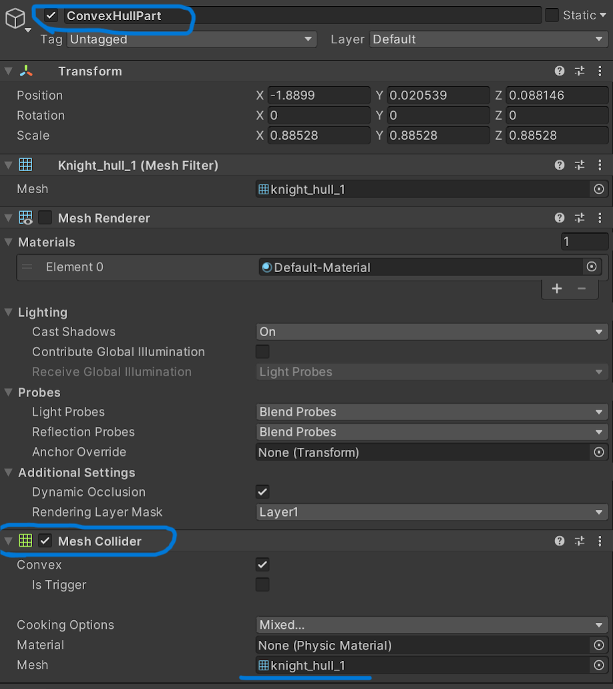 

---

7-2). 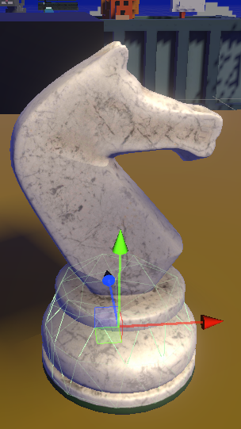 

---

7-3). TestHorse(최상위 부모)의 

'Touch Hand Grab Interactable' - 'Colliders'에, 

'Hierarchy'창에 있는 ConvexHullPart를 하나씩 드래그 드롭.
 
※ Collider 주의사항 참고

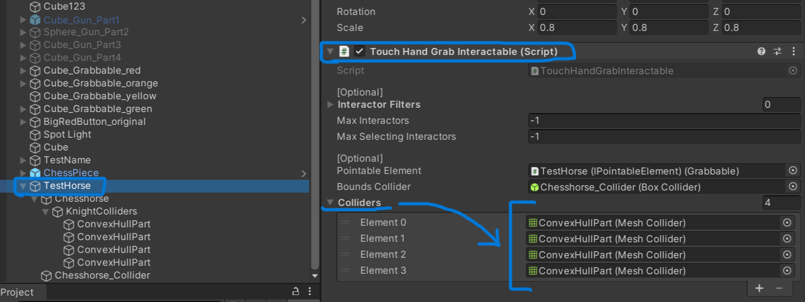 

---

---

### - Collider 주의사항

-Bounds Collider - 물체를 잡기 위한 공간. [ Is Trigger (on) ]

*여유 공간 *Is Trigger를 켜야 물체가 밀리지 않음.
 
-Colliders - 실제로 물체가 잡히는 공간. [ Is Trigger (off) ]
*Bounds Collider 보다 작은 공간 *Is Trigger가 꺼져 있어야 물체를 통과 하지 않고 잡힘.

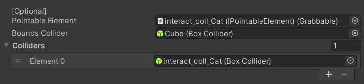

---

## 11. 핸드 트래킹 관련
OVRCamera의 손 추적 지원을 "컨트롤러 및 손"으로 설정하여 내 앱에서 손 추적 및 컨트롤러(동시에 아님)와 함께 양손을 사용하고 있습니다.
내가 원하는 것은 손 추적과 컨트롤러 사이의 전환을 감지하는 것이지만 런타임에 손에서 컨트롤러로 변경할 때 OVRHand의 IsTracked 및 HandConfidence가 마지막 값을 유지하고 업데이트하지 않는 것 같습니다. 그래서 종종 둘 중 하나 또는 둘 다 여전히 유지됩니다 활성 손의 값(IsTracked = true 및 HandConfidence = TrackingConfidence.High)이며 변경을 감지하는 데 사용할 수 없습니다. 손짓으로 앱에서 Oculus 홈으로 돌아간 다음 홈에서 컨트롤러를 켜고 앱으로 돌아가면 확인할 수 있습니다. (그러나 이 문제는 컨트롤러를 터치하여 앱에서 컨트롤러를 활성화할 때도 발생하지만, 컨트롤러를 터치하면 값이 변경될 수 있으므로 IsTracked = false이고 HandConfidence가 낮음이 표시되는 경우도 있습니다.)
OVRHand의 SkinnedMeshRenderer.enabled 값을 확인하여 감지할 수 있습니다. 그러나 손 추적을 사용하지 않을 때는 IsTracked가 최소한 false여야 한다고 생각합니다.
https://forums.oculusvr.com/t5/Unity-VR-Development/IsTracked-is-true-and-HandConfidence-is-High-when-hand

---

## 12. 손 위치
 
-검정 오른손 = Player > TrackingSpace > RightHandAnchor
 
-검정 왼손 = Player > TrackingSpace > LeftHandAnchor
   
- 유니티 재생 시 생기는 오브젝트 ↓
  
-로컬아바타 왼손 =Joint LeftHandWrist(?)

-로컬아바타 오른손 = Joint RightHandWrist(?)
 
- 스크립트 예측 : OVR Hand, Hand, OVRManager, OVRCameraRig
OVRCameraRig 안의 UpdateAnchors

---

## 15. 크롬 캐스트 티비 미러링 방법

#### 1. 크롬캐스트를 TV HTMI단자에 꼽고 전원을 연결한다. 

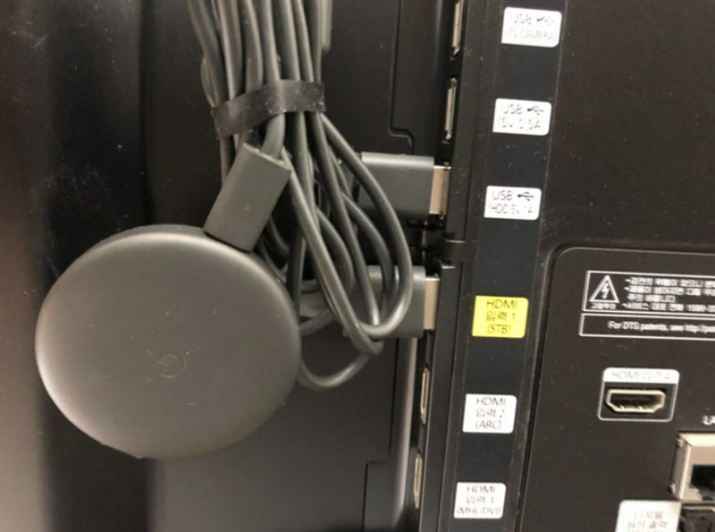

*크롬캐스트에 연결된 WIFI와 메타(오큘러스) 퀘스트2에 연결된 WIFI가 같아야 한다.*

[출처] https://mytem.me/story/2341/

---

#### 2. 오큘러스 퀘스트 메뉴 내의 
'공유' 클릭.

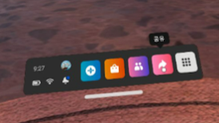

---

#### 3. 좌측 상단의 미러링 클릭.

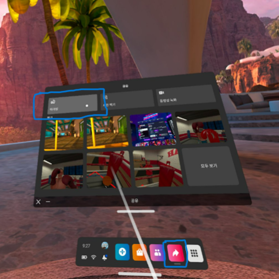

---

#### 4. 이 헤드셋에서 미러링에서 크롬캐스트를 선택하면 연결된다.

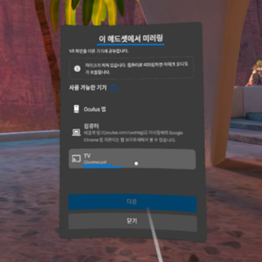

---

---
# 오큐러스와 PC(Unity)연결

---

# 목차* 
* 오큘러스 웹다운로드
* PC와 연결
* Quest link 나가는법
* Hand Tracking 활성화 (자동,수동)
* Oclus로 스크린샷 찍기
* pc화면으로 Oclus화면 스크린샷
* 공장초기화법

---
### 오큘러스 웹다운로드
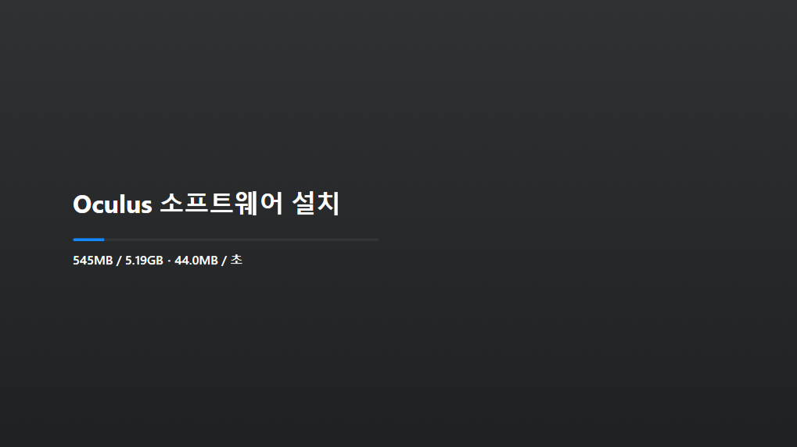 
오큐러스를 사용하기 위해 오큐러스 웹을 다운로드한다.
https://www.oculus.com/download_app/?id=1582076955407037

---
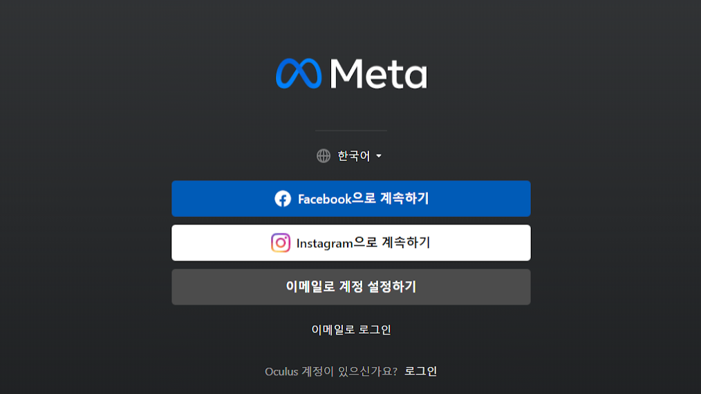 
다운로드를 마치고 로그인을 진행한다 
(feacbook, instargram)

---
# PC와 연결
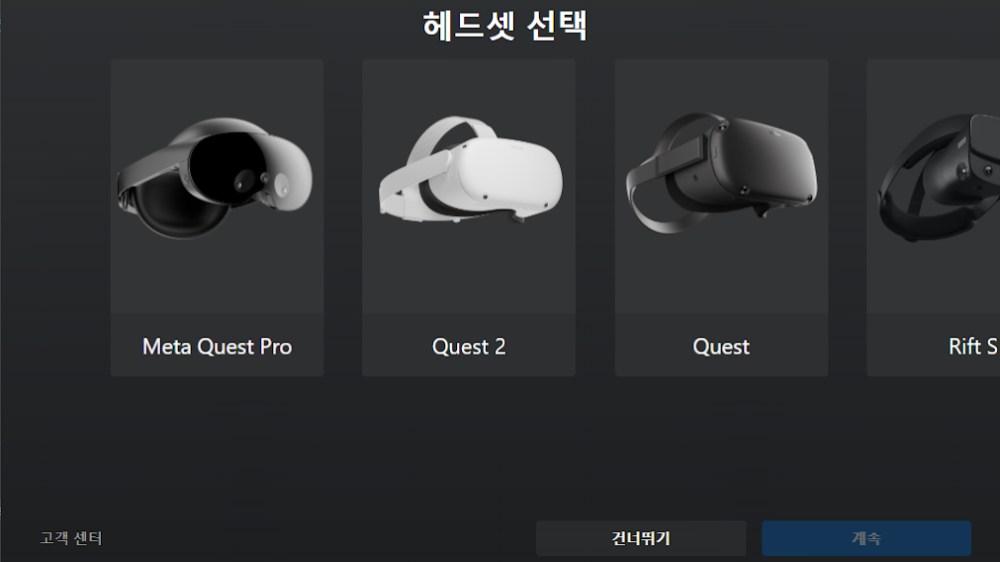
오큘러스 앱에서 기기- 헤드셋추가 - Quest 2선택- 계속 

---
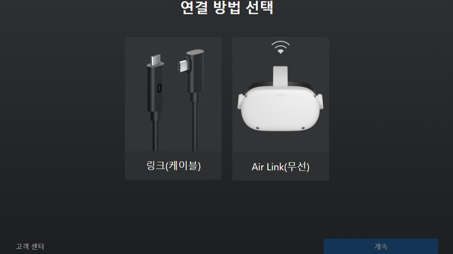
 링크(케이블)선택

---

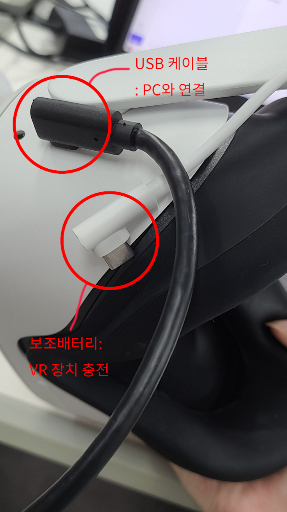
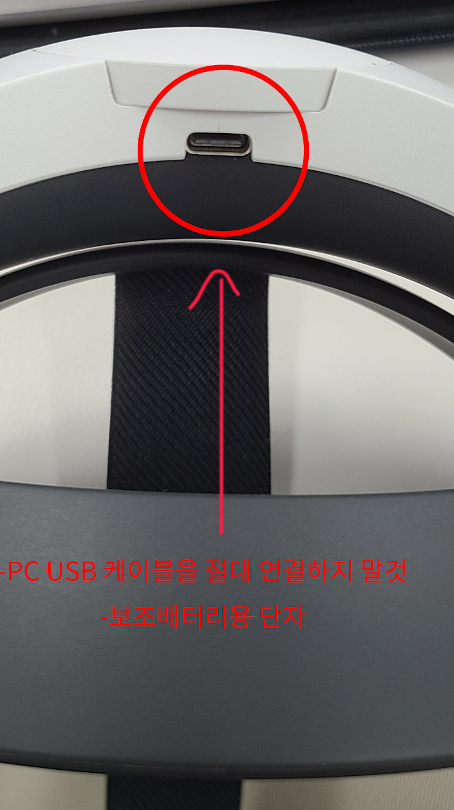
-USB 케이블을 PC USB와 연결하기 
-보조 배터리가 연결되어 있으면 빼고 연결하기 
-PC USB 케이블을 VR 헤드셋 뒷부분에 있는 곳에 연결하지 말 것

---

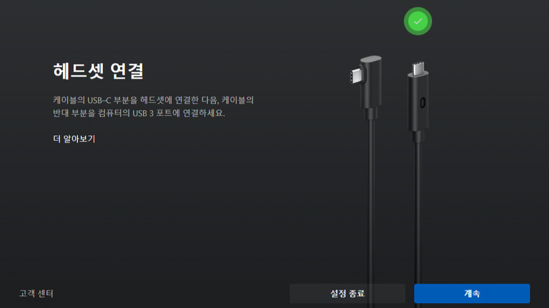
연결 후 계속

---

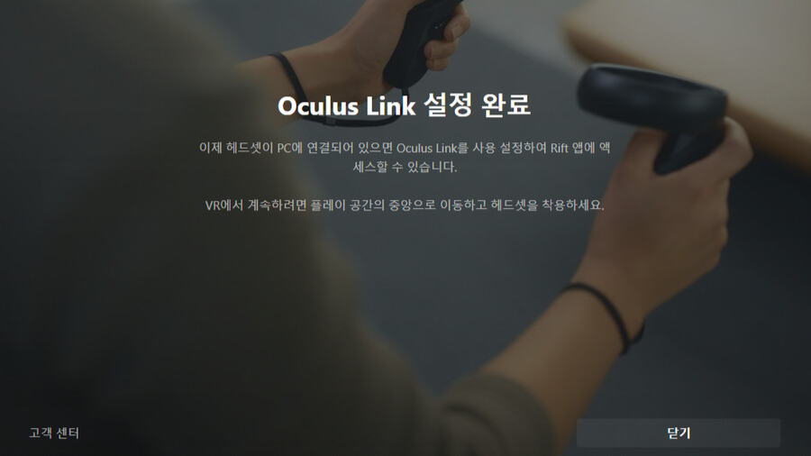
이런 화면이 뜨면 성공

---
#### 추가필요설정 

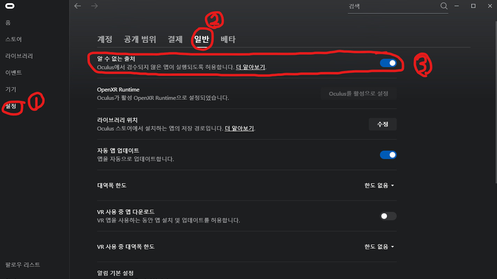
오큘러스 앱 실행 → 설정 → 일반 → 알 수 없는 출처 허용

---
### PC화면으로 연결(오큐러스)
홈- 환경 설정- 시스템 - Quest Link - Quest Link 실행-  
pc에서 뜨는 연결된 PC이름 클릭 후-실행

웹을 실행시킬라면 UI오른쪽에 +를 눌러 원하는 앱을
누르면 실행이 된다.

---
### Quest link 나가는법

연결된 오큐러스 UI 맨 좌측에 vr기기 아이콘을 눌러 
나가면된다.

---
#### Hand Tracking 활성화 (자동)

----
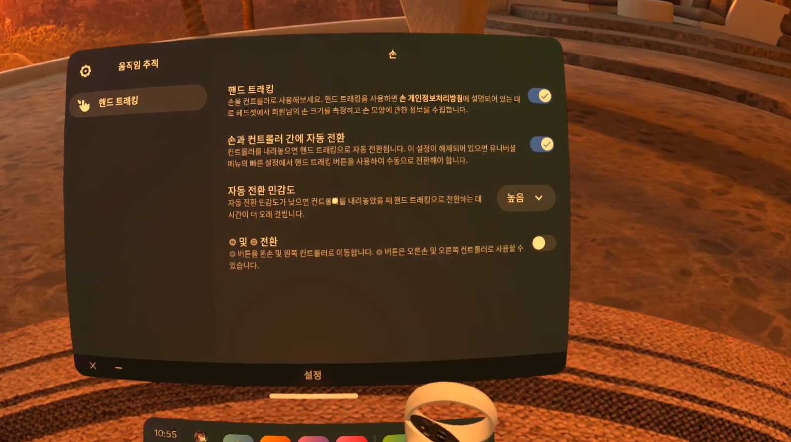
 [홈]- [환경설정]- [컨트롤러]- [핸드트래킹] 활성화,
  [민감도] 높음으로 설정후 
 핸드를 오큘러스에서 안보이게 둠(시간 2-3분정도걸림)
 

---
#### Hand Tracking 활성화 (수동)

만일 자동으로 원활하지않는다면 수동으로도 가능하다

---
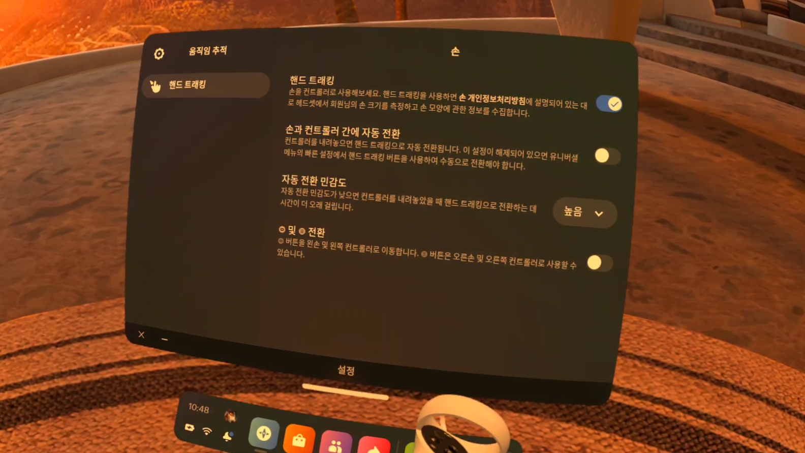
[홈]- [환경설정]- [컨트롤러]- [핸드트래킹]-[자동전환해제]

---
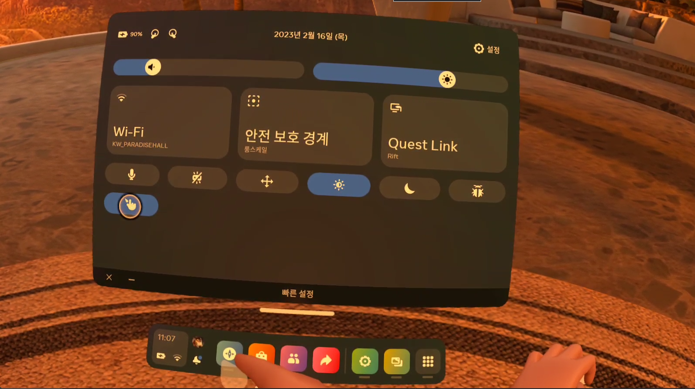

[홈]-[(우측)빠른설정]-[핸드트래킹]
(단,인식은 쉽지만 빠른설정들어가 일일이 핸드트리킹을 설정해야함)

---

### Oclus로 스크린샷 찍기

우측 핸드트리킹에서 o자 버튼를 누르고 검지부분을 누르면
 자동으로 오큐러스
스크린 샷이 가능하다

---
## pc로 보내는 방법 
{메인UI}-{파일}-(원하는 사진을 클릭)-{공유하기버튼 클릭}
{페이스북으로 메세지보내기}만 가능하다

---

### pc화면으로 Oclus화면 스크린샷
[side quest링크](https://sidequestvr.com/setup-howto)

---

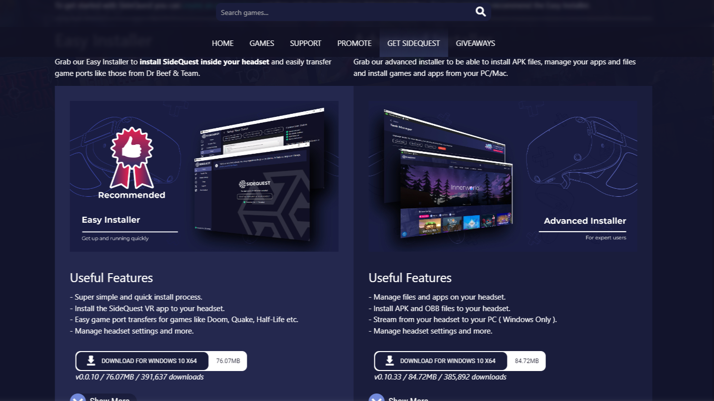
[Get SideQuest]-[Useful Features다운]

---

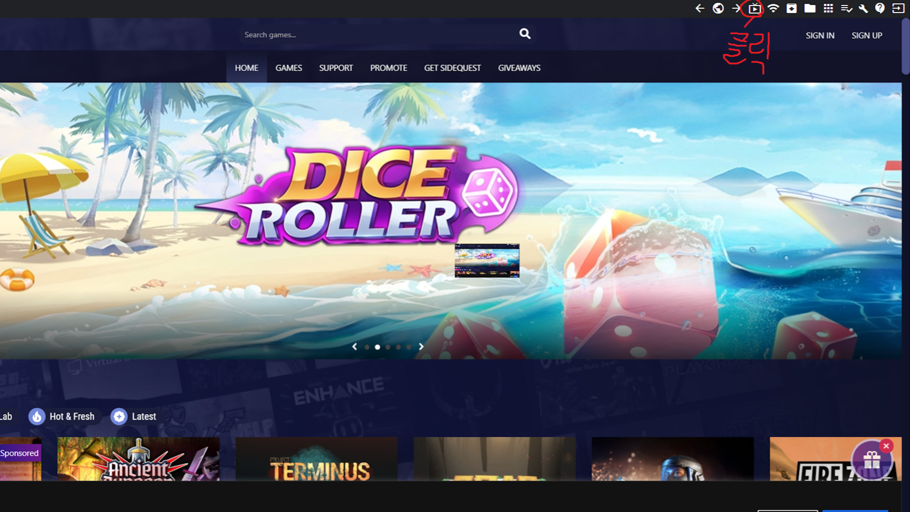
[다운로드 후]-[헤드셋(오큘러스)착용후]- {디버깅 허용}

---

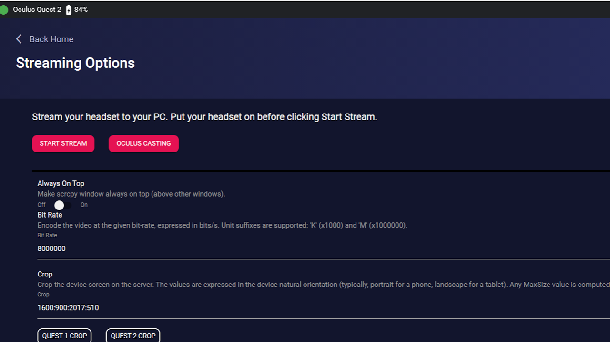
[START STREAM]클릭-[헤드셋을 써야 화면이 나옴]

---

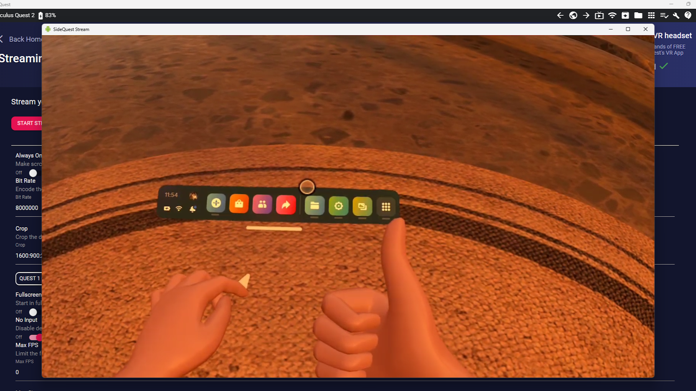
이런화면이 나오면 성공

---

## Passthrough

[참고:Youtube](https://youtu.be/9u3QQi6Gnx0)
- edit / projectsetting / player / Other Settings
- color space : linear
- script backend : IL2CPP
- target architectures : ARM64
- minimum API level

---

- OVR camerarig / OVR manager / Quest Features /Experimental
- Experimental Feature enable 체크
- Passthrough capability enable 체크
- insight passthrough / enable passthrough 체크
- 빌드중 OpenXR관련 에러가 발생하여
- oculus / tools / openXR 추가 - restart

---

- passthrough 작동 여부는 oculus link로 확인 불가. 빌드후 해드셋에 업데이트 하여 확인해야함.
- OVRCameraRig에 OVRPassthroughLayer 컴퍼넌트 추가
- OVR passthrough layer / placement : underlay
- window / rendering / lighting / Environment / skybox meterial : none

---

Assets\Oculus\SampleFramework\Usage\Passthrough\Scenes\PassthroughHands.scene

---

# 핸드 트래킹 제스처 작업 가능 리스트

[튜토리얼 영상](https://youtu.be/9u3QQi6Gnx0)

오브젝트 물건을 집는 모션 (21:23~21:30)

---

손을 주먹으로 쥐었다 펴는 동작 (21:09~21:21)

---

오브젝트를 던지는 모션 (21:30~21:31)

---
#### 핸드 트래킹 제스처 작업 가능 리스트

[튜토리얼 영상(2)](https://youtu.be/fZXKGJYri1Y)

* 사물에 닿으면 들고 있는 오브젝트의 변화를 주는 모션 (06:30~06:40)

---

* 장착한 오브젝트(막대기)와 또 다른 오브젝트가 상호작용하는 모션 (06:41~06:45)

---

* 워프를 통해 다른 장소로 이동 하는 기능 (24:01~24:26)

---

#### 핸드 트래킹 제스처 작업 가능 리스트

[튜토리얼 영상(3)]( https://youtu.be/5NRTT8Tbmoc)

* 높은 곳을 손으로 잡고 올라가는 모션 (06:33~06:38)

---

* 중력이 적용되어 높은 곳에 있다가 떨어지는 기능 (11:55~12:02)

---
 
 
#### 핸드 트래킹 제스처 작업 가능 리스트

[튜토리얼 영상(4)](  https://youtu.be/FMu7hKUX3Oo)

* 총을 발사하는 모션 (11:10~11:20)

---

* 오브젝트를 조작할 수 있는 기술 (13:43~14:08)
    오브젝트의 특정 버튼을 클릭할 수 있거나 오브젝트를 자유롭게 던지거나 받을 수 있음

 ---

 #### 핸드 트래킹 제스처 작업 가능 리스트
[튜토리얼 영상(5)](https://youtu.be/4tW7XpAiuDg)

 * UI 기능 조작 기능 (12:17~12:29)
 버튼 클릭 / 옵션 선택 / 버튼 바 조정

 ---
 

 * 오브젝트 선택시 색변화 모션 (18:15~18:23)

 ---
  #### 핸드 트래킹 제스처 작업 가능 리스트
[튜토리얼 영상(6)](https://youtu.be/bYS35_hC6B0)
 
* 문 손잡이를 잡고 열고 닫을 수 있는 모션 (05:06~05:45)

---

 

 * 고정된 막대기를 움직이는 모션 (07:42~07:53)

---

  

  * 사물함 서랍을 열고 닫는 모션 (10:46~11:03)

---

  #### 핸드 트래킹 제스처 작업 가능 리스트

[튜토리얼 영상(7)](https://youtu.be/bYS35_hC6B0)
  
  * 오브젝트(무기)를 드롭할 때 나타나는 모션 (04:29~04:45)

---
  
  * 오브젝트(무기) 인벤토리 기능 (12:19~12:30 / 12:48~12:59 )

---

 * 장신구(모자)를 착용할 수 있는 기능 (08:11~08:17)

---

[튜토리얼 영상(8)](https://youtu.be/mHHYI7hzZ6M)
  
* 벽에 있는 오브젝트를 잡고 올라가는 클라이밍 모션 (10:36~10:55)

---

[튜토리얼 영상(9)]( https://youtu.be/mHHYI7hzZ6M)

- 양손으로 오브젝트를 조정할 수 있는 기능 (20:13~20:42) 

---

[튜토리얼 영상(10)](https://www.youtube.com/watch?v=1FRqniErAfs)

* 실제 손을 인식하여 가상 손이 똑같이 움직이는 기능 (3:17~3:24)

---

* 오브젝트를 집게 손 모양으로 집을 때 상호작용하는 기능 (9:54~10:03)

---

[튜토리얼 영상(11)](https://www.youtube.com/watch?v=P0rbFHWpKnA)
#### 3D 오브젝트 중력 추가와 충돌감지 기능 (01:53~01:59)

* 중력을 통해 오브젝트가 위에서 아래로 떨어짐
* 테이블과 오브젝트가 서로 맞닿았을 때 통과하지 않고 막히는 기능

---

#### 3D 오브젝트 중력 추가와 충돌감지 기능 (01:53~01:59)
* 중력을 통해 오브젝트가 위에서 아래로 떨어짐
* 테이블과 오브젝트가 서로 맞닿았을 때 통과하지 않고 막히는 기능

---

오브젝트가 회전축을 중심으로 회전하는 기능 (09:51~09:55)

---

두 손을 사용하여 오브젝트 크기를 확대하거나 축소할 수 있는 기능 (9:46~09:50)

* 양쪽으로 잡아당길 때 : 스케일 확대
* 안쪽으로 손 모을 때 : 스케일 축소

---

[튜토리얼 영상(12)](https://www.youtube.com/watch?v=67hPv3C11Rk)

다양한 손동작으로 컵(오브젝트)을 집는 모션과 기능 (07:12~07:45)
* 여러 개의 손동작을 만들어 오브젝트와 상호작용할 수 있음
* 각도와 손가락 위치 등에 따라 모션이 달라짐

---

컵을 집었을 때 손이 오브젝트와 자동으로 붙는 기능 (09:31~09:35)

---

[튜토리얼 영상(13)](https://www.youtube.com/watch?v=bkn-daQzALQ)

* 핸드트래킹 도중 집게 손을 했을 때, Hand UI의 모양과 색이 변화하는 기능 (07:33~07:41)
* 사용자가 버튼을 조작하거나 오브젝트를 선택해야 할 때, 클릭 또는 상호작용 중이라는 것을 알 수 있게 함

---

* 손이 어떤 오브젝트를 가리키는 지 알 수 있는 기능과 Hand UI 모양 또는 색의 변화 (08:21~08:39)

---

핸드트래킹으로 오브젝트를 상호작용했을 때 색이 변화하는 기능 (08:23~08:36)
 
* 기본 상태(default) : 빨간색 
* 오버(hover) : 파란색
* 클릭 또는 상호작용(click) : 초록색

---

[튜토리얼 영상(14)](https://youtu.be/IDE3eYDadig)

버튼 클릭 기능 (08:45~09:00)
* 버튼 호버 / 버튼을 눌렀을 때 / 버튼을 누르지 않았을 때 각기 색을 다르게 지정하여 오브젝트 행동에 따라 색이 변화함

---
[튜토리얼 영상(15)](https://youtu.be/XOc71-Og0Kg)

* 버튼 인터페이스를 통해 UI를 움직이거나 옵션을 설정할 수 있는 기능 (09:54~10:13)

---

[종합적으로 정리한 영상](https://www.youtube.com/watch?v=GF2BswT7EcM&t=249s)

---

# HandTrackingEvent
* 가리키기, 집기, 집기 풀기, 스크롤 및 손바닥 집기
* 1point, pinch, unpinch, scroll, and palm pinch
[상호작용](https://developer.oculus.com/resources/hands-design-interactions/)
OVR Skeleton, OVR Hand

---

# 참고 링크

* https://developer.oculus.com/documentation/unity/unity-handtracking/?locale=ko_KR
* http://45.32.49.113/wiki/index.php/%EC%97%B0%EA%B5%AC:_oculus_quest_2_%EC%98%A4%ED%81%98%EB%9F%AC%EC%8A%A4_%ED%80%98%EC%8A%A4%ED%8A%B8_2#passthrough
* https://learn.unity.com/tutorial/unity-hub-mic-unity-editeo-seolci#
* [핸드트래킹 제스쳐](https://youtu.be/vSia7t_WlbQ)

